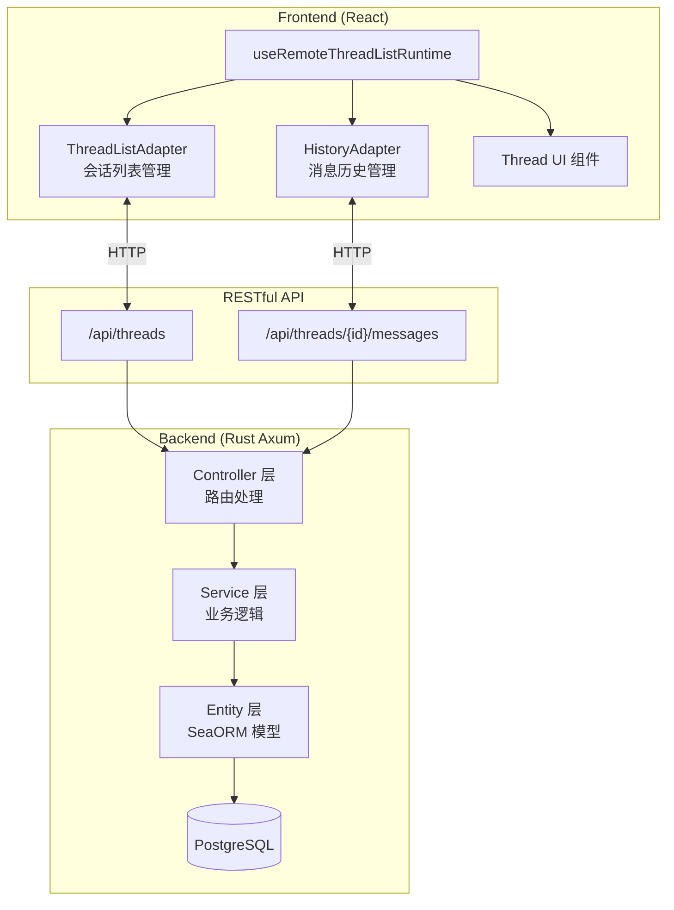
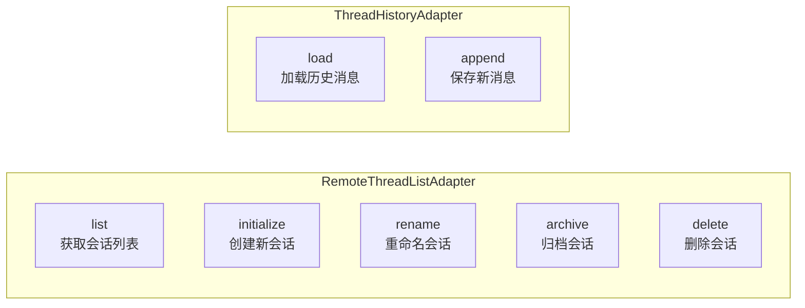
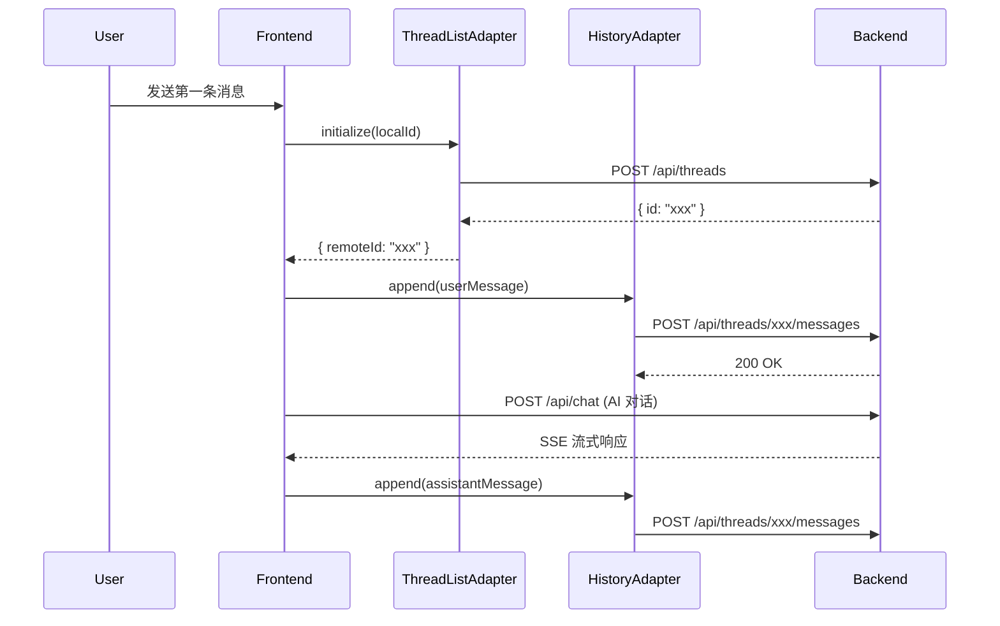
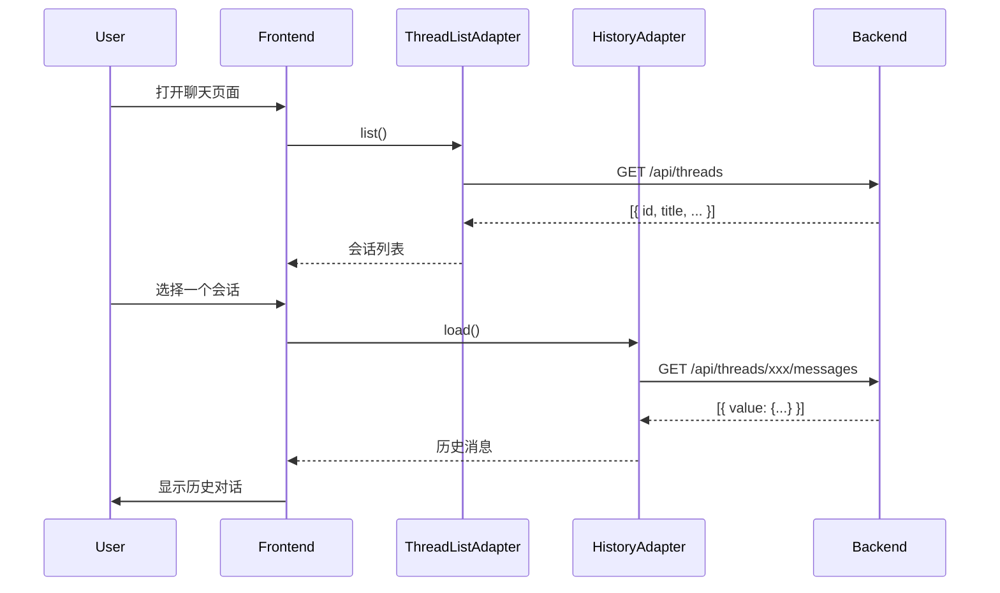

# 使用 Rust Axum + SeaORM 实现 assistant-ui 自定义会话持久化

在构建 AI 聊天应用时，会话（Thread）持久化是一个常见需求。本文将详细介绍如何使用 Rust Axum + SeaORM 作为后端，结合 `@assistant-ui/react` 的 Custom Thread List 功能，实现完整的会话管理系统。

## 架构概览



## 核心概念

### 1. 为什么需要 Custom Thread List？

| 场景 | 默认行为 | Custom Thread List |
|------|---------|-------------------|
| 会话存储 | 仅内存，刷新丢失 | 持久化到数据库 |
| 多设备同步 | 不支持 | 支持 |
| 会话归档 | 不支持 | 支持 |
| 标题管理 | 不支持 | 支持自动/手动生成 |

### 2. 两个核心适配器

assistant-ui 的 Custom Thread List 需要实现两个适配器：



## 后端实现

### 第一步：定义 Entity 模型

使用 SeaORM 2.0 的 Entity First 模式定义数据模型。

#### 会话模型 (chat_thread)

```rust
// crates/entity/src/chat_thread.rs
use schemars::JsonSchema;
use sea_orm::entity::prelude::*;
use serde::{Deserialize, Serialize};

/// 聊天会话线程，用于组织一组相关的聊天消息
#[sea_orm::model]
#[derive(Clone, Debug, PartialEq, DeriveEntityModel, Eq, Serialize, Deserialize, JsonSchema)]
#[serde(rename_all = "camelCase")]
#[sea_orm(table_name = "chat_thread")]
pub struct Model {
    /// 会话唯一标识符
    #[sea_orm(primary_key, auto_increment = false)]
    pub id: Uuid,

    /// 会话标题，可由用户设置或根据首条消息自动生成
    pub title: Option<String>,

    /// 会话创建时间
    #[sea_orm(default_expr = "Expr::current_timestamp()")]
    pub created_at: DateTimeUtc,

    /// 会话最后更新时间，每次新增消息时自动更新
    #[sea_orm(auto_update, default_expr = "Expr::current_timestamp()")]
    pub updated_at: DateTimeUtc,

    /// 会话所属用户的 ID
    pub user_id: Uuid,

    /// 会话是否归档，默认为 false
    #[sea_orm(default_value = false)]
    pub archived: bool,

    // 关联关系定义
    #[serde(skip)]
    #[sea_orm(belongs_to, from = "user_id", to = "id", on_delete = "Cascade")]
    pub user: HasOne<super::user::Entity>,

    #[serde(skip)]
    #[sea_orm(has_many)]
    pub messages: HasMany<super::chat_message::Entity>,
}

impl ActiveModelBehavior for ActiveModel {}
```

#### 消息模型 (chat_message)

```rust
// crates/entity/src/chat_message.rs
use schemars::JsonSchema;
use sea_orm::entity::prelude::*;
use serde::{Deserialize, Serialize};

/// 聊天消息，存储单条用户或 AI 助手的消息内容
#[sea_orm::model]
#[derive(Clone, Debug, PartialEq, DeriveEntityModel, Eq, Serialize, Deserialize, JsonSchema)]
#[serde(rename_all = "camelCase")]
#[sea_orm(table_name = "chat_message")]
pub struct Model {
    /// 消息唯一标识符
    #[sea_orm(primary_key, auto_increment = false)]
    pub id: Uuid,

    /// 所属会话线程的 ID
    pub thread_id: Uuid,

    /// 消息创建时间
    #[sea_orm(default_expr = "Expr::current_timestamp()")]
    pub created_at: DateTimeUtc,

    /// 消息内容，JSON 格式存储完整的消息结构
    /// 包含 message、parentId 等字段，与 assistant-ui 的格式兼容
    #[sea_orm(column_type = "JsonBinary")]
    pub value: serde_json::Value,

    // 关联关系
    #[serde(skip)]
    #[sea_orm(belongs_to, from = "thread_id", to = "id", on_delete = "Cascade")]
    pub thread: HasOne<super::chat_thread::Entity>,
}

impl ActiveModelBehavior for ActiveModel {}
```

> **设计要点**：
> - `value` 字段使用 `JsonBinary` 类型，直接存储 assistant-ui 的消息格式
> - 使用 `on_delete = "Cascade"` 确保删除会话时自动清理消息
> - `updated_at` 使用 `auto_update` 自动更新时间戳

### 第二步：实现 Service 层

Service 层封装业务逻辑，提供会话和消息的 CRUD 操作。

```rust
// crates/server/src/service/chat_thread/service.rs
use super::dto::UpdateThreadDto;
use crate::common::{ListData, QueryParams, apply_date_filter};
use crate::error::Result;
use anyhow::anyhow;
use chrono::Utc;
use entity::chat_thread::Column;
use sea_orm::{IntoActiveModel, QueryOrder, prelude::*};
use uuid::Uuid;

/// 获取用户的会话列表（分页、排序、搜索）
pub async fn list(
    db: &DbConn,
    params: QueryParams,
    user_id: Uuid,
) -> Result<ListData<entity::chat_thread::Model>> {
    let mut query = entity::chat_thread::Entity::find()
        .filter(Column::UserId.eq(user_id));

    // 支持按标题搜索
    if let Some(ref search) = params.search {
        query = query.filter(Column::Title.contains(search));
    }

    // 支持日期范围过滤
    query = apply_date_filter(
        query,
        Column::UpdatedAt,
        params.start_date.as_deref(),
        params.end_date.as_deref(),
    );

    // 排序处理
    let order = if params.sort_order == "asc" {
        sea_orm::Order::Asc
    } else {
        sea_orm::Order::Desc
    };

    query = match params.sort_by.as_deref() {
        Some("title") => query.order_by(Column::Title, order),
        _ => query.order_by(Column::UpdatedAt, order),  // 默认按更新时间排序
    };

    // 分页查询
    let paginator = query.paginate(db, params.page_size);
    let total = paginator.num_items().await?;
    let list = paginator.fetch_page(params.page.saturating_sub(1)).await?;

    Ok(ListData { list, total })
}

/// 获取单个会话详情
pub async fn get_one(db: &DbConn, id: Uuid, user_id: Uuid) -> Result<entity::chat_thread::Model> {
    let thread = entity::chat_thread::Entity::find_by_id(id)
        .filter(Column::UserId.eq(user_id))
        .one(db)
        .await?;
    thread.ok_or_else(|| anyhow!("会话不存在或无权访问").into())
}

/// 创建新会话
pub async fn create(db: &DbConn, user_id: Uuid) -> Result<entity::chat_thread::Model> {
    let model = entity::chat_thread::ActiveModelEx::new()
        .set_user_id(user_id)
        .set_created_at(Utc::now());
    Ok(model.insert(db).await?.into())
}

/// 更新会话（标题、归档状态）
pub async fn update(
    db: &DbConn,
    id: Uuid,
    user_id: Uuid,
    dto: UpdateThreadDto,
) -> Result<entity::chat_thread::Model> {
    let thread = entity::chat_thread::Entity::find_by_id(id)
        .filter(Column::UserId.eq(user_id))
        .one(db)
        .await?
        .ok_or_else(|| anyhow!("会话不存在或无权访问"))?;

    let mut model = thread.into_active_model().into_ex();

    if let Some(title) = dto.title {
        model = model.set_title(title);
    }
    if let Some(archived) = dto.archived {
        model = model.set_archived(archived);
    }

    Ok(model.update(db).await?.into())
}

/// 删除会话（级联删除消息）
pub async fn delete(db: &DbConn, id: Uuid, user_id: Uuid) -> Result<()> {
    entity::chat_thread::Entity::delete_by_id(id)
        .filter(Column::UserId.eq(user_id))
        .exec(db)
        .await?;
    Ok(())
}

/// 添加消息到会话
pub async fn add_message(
    db: &DbConn,
    thread_id: Uuid,
    user_id: Uuid,
    message: serde_json::Value,
) -> Result<entity::chat_message::Model> {
    // 使用 exists() 验证会话归属，比 one() 更高效
    let exists = entity::chat_thread::Entity::find_by_id(thread_id)
        .filter(entity::chat_thread::Column::UserId.eq(user_id))
        .exists(db)
        .await?;

    if !exists {
        return Err(anyhow!("会话不存在或无权访问").into());
    }

    let model = entity::chat_message::ActiveModelEx::new()
        .set_thread_id(thread_id)
        .set_value(message)
        .set_created_at(Utc::now());
    Ok(model.insert(db).await?.into())
}

/// 获取会话的所有消息
pub async fn list_messages(
    db: &DbConn,
    thread_id: Uuid,
    user_id: Uuid,
) -> Result<Vec<entity::chat_message::Model>> {
    // 验证会话归属
    let exists = entity::chat_thread::Entity::find_by_id(thread_id)
        .filter(entity::chat_thread::Column::UserId.eq(user_id))
        .exists(db)
        .await?;

    if !exists {
        return Err(anyhow!("会话不存在或无权访问").into());
    }

    let data = entity::chat_message::Entity::find()
        .filter(entity::chat_message::COLUMN.thread_id.eq(thread_id))
        .all(db)
        .await?;

    Ok(data)
}
```

### 第三步：实现 Controller 层

Controller 层定义 RESTful API 路由。

```rust
// crates/server/src/service/chat_thread/controller.rs
use axum::extract::{Query, State};
use axum::{Extension, Router};
use axum_extra::routing::{RouterExt, TypedPath};
use serde::Deserialize;
use std::sync::Arc;
use uuid::Uuid;

use super::service;
use crate::AppState;
use crate::common::{ApiResponse, ListData, QueryParams};
use crate::error::{AppJson, Result};
use crate::service::auth::Claims;
use crate::service::chat_thread::dto::UpdateThreadDto;
use entity::chat_message::Model as MessageModel;
use entity::chat_thread::Model as ThreadModel;

// 类型安全的路由路径定义
#[derive(Debug, TypedPath)]
#[typed_path("/threads")]
pub struct ThreadsPath;

#[derive(Debug, TypedPath, Deserialize)]
#[typed_path("/threads/{id}")]
pub struct ThreadPath {
    id: Uuid,
}

#[derive(Debug, TypedPath, Deserialize)]
#[typed_path("/threads/{thread_id}/messages")]
pub struct MessagesPath {
    thread_id: Uuid,
}

// 获取会话列表
async fn list(
    _: ThreadsPath,
    State(state): State<Arc<AppState>>,
    Extension(claims): Extension<Claims>,
    Query(params): Query<QueryParams>,
) -> Result<ApiResponse<ListData<ThreadModel>>> {
    Ok(ApiResponse::ok(
        service::list(&state.db, params, claims.sub).await?,
    ))
}

// 创建新会话
async fn create(
    _: ThreadsPath,
    State(state): State<Arc<AppState>>,
    Extension(claims): Extension<Claims>,
) -> Result<ApiResponse<ThreadModel>> {
    Ok(ApiResponse::ok(
        service::create(&state.db, claims.sub).await?,
    ))
}

// 获取单个会话
async fn get_one(
    ThreadPath { id }: ThreadPath,
    State(state): State<Arc<AppState>>,
    Extension(claims): Extension<Claims>,
) -> Result<ApiResponse<ThreadModel>> {
    Ok(ApiResponse::ok(
        service::get_one(&state.db, id, claims.sub).await?,
    ))
}

// 更新会话
async fn update(
    ThreadPath { id }: ThreadPath,
    State(state): State<Arc<AppState>>,
    Extension(claims): Extension<Claims>,
    AppJson(dto): AppJson<UpdateThreadDto>,
) -> Result<ApiResponse<ThreadModel>> {
    Ok(ApiResponse::ok(
        service::update(&state.db, id, claims.sub, dto).await?,
    ))
}

// 删除会话
async fn delete(
    ThreadPath { id }: ThreadPath,
    State(state): State<Arc<AppState>>,
    Extension(claims): Extension<Claims>,
) -> Result<ApiResponse<()>> {
    service::delete(&state.db, id, claims.sub).await?;
    Ok(ApiResponse::ok(()))
}

// 获取会话消息列表
async fn list_messages(
    MessagesPath { thread_id }: MessagesPath,
    State(state): State<Arc<AppState>>,
    Extension(claims): Extension<Claims>,
) -> Result<ApiResponse<Vec<MessageModel>>> {
    Ok(ApiResponse::ok(
        service::list_messages(&state.db, thread_id, claims.sub).await?,
    ))
}

// 添加消息
async fn add_message(
    MessagesPath { thread_id }: MessagesPath,
    State(state): State<Arc<AppState>>,
    Extension(claims): Extension<Claims>,
    AppJson(message): AppJson<serde_json::Value>,
) -> Result<ApiResponse<MessageModel>> {
    Ok(ApiResponse::ok(
        service::add_message(&state.db, thread_id, claims.sub, message).await?,
    ))
}

// 注册路由
pub fn router() -> Router<Arc<AppState>> {
    Router::new()
        .typed_get(get_one)
        .typed_get(list)
        .typed_post(create)
        .typed_put(update)
        .typed_delete(delete)
        .typed_get(list_messages)
        .typed_post(add_message)
}
```

### API 接口汇总

| 方法 | 路径 | 描述 |
|------|------|------|
| GET | `/api/threads` | 获取会话列表 |
| POST | `/api/threads` | 创建新会话 |
| GET | `/api/threads/{id}` | 获取单个会话 |
| PUT | `/api/threads/{id}` | 更新会话 |
| DELETE | `/api/threads/{id}` | 删除会话 |
| GET | `/api/threads/{id}/messages` | 获取消息列表 |
| POST | `/api/threads/{id}/messages` | 添加消息 |

## 前端实现

### 第一步：创建 API 客户端

```typescript
// src/api/chat.ts
import { client } from "./client";
import type { ListData, QueryParams } from "@/types";

/** 会话模型 */
export interface ChatThread {
  id: string;
  user_id: string;
  title: string | null;
  archived: boolean;
  created_at: string;
  updated_at: string;
}

/** 消息模型 */
export interface ChatMessage {
  id: string;
  thread_id: string;
  value: unknown;  // assistant-ui 的消息格式
  created_at: string;
}

/** 更新会话 DTO */
export interface UpdateThreadDto {
  title?: string;
  archived?: boolean;
}

export const chatApi = {
  // 会话管理
  listThreads: (params?: QueryParams) =>
    client.get<ListData<ChatThread>>("/api/threads", params),

  getThread: (id: string) =>
    client.get<ChatThread>(`/api/threads/${id}`),

  createThread: () =>
    client.post<ChatThread>("/api/threads"),

  updateThread: (id: string, data: UpdateThreadDto) =>
    client.put<ChatThread>(`/api/threads/${id}`, data),

  deleteThread: (id: string) =>
    client.delete<void>(`/api/threads/${id}`),

  // 消息管理
  listMessages: (threadId: string) =>
    client.get<ChatMessage[]>(`/api/threads/${threadId}/messages`),

  addMessage: (threadId: string, message: unknown) =>
    client.post<ChatMessage>(`/api/threads/${threadId}/messages`, message),
};
```

### 第二步：实现 ThreadListAdapter

`RemoteThreadListAdapter` 负责会话列表的 CRUD 操作。

```typescript
// src/lib/chat/thread-list-adapter.ts
import type {
  unstable_RemoteThreadListAdapter as RemoteThreadListAdapter
} from "@assistant-ui/react";
import { chatApi } from "@/api";

export const createThreadListAdapter = (): RemoteThreadListAdapter => ({
  /**
   * 获取会话列表
   * 在组件挂载时调用，用于初始化会话列表
   */
  async list() {
    const data = await chatApi.listThreads({ page: 1, pageSize: 100 });
    return {
      threads: data.list.map((t) => ({
        remoteId: t.id,
        externalId: undefined,
        title: t.title ?? undefined,
        status: t.archived ? ("archived" as const) : ("regular" as const),
      })),
    };
  },

  /**
   * 初始化新会话
   * 当用户发送第一条消息时调用
   */
  async initialize(_threadId: string) {
    const data = await chatApi.createThread();
    return { remoteId: data.id, externalId: undefined };
  },

  /**
   * 重命名会话
   */
  async rename(remoteId: string, newTitle: string) {
    await chatApi.updateThread(remoteId, { title: newTitle });
  },

  /**
   * 归档会话
   */
  async archive(remoteId: string) {
    await chatApi.updateThread(remoteId, { archived: true });
  },

  /**
   * 取消归档
   */
  async unarchive(remoteId: string) {
    await chatApi.updateThread(remoteId, { archived: false });
  },

  /**
   * 删除会话
   */
  async delete(remoteId: string) {
    await chatApi.deleteThread(remoteId);
  },

  /**
   * 获取单个会话
   */
  async fetch(threadId: string) {
    const data = await chatApi.getThread(threadId);
    return {
      remoteId: data.id,
      externalId: undefined,
      title: data.title ?? undefined,
      status: data.archived ? ("archived" as const) : ("regular" as const),
    };
  },

  /**
   * 生成标题（可选实现）
   */
  async generateTitle(_remoteId: string, _messages: readonly unknown[]) {
    // TODO: 调用 AI 生成标题
    return new ReadableStream({
      start(controller) {
        controller.close();
      },
    }) as never;
  },
});
```

### 第三步：实现 HistoryAdapter

`ThreadHistoryAdapter` 负责消息历史的加载和保存。

```typescript
// src/lib/chat/history-adapter.ts
import type {
  ThreadHistoryAdapter,
  ExportedMessageRepository,
  ThreadMessage,
} from "@assistant-ui/react";
import { useAssistantApi } from "@assistant-ui/react";
import { chatApi, type ChatMessage } from "@/api/chat";
import { useMemo } from "react";

/**
 * 消息仓库项（与 assistant-ui 内部类型匹配）
 */
interface MessageRepositoryItem {
  message: ThreadMessage;
  parentId: string | null;
}

/**
 * 创建消息历史适配器的 Hook
 * 需要在 RuntimeAdapterProvider 内部使用
 */
export function useHistoryAdapter(): ThreadHistoryAdapter {
  const api = useAssistantApi();

  return useMemo<ThreadHistoryAdapter>(
    () => ({
      /**
       * 加载历史消息
       * 在切换会话时调用
       */
      async load(): Promise<ExportedMessageRepository> {
        const { remoteId } = api.threadListItem().getState();
        if (!remoteId) return { messages: [] };

        const messages = await chatApi.listMessages(remoteId);

        // 构建 ExportedMessageRepository 格式
        const exportedMessages = messages.map(
          (m: ChatMessage) => m.value as MessageRepositoryItem
        );
        const headId =
          exportedMessages.length > 0
            ? exportedMessages[exportedMessages.length - 1].message.id
            : null;

        return {
          headId,
          messages: exportedMessages,
        };
      },

      /**
       * 保存新消息
       * 每条消息发送后调用
       */
      async append(item: MessageRepositoryItem): Promise<void> {
        // 重要：等待会话初始化完成，避免竞态条件
        const { remoteId } = await api.threadListItem().initialize();
        if (!remoteId) return;

        await chatApi.addMessage(remoteId, item);
      },
    }),
    [api]
  );
}
```

> **重要提示**：在 `append` 方法中必须使用 `await api.threadListItem().initialize()` 等待会话初始化完成。这避免了首条消息可能因竞态条件而丢失的问题。

### 第四步：集成到 Chat 页面

```typescript
// src/routes/chat.tsx
import { useMemo, useRef } from "react";
import { createFileRoute, redirect, useNavigate } from "@tanstack/react-router";
import {
  AssistantRuntimeProvider,
  RuntimeAdapterProvider,
  unstable_useRemoteThreadListRuntime as useRemoteThreadListRuntime,
} from "@assistant-ui/react";
import {
  useChatRuntime,
  AssistantChatTransport,
} from "@assistant-ui/react-ai-sdk";
import { useAuthStore } from "@/stores/auth";
import { Thread } from "@/components/thread";
import { createThreadListAdapter, useHistoryAdapter } from "@/lib/chat";

export const Route = createFileRoute("/chat")({
  beforeLoad: () => {
    const token = useAuthStore.getState().token;
    if (!token) {
      throw redirect({ to: "/login" });
    }
  },
  component: ChatPage,
});

/**
 * History Adapter Provider
 * 用于注入消息历史适配器
 */
function HistoryAdapterProvider({ children }: { children?: React.ReactNode }) {
  const history = useHistoryAdapter();
  return (
    <RuntimeAdapterProvider adapters={{ history }}>
      {children}
    </RuntimeAdapterProvider>
  );
}

function ChatPage() {
  const navigate = useNavigate();
  const [token, user] = useAuthStore((state) => [state.token, state.user]);

  // 创建 thread list adapter
  const threadListAdapter = useMemo(() => {
    const adapter = createThreadListAdapter();
    // 注入 HistoryAdapterProvider，为每个会话提供历史适配器
    adapter.unstable_Provider = HistoryAdapterProvider;
    return adapter;
  }, []);

  // 使用 useRemoteThreadListRuntime 包装，支持会话持久化
  const runtime = useRemoteThreadListRuntime({
    // runtimeHook 为每个会话创建独立的 runtime
    runtimeHook: () =>
      useChatRuntime({
        transport: new AssistantChatTransport({
          api: `${import.meta.env.VITE_API_URL}/api/chat`,
          headers: {
            Authorization: `Bearer ${token}`,
          },
          body: {
            sessionId: user?.id,
          },
        }),
      }),
    adapter: threadListAdapter,
  });

  return (
    <AssistantRuntimeProvider runtime={runtime}>
      <div className="flex h-full flex-col">
        {/* 聊天 UI */}
        <Thread />
      </div>
    </AssistantRuntimeProvider>
  );
}
```

## 数据流示意

### 创建新会话流程



### 加载历史会话流程



## 消息格式说明

assistant-ui 使用特定的消息格式，我们直接将其存储在 `value` 字段中：

```typescript
// MessageRepositoryItem 格式
{
  "message": {
    "id": "msg-uuid",
    "role": "user" | "assistant",
    "parts": [
      { "type": "text", "text": "消息内容" },
      // 或工具调用
      { "type": "tool-call", "toolCallId": "xxx", "toolName": "xxx", "args": {} }
    ],
    "createdAt": "2024-01-01T00:00:00Z"
  },
  "parentId": "parent-msg-uuid" | null
}
```

> **设计考量**：直接存储 assistant-ui 的原始格式，避免格式转换带来的复杂性和潜在问题。

## 最佳实践

### 1. 权限控制

始终验证用户对会话的所有权：

```rust
// 每个操作都验证 user_id
let thread = entity::chat_thread::Entity::find_by_id(id)
    .filter(Column::UserId.eq(user_id))  // 关键：过滤用户
    .one(db)
    .await?;
```

### 2. 使用 exists() 而非 one()

当只需要验证存在性时，使用 `exists()` 更高效：

```rust
// 推荐
let exists = entity::chat_thread::Entity::find_by_id(thread_id)
    .filter(Column::UserId.eq(user_id))
    .exists(db)
    .await?;

// 不推荐（多余的数据加载）
let thread = entity::chat_thread::Entity::find_by_id(thread_id)
    .filter(Column::UserId.eq(user_id))
    .one(db)
    .await?;
let exists = thread.is_some();
```

### 3. 等待会话初始化

在 HistoryAdapter 的 `append` 方法中，必须等待会话初始化完成：

```typescript
async append(item: MessageRepositoryItem): Promise<void> {
  // 必须 await，避免首条消息丢失
  const { remoteId } = await api.threadListItem().initialize();
  if (!remoteId) return;

  await chatApi.addMessage(remoteId, item);
}
```

### 4. 级联删除

在 Entity 定义中使用 `on_delete = "Cascade"`，确保删除会话时自动清理关联消息：

```rust
#[sea_orm(belongs_to, from = "thread_id", to = "id", on_delete = "Cascade")]
pub thread: HasOne<super::chat_thread::Entity>,
```

## 总结

本文介绍了使用 Rust Axum + SeaORM 实现 assistant-ui Custom Thread List 的完整方案：

1. **Entity 层**：使用 SeaORM Entity First 模式定义 `chat_thread` 和 `chat_message` 模型
2. **Service 层**：封装 CRUD 业务逻辑，包含权限验证
3. **Controller 层**：使用 axum-extra 的 TypedPath 定义类型安全的 RESTful API
4. **前端适配器**：
   - `RemoteThreadListAdapter`：管理会话列表
   - `ThreadHistoryAdapter`：管理消息历史
5. **集成**：使用 `useRemoteThreadListRuntime` 组合两个适配器

这套方案实现了完整的会话持久化功能，支持多会话管理、历史消息加载、会话归档等特性。
