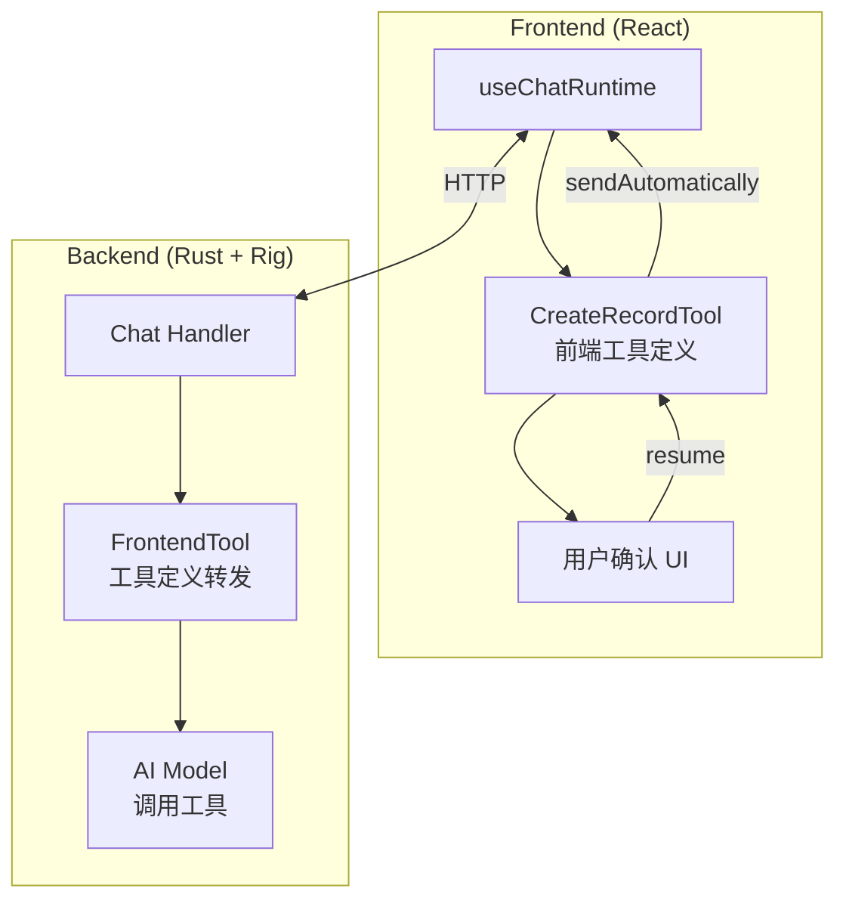
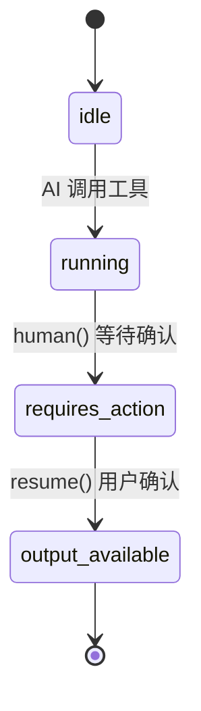
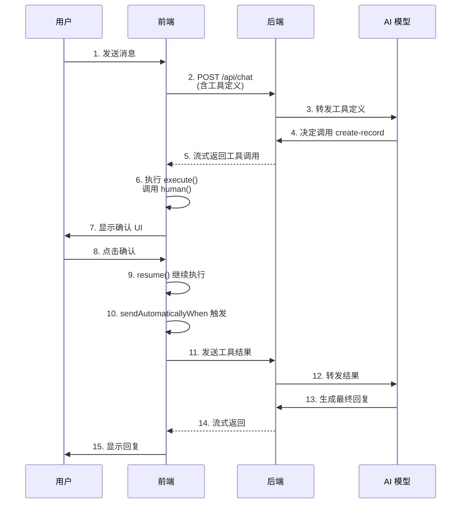

# 使用 assistant-ui 实现前端工具与人机交互

在构建 AI 聊天应用时，我们经常需要让 AI 调用工具来完成特定任务。有些工具需要在前端执行并获取用户确认，比如创建订单、删除数据等敏感操作。本文将介绍如何使用 `@assistant-ui/react` 实现一个完整的前端工具，包含用户确认流程。

## 架构概览



## 核心概念

### 1. 前端工具 vs 后端工具

| 特性 | 前端工具 | 后端工具 |
|------|---------|---------|
| 执行位置 | 浏览器 | 服务器 |
| 用户交互 | 支持 human-in-the-loop | 不支持 |
| 适用场景 | 需要用户确认的操作 | 数据查询、计算等 |
| 工具定义 | 前端定义，转发到后端 | 后端定义 |

### 2. 工具状态流转



## 前端实现

### 1. 定义工具 Schema

首先定义工具的参数类型：

```typescript
// src/components/tools/create-record/schema.ts
import { z } from "zod";

export const CreateRecordSchema = z.object({
  orderName: z.string().describe("订单名称"),
  amount: z.number().describe("计件数量"),
});

export type CreateRecordSchemaType = z.infer<typeof CreateRecordSchema>;
```

### 2. 创建前端工具

使用 `makeAssistantTool` 创建带有用户确认的前端工具：

```typescript
// src/components/tools/create-record/index.tsx
import { makeAssistantTool } from "@assistant-ui/react";
import { CreateRecordSchema, CreateRecordSchemaType } from "./schema";

export const CreateRecordTool = makeAssistantTool<
  CreateRecordSchemaType,
  { success: boolean }
>({
  toolName: "create-record",
  type: "frontend",  // 关键：标记为前端工具
  parameters: CreateRecordSchema,
  description: "创建计件记录",

  // execute 函数在前端执行
  execute: async (args, ctx) => {
    const { human } = ctx;

    // human() 会暂停执行，等待用户在 render 中调用 resume()
    const userResponse = await human("请确认创建计件记录");

    // 用户确认后继续执行
    if (userResponse === "confirmed") {
      // 调用实际的 API 创建记录
      // await api.createRecord(args);
      return { success: true };
    }

    return { success: false };
  },

  // render 函数渲染工具 UI
  render: (options) => {
    const { args, status, result, resume } = options;

    // 等待用户确认状态
    if (status.type === "requires-action" || status.type === "running") {
      return (
        <div className="rounded-lg border p-4">
          <div className="mb-2 font-medium">确认创建计件记录</div>
          <div className="mb-4 text-sm text-muted-foreground">
            订单: {args.orderName}<br />
            数量: {args.amount}
          </div>
          <div className="flex gap-2">
            <button
              className="rounded bg-primary px-4 py-2 text-primary-foreground"
              onClick={() => resume("confirmed")}
            >
              确认
            </button>
            <button
              className="rounded border px-4 py-2"
              onClick={() => resume("cancelled")}
            >
              取消
            </button>
          </div>
        </div>
      );
    }

    // 已完成状态
    return (
      <div className="rounded-lg border p-4">
        <div className="text-sm text-muted-foreground">
          {result?.success ? "✅" : "❌"} 计件记录: {args.orderName} x {args.amount}
        </div>
      </div>
    );
  },
});
```

### 3. 配置 Chat Runtime

在聊天页面配置 runtime，处理工具完成后的自动发送：

```typescript
// src/routes/chat.tsx
import { useRef } from "react";
import { AssistantRuntimeProvider } from "@assistant-ui/react";
import { useChatRuntime, AssistantChatTransport } from "@assistant-ui/react-ai-sdk";
import { lastAssistantMessageIsCompleteWithToolCalls } from "ai";
import { CreateRecordTool } from "@/components/tools/create-record";

function ChatPage() {
  // 跟踪已处理的工具调用，防止重复发送
  const processedToolCalls = useRef(new Set<string>());

  const runtime = useChatRuntime({
    transport: new AssistantChatTransport({
      api: `${import.meta.env.VITE_API_URL}/api/chat`,
      headers: {
        Authorization: `Bearer ${token}`,
      },
    }),

    // 工具完成后自动发送消息到后端
    sendAutomaticallyWhen: (options) => {
      // 检查最后一条消息是否包含已完成的工具调用
      if (!lastAssistantMessageIsCompleteWithToolCalls(options)) {
        return false;
      }

      const lastMsg = options.messages.at(-1);
      const toolPart = lastMsg?.parts.find(
        (part) =>
          part.type === "tool-create-record" &&
          part.state === "output-available"
      ) as { toolCallId: string } | undefined;

      if (toolPart) {
        const toolCallId = toolPart.toolCallId;
        // 防止同一个工具调用重复触发
        if (!processedToolCalls.current.has(toolCallId)) {
          processedToolCalls.current.add(toolCallId);
          return true;
        }
      }

      return false;
    },
  });

  return (
    <AssistantRuntimeProvider runtime={runtime}>
      <Thread />
      <CreateRecordTool />  {/* 注册工具组件 */}
    </AssistantRuntimeProvider>
  );
}
```

## 后端实现

### 1. 定义前端工具结构

后端需要接收前端传来的工具定义，并转发给 AI 模型：

```rust
// crates/server/src/chat/frontend_tools.rs
use rig::tool::ToolDyn;
use serde_json::Value;

#[derive(Debug, Clone)]
pub struct FrontendTool {
    pub name: String,
    pub description: String,
    pub parameters: Value,
}

impl ToolDyn for FrontendTool {
    fn name(&self) -> String {
        self.name.clone()
    }

    fn definition<'a>(
        &'a self,
        _prompt: String,
    ) -> rig::wasm_compat::WasmBoxedFuture<'a, rig::completion::ToolDefinition> {
        async move {
            rig::completion::ToolDefinition {
                name: self.name.clone(),
                description: self.description.clone(),
                parameters: self.parameters.clone(),
            }
        }
        .boxed()
    }

    fn call<'a>(
        &'a self,
        _args: String,
    ) -> rig::wasm_compat::WasmBoxedFuture<'a, Result<String, rig::tool::ToolError>> {
        // 前端工具不在后端执行，返回错误
        async move {
            Err(rig::tool::ToolError::ToolCallError(
                "Frontend tool should not be executed on backend".into(),
            ))
        }
        .boxed()
    }
}
```

### 2. 请求结构

定义接收前端工具的请求结构：

```rust
// crates/server/src/chat/request.rs
use serde::{Deserialize, Serialize};
use serde_json::Value;
use std::collections::HashMap;

#[derive(Debug, Deserialize)]
pub struct ChatRequest {
    pub messages: Vec<Message>,
    #[serde(default)]
    pub tools: Option<ForwardedTools>,
}

#[derive(Debug, Deserialize)]
pub struct ForwardedTools {
    pub tools: HashMap<String, ToolDefinition>,
}

#[derive(Debug, Deserialize)]
pub struct ToolDefinition {
    pub description: String,
    pub parameters: Value,
}
```

### 3. 在 Chat Handler 中使用

```rust
// crates/server/src/service/chat.rs
pub async fn handle_chat(
    request: ChatRequest,
) -> Result<impl IntoResponse, AppError> {
    let mut agent_builder = openai_client
        .agent("gpt-4")
        .preamble("你是一个助手...");

    // 添加后端工具
    agent_builder = agent_builder
        .tool(QueryRecordsTool)
        .tool(GetStatsTool);

    // 添加前端转发的工具
    if let Some(forwarded) = &request.tools {
        let frontend_tools: Vec<Box<dyn ToolDyn>> = forwarded.into();
        for tool in frontend_tools {
            agent_builder = agent_builder.dynamic_tool(tool);
        }
    }

    let agent = agent_builder.build();

    // 处理聊天...
}
```

## 数据流详解

### 完整的请求-响应流程



## 关键点总结

### 1. `type: "frontend"` 的作用

标记工具为前端工具，assistant-ui 会：
- 将工具定义发送到后端（让 AI 知道可以调用）
- 在前端执行 `execute` 函数（而不是后端）

### 2. `human()` 函数

`human()` 是实现人机交互的关键：
- 调用后会暂停 `execute` 的执行
- 将状态设为 `requires-action`
- 等待 `render` 中调用 `resume()`
- `resume()` 的参数会作为 `human()` 的返回值

### 3. 防止重复发送

使用 `useRef` 跟踪已处理的 `toolCallId`：

```typescript
const processedToolCalls = useRef(new Set<string>());

// 在 sendAutomaticallyWhen 中
if (!processedToolCalls.current.has(toolCallId)) {
  processedToolCalls.current.add(toolCallId);
  return true;
}
```

### 4. 后端工具定义的"空实现"

后端的 `FrontendTool.call()` 返回错误是正确的：
- 前端工具不应该在后端执行
- 如果意外调用，返回明确的错误信息

## 常见问题

### Q: 为什么不用 `makeAssistantToolUI`？

`makeAssistantToolUI` 只渲染 UI，不会将工具定义发送到后端。如果需要 AI 能够调用工具，必须使用 `makeAssistantTool`。

### Q: `Tool call is not waiting for human input` 错误？

这通常是因为：
1. 没有在 `execute` 中调用 `human()`
2. 在错误的状态下调用了 `resume()`

### Q: 工具完成后消息无限发送？

需要跟踪已处理的 `toolCallId`，防止 `sendAutomaticallyWhen` 对同一个工具调用重复返回 `true`。

## 参考资源

- [assistant-ui 文档](https://www.assistant-ui.com/)
- [Vercel AI SDK](https://sdk.vercel.ai/)
- [Rig - Rust AI Framework](https://github.com/0xPlaygrounds/rig)
