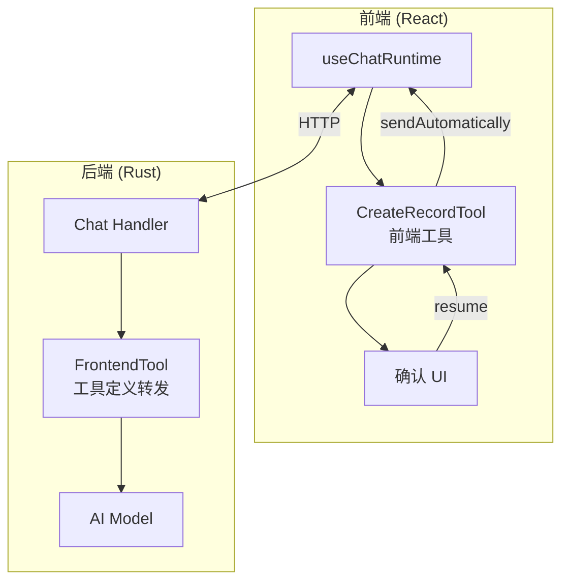
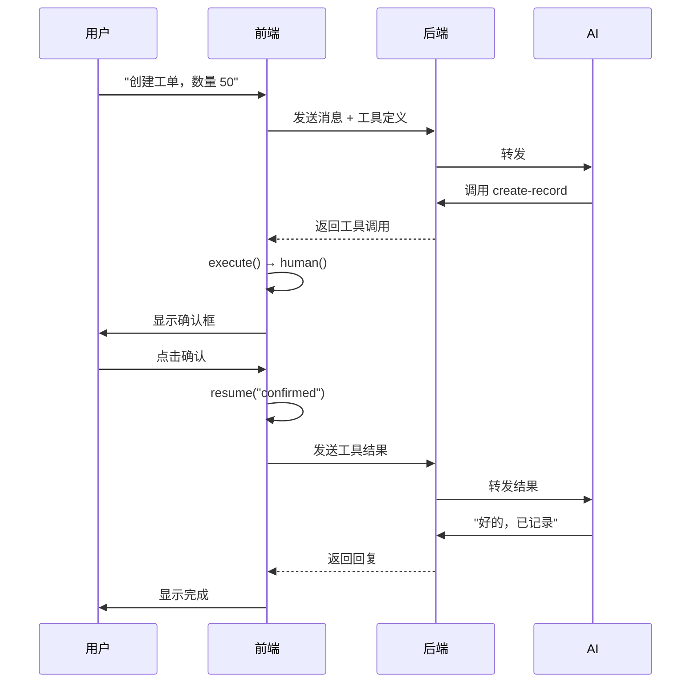

# 让 AI 学会"问一嘴"：assistant-ui 前端工具的人机交互实践

> 🤖 当 AI 助手要帮用户执行敏感操作时，总不能闷头就干吧？得先问问人家确不确认啊！

## 背景：一个"莽撞"的 AI 助手

我在做一个工单管理系统，里面有个 AI 助手功能。用户可以说"帮我创建一个工单，数量 50"，AI 就会调用工具创建记录。

听起来很美好，但问题来了：

**AI 太"自信"了。**

它收到指令就直接执行，万一用户说错了呢？万一 AI 理解错了呢？50 变成 500，那可就麻烦了。

所以我需要一个机制：**AI 调用工具前，先让用户确认一下。**

```
用户: 帮我创建一个工单，数量 50

AI: 好的，我来帮你创建记录
    ┌─────────────────────────┐
    │ 确认创建记录             │
    │ 名称: A 款               │
    │ 数量: 50                 │
    │ [确认]  [取消]           │
    └─────────────────────────┘

用户: *点击确认*

AI: ✅ 已创建记录：A 款 x 50
```

这就是所谓的 **Human-in-the-Loop**（人机协作）模式。

## 技术选型

- 前端：React + `@assistant-ui/react`
- 后端：Rust + Axum + Rig（AI 框架）
- AI：OpenAI GPT-4

`assistant-ui` 是一个专门为 AI 聊天界面设计的 React 组件库，它有个很棒的特性：**前端工具（Frontend Tools）**。

## 架构概览



## 核心概念：前端工具 vs 后端工具

| | 前端工具 | 后端工具 |
|---|---|---|
| 执行位置 | 浏览器 | 服务器 |
| 能否与用户交互 | ✅ 可以 | ❌ 不行 |
| 适用场景 | 需要确认的操作 | 查询、计算 |

前端工具的精髓在于：**工具定义发给 AI，但执行在前端**。

AI 知道有这个工具可以用，当它决定调用时，前端拦截执行，可以弹个确认框、让用户填个表单，用户操作完再把结果告诉 AI。

## 实现步骤

### 1. 定义工具参数

```typescript
// schema.ts
import { z } from "zod";

export const CreateRecordSchema = z.object({
  name: z.string().describe("名称"),
  amount: z.number().describe("数量"),
});
```

### 2. 创建前端工具

这是最关键的部分，使用 `makeAssistantTool`：

```typescript
import { makeAssistantTool } from "@assistant-ui/react";

export const CreateRecordTool = makeAssistantTool({
  toolName: "create-record",
  type: "frontend",  // 🔑 关键：标记为前端工具
  parameters: CreateRecordSchema,
  description: "创建记录",

  // execute 在前端执行
  execute: async (args, ctx) => {
    const { human } = ctx;

    // human() 会暂停执行，等待用户确认
    const response = await human("请确认创建记录");

    if (response === "confirmed") {
      // 调用实际 API
      await api.createRecord(args);
      return { success: true };
    }
    return { success: false };
  },

  // render 渲染确认 UI
  render: ({ args, status, result, resume }) => {
    // 等待确认状态
    if (status.type === "requires-action") {
      return (
        <div className="rounded-lg border p-4">
          <div>确认创建记录</div>
          <div>名称: {args.name} | 数量: {args.amount}</div>
          <button onClick={() => resume("confirmed")}>确认</button>
          <button onClick={() => resume("cancelled")}>取消</button>
        </div>
      );
    }

    // 完成状态
    return <div>{result?.success ? "✅" : "❌"} 已处理</div>;
  },
});
```

**核心 API 解释：**

- `human(message)`: 暂停执行，等待用户操作
- `resume(value)`: 用户操作后恢复执行，value 会作为 `human()` 的返回值

### 3. 注册工具

```tsx
function ChatPage() {
  const processedToolCalls = useRef(new Set<string>());

  const runtime = useChatRuntime({
    transport: new AssistantChatTransport({
      api: "/api/chat",
    }),
    // 工具完成后自动发送结果给后端
    sendAutomaticallyWhen: (options) => {
      if (!lastAssistantMessageIsCompleteWithToolCalls(options)) {
        return false;
      }
      const lastMsg = options.messages.at(-1);
      const toolPart = lastMsg?.parts.find(
        (p) => p.type === "tool-create-record" && p.state === "output-available"
      ) as { toolCallId: string } | undefined;

      if (toolPart && !processedToolCalls.current.has(toolPart.toolCallId)) {
        processedToolCalls.current.add(toolPart.toolCallId);
        return true;
      }
      return false;
    },
  });

  return (
    <AssistantRuntimeProvider runtime={runtime}>
      <Thread />
      <CreateRecordTool />
    </AssistantRuntimeProvider>
  );
}
```

### 4. 后端接收工具定义

前端会把工具定义发给后端，后端需要转发给 AI：

```rust
// Rust 后端
pub struct FrontendTool {
    pub name: String,
    pub description: String,
    pub parameters: Value,
}

impl ToolDyn for FrontendTool {
    fn name(&self) -> String { self.name.clone() }

    fn definition(&self, _: String) -> ToolDefinition {
        ToolDefinition {
            name: self.name.clone(),
            description: self.description.clone(),
            parameters: self.parameters.clone(),
        }
    }

    fn call(&self, _: String) -> Result<String, ToolError> {
        // 前端工具不在后端执行！
        Err(ToolError::ToolCallError("Frontend tool".into()))
    }
}
```

## 完整流程



## 踩坑记录

### 坑 1：`Tool call is not waiting for human input`

**原因**：没在 `execute` 里调用 `human()`，或者在错误状态下调用了 `resume()`

**解决**：确保 `execute` 里有 `await human()`，且只在 `status.type === "requires-action"` 时调用 `resume()`

### 坑 2：工具完成后消息无限发送

**原因**：`sendAutomaticallyWhen` 对同一个工具调用重复返回 `true`

**解决**：用 `useRef` 记录已处理的 `toolCallId`

```typescript
const processedToolCalls = useRef(new Set<string>());

sendAutomaticallyWhen: (options) => {
  // ... 找到完成的工具调用
  if (!processedToolCalls.current.has(toolCallId)) {
    processedToolCalls.current.add(toolCallId);
    return true;
  }
  return false;
}
```

### 坑 3：用错了 `makeAssistantToolUI`

`makeAssistantToolUI` 只渲染 UI，不会把工具定义发给后端。如果需要 AI 能调用，必须用 `makeAssistantTool`。

## 总结

通过 `assistant-ui` 的前端工具机制，我们实现了：

1. **AI 能力不打折**：AI 仍然可以决定何时调用工具
2. **用户有控制权**：敏感操作必须经过用户确认
3. **体验很自然**：确认框嵌入在对话流中，不突兀

这套方案已经在生产环境稳定运行，用户再也不用担心 AI "手滑"了 😄

---

**技术栈**：React + Rust + Tauri + assistant-ui

如果你也在做 AI 应用，需要人机协作的场景，希望这篇文章对你有帮助！

欢迎评论区交流 👇
