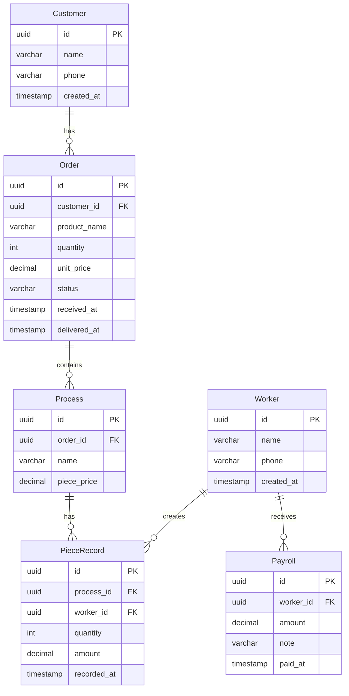

# StitchWork 数据库设计

## ER 图



## 表结构

### customer 客户表

| 字段 | 类型 | 约束 | 说明 |
|------|------|------|------|
| id | UUID | PK | 主键 |
| name | VARCHAR(100) | NOT NULL | 客户名称 |
| phone | VARCHAR(20) | | 联系电话 |
| created_at | TIMESTAMP | NOT NULL DEFAULT NOW() | 创建时间 |

### order 订单表

| 字段 | 类型 | 约束 | 说明 |
|------|------|------|------|
| id | UUID | PK | 主键 |
| customer_id | UUID | FK → customer.id | 客户 |
| product_name | VARCHAR(200) | NOT NULL | 产品名称 |
| quantity | INT | NOT NULL | 总数量 |
| unit_price | DECIMAL(10,2) | NOT NULL | 单价 |
| status | VARCHAR(20) | NOT NULL DEFAULT 'pending' | 状态 |
| received_at | TIMESTAMP | NOT NULL DEFAULT NOW() | 拿货时间 |
| delivered_at | TIMESTAMP | | 出货时间 |

状态枚举: `pending` / `processing` / `completed` / `delivered`

### worker 工人表

| 字段 | 类型 | 约束 | 说明 |
|------|------|------|------|
| id | UUID | PK | 主键 |
| name | VARCHAR(50) | NOT NULL | 姓名 |
| phone | VARCHAR(20) | | 联系电话 |
| created_at | TIMESTAMP | NOT NULL DEFAULT NOW() | 创建时间 |

### process 工序表

| 字段 | 类型 | 约束 | 说明 |
|------|------|------|------|
| id | UUID | PK | 主键 |
| order_id | UUID | FK → order.id | 所属订单 |
| name | VARCHAR(100) | NOT NULL | 工序名称 |
| piece_price | DECIMAL(10,2) | NOT NULL | 计件单价 |

常用工序: `缝盘` / `挑状` / `埋夹`

### piece_record 计件记录表

| 字段 | 类型 | 约束 | 说明 |
|------|------|------|------|
| id | UUID | PK | 主键 |
| process_id | UUID | FK → process.id | 工序 |
| worker_id | UUID | FK → worker.id | 工人 |
| quantity | INT | NOT NULL | 完成数量 |
| amount | DECIMAL(10,2) | NOT NULL | 金额 |
| recorded_at | TIMESTAMP | NOT NULL DEFAULT NOW() | 记录时间 |

### payroll 工资发放表

| 字段 | 类型 | 约束 | 说明 |
|------|------|------|------|
| id | UUID | PK | 主键 |
| worker_id | UUID | FK → worker.id | 工人 |
| amount | DECIMAL(10,2) | NOT NULL | 发放金额 |
| note | VARCHAR(500) | | 备注 |
| paid_at | TIMESTAMP | NOT NULL DEFAULT NOW() | 发放时间 |

## 索引

```sql
-- 订单查询
CREATE INDEX idx_order_customer ON "order"(customer_id);
CREATE INDEX idx_order_status ON "order"(status);

-- 计件查询
CREATE INDEX idx_piece_record_process ON piece_record(process_id);
CREATE INDEX idx_piece_record_worker ON piece_record(worker_id);
CREATE INDEX idx_piece_record_date ON piece_record(recorded_at);

-- 工资查询
CREATE INDEX idx_payroll_worker ON payroll(worker_id);
```

## 常用查询

### 工人计件汇总

```sql
SELECT
    w.id,
    w.name,
    SUM(pr.quantity) as total_pieces,
    SUM(pr.amount) as total_amount
FROM worker w
LEFT JOIN piece_record pr ON w.id = pr.worker_id
WHERE pr.recorded_at BETWEEN :start_date AND :end_date
GROUP BY w.id, w.name;
```

### 订单进度

```sql
SELECT
    o.id,
    o.product_name,
    o.quantity as total,
    COALESCE(SUM(pr.quantity), 0) as completed
FROM "order" o
LEFT JOIN process p ON o.id = p.order_id
LEFT JOIN piece_record pr ON p.id = pr.process_id
WHERE o.status = 'processing'
GROUP BY o.id;
```
