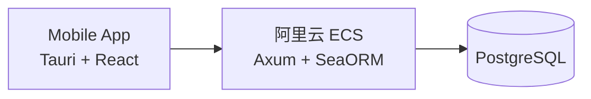
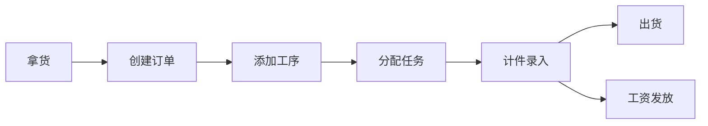

# StitchWork 系统设计文档

## 1. 系统概述

单工坊服装加工流程管理系统，老板使用，管理订单、计件和工资。

## 2. 架构



## 3. 业务流程



## 4. 核心功能

### 4.1 订单管理

- 创建订单（拿货）
- 添加工序和计件单价
- 更新订单状态
- 标记出货

### 4.2 计件录入

- 选择工序 + 工人 + 数量
- 自动计算金额

### 4.3 工资管理

- 查看工人计件汇总
- 老板手动录入发放金额

## 5. API

```text
# 客户
POST/GET    /api/customers

# 订单
POST/GET    /api/orders
PATCH       /api/orders/:id

# 工序
POST        /api/orders/:id/processes
GET         /api/processes?order_id=

# 计件
POST/GET    /api/records

# 工人
POST/GET    /api/workers

# 工资
POST        /api/payroll
GET         /api/payroll?worker_id=
GET         /api/workers/:id/summary   # 计件汇总
```

## 6. 项目结构

```text
StitchWork/
├── src/                    # React 前端
├── src-tauri/              # Tauri 客户端
└── server/                 # Axum 服务端
    ├── src/
    │   ├── main.rs
    │   ├── routes/
    │   └── entities/
    ├── migration/
    ├── Cargo.toml
    └── Dockerfile
```
