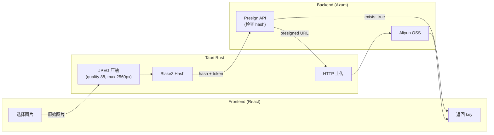

# 图片上传优化：Rust 压缩 + Blake3 秒传

基于 Tauri Rust 实现的高质量图片压缩和 hash 去重上传系统，用于订单图片、头像等场景。

## 架构概览



**为什么在 Rust 端处理？**

- 原生性能：Rust 图片处理比 JS 更快，尤其大图
- 避免数据往返：压缩后直接上传，不用 base64 传回前端
- 统一流程：一个命令完成压缩 + hash + 上传

## 核心流程

### 1. 前端调用

```typescript
// src/utils/upload.ts
const result = await invoke<UploadResult>("upload_image", {
  imageData,           // 原始图片 bytes
  apiUrl: API_URL,     // 后端地址
  token: getToken(),   // JWT token
  options: {
    maxDimension: 2560,
    quality: 88,
  },
});
```

### 2. Rust 端处理 (`src-tauri/src/image.rs`)

```rust
#[tauri::command]
pub async fn upload_image(
    image_data: Vec<u8>,
    api_url: String,
    token: String,
    options: Option<ProcessOptions>,
) -> Result<UploadResult, String> {
    // 1. 压缩图片
    let (jpeg_data, hash) = process_image_internal(&image_data, &opts)?;

    // 2. 调用 presign API（带 hash）
    let presign = call_presign_api(&client, &api_url, &token, &hash).await?;

    // 3. 如果文件已存在，秒传
    if presign.exists {
        return Ok(UploadResult { key: presign.key, exists: true, size });
    }

    // 4. 上传到 OSS
    upload_to_oss(&client, &presign.upload_url, &jpeg_data).await?;

    Ok(UploadResult { key: presign.key, exists: false, size })
}
```

## 图片处理参数

| 参数 | 默认值 | 说明 |
|------|--------|------|
| `quality` | 88 | JPEG 质量 (1-100)，88 为高质量 |
| `maxDimension` | 2560 | 最大宽/高，超出按比例缩放 |
| 输出格式 | JPEG | 统一转换为 JPEG |
| 缩放算法 | Lanczos3 | 高质量缩放插值 |

### 压缩逻辑

```rust
fn process_image_internal(image_data: &[u8], opts: &ProcessOptions)
    -> Result<(Vec<u8>, String), String>
{
    // 解码（支持 JPEG/PNG/WebP）
    let img = ImageReader::new(Cursor::new(image_data))
        .with_guessed_format()?
        .decode()?;

    // 按比例缩放（如果超出 maxDimension）
    let img = resize_if_needed(img, opts.max_dimension);

    // 编码为 JPEG
    let mut jpeg_data = Vec::new();
    JpegEncoder::new_with_quality(&mut jpeg_data, opts.quality)
        .encode_image(&img)?;

    // 计算 blake3 hash（64 字符十六进制）
    let hash = blake3::hash(&jpeg_data).to_string();

    Ok((jpeg_data, hash))
}
```

### 缩放逻辑

```rust
fn resize_if_needed(img: DynamicImage, max_dimension: u32) -> DynamicImage {
    let (w, h) = img.dimensions();
    let max_side = w.max(h);

    if max_side <= max_dimension {
        return img;  // 不需要缩放
    }

    // 按比例缩放
    let scale = max_dimension as f64 / max_side as f64;
    let new_w = (w as f64 * scale).round() as u32;
    let new_h = (h as f64 * scale).round() as u32;

    img.resize(new_w, new_h, FilterType::Lanczos3)
}
```

## Hash 秒传

### 原理

使用 Blake3 计算压缩后图片的 hash，作为文件名：`uploads/{hash}.jpg`

相同内容的图片 hash 相同，实现：
1. 去重存储：相同图片只存一份
2. 秒传：已存在的图片跳过上传

### 后端实现 (`server/src/service/upload/controller.rs`)

```rust
async fn presign(req: PresignRequest) -> Result<PresignResponse> {
    if let Some(ref hash) = req.hash {
        let key = format!("uploads/{}.jpg", hash);

        // 检查文件是否已存在
        let exists = s3.client
            .head_object()
            .bucket(&s3.bucket)
            .key(&key)
            .send()
            .await
            .is_ok();

        if exists {
            // 秒传：直接返回 key
            return Ok(PresignResponse {
                upload_url: None,
                key,
                exists: true,
            });
        }

        // 不存在：生成 presigned URL
        let presigned = s3.client.put_object()...presigned().await?;
        return Ok(PresignResponse {
            upload_url: Some(presigned.uri().to_string()),
            key,
            exists: false,
        });
    }

    // 无 hash：回退到 UUID（兼容旧客户端）
    let key = format!("uploads/{}.jpg", Uuid::new_v4());
    // ...
}
```

### 数据结构

```rust
// 请求
struct PresignRequest {
    filename: String,
    content_type: String,
    hash: Option<String>,  // blake3 hash
}

// 响应
struct PresignResponse {
    upload_url: Option<String>,  // None 表示秒传
    key: String,
    exists: bool,
}
```

## 浏览器回退

非 Tauri 环境（纯 Web）使用 JS 压缩：

```typescript
async function uploadImageBrowser(file: File | Blob): Promise<string> {
  // 使用 browser-image-compression
  const compressed = await imageCompression(file, {
    maxSizeMB: 0.5,
    maxWidthOrHeight: 1920,
    useWebWorker: true,
  });

  // 无 hash 去重（兼容模式）
  const { uploadUrl, key } = await uploadApi.presign(
    "image.jpg",
    compressed.type
  );

  await fetch(uploadUrl, { method: "PUT", body: compressed });
  return key;
}
```

## 依赖

### Tauri (src-tauri/Cargo.toml)

```toml
image = { version = "0.25", default-features = false, features = ["jpeg", "png", "webp"] }
blake3 = "1"
reqwest = { version = "0.12", features = ["json"] }
```

### 前端

```bash
pnpm add browser-image-compression  # 浏览器回退
```

## 性能对比

| 场景 | 原方案 (JS) | 新方案 (Rust) |
|------|-------------|---------------|
| 5MB 图片压缩 | ~2s | ~0.5s |
| 重复图片上传 | 完整上传 | 秒传 (跳过) |
| 数据传输 | 压缩→base64→前端→上传 | 压缩→直接上传 |

## 文件结构

```
src-tauri/src/
└── image.rs          # Tauri 命令：upload_image

server/src/service/upload/
├── controller.rs     # presign API（支持 hash 检查）
└── dto.rs            # PresignRequest/Response

src/
├── utils/upload.ts   # uploadImage 函数（Tauri/浏览器分流）
└── components/ImageUploader.tsx  # 上传组件
```

## 注意事项

1. **内存占用**：大图片解码会占用内存，`image` crate 完整解码到内存
2. **并发上传**：两个客户端同时上传相同图片可能都上传，S3 PUT 幂等所以安全
3. **Hash 碰撞**：Blake3 256-bit，碰撞概率极低
4. **格式转换**：所有图片转为 JPEG，透明通道会丢失
