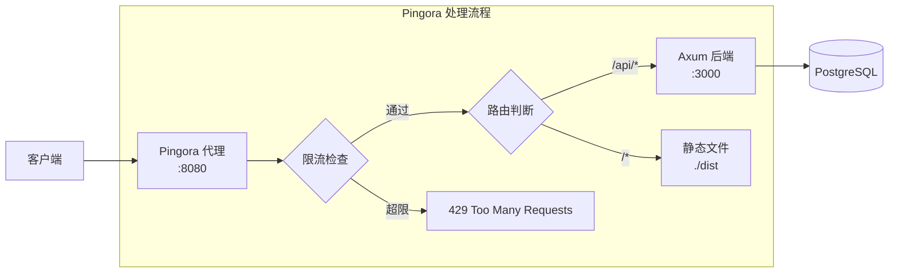
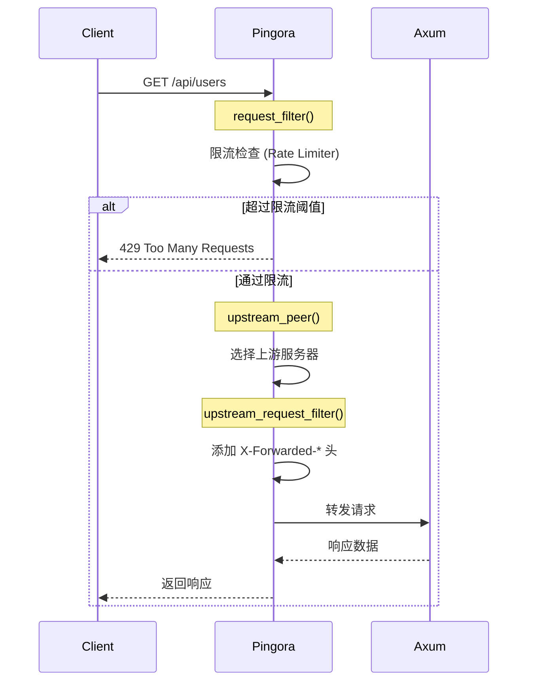
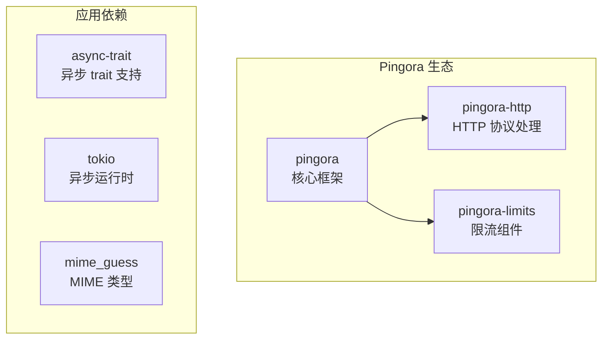
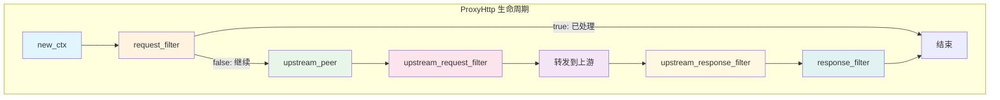
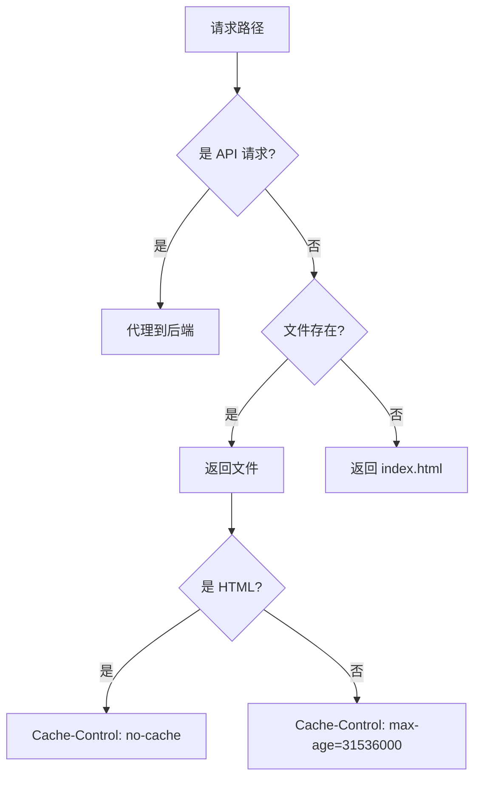
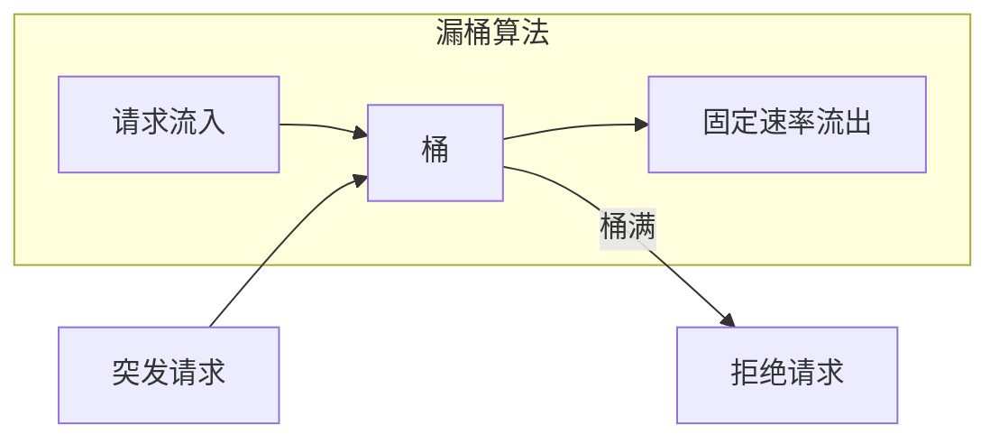
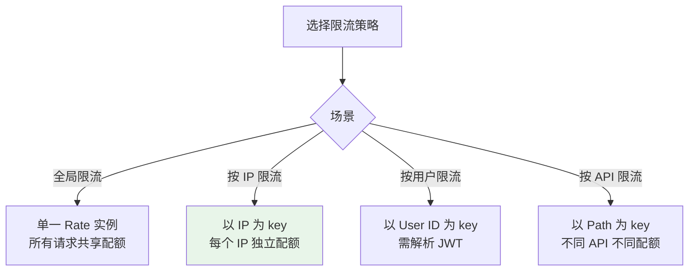
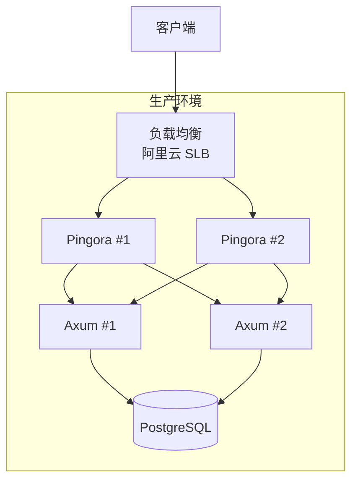

# Pingora 反向代理教程

Pingora 是 Cloudflare 开源的高性能 Rust 代理框架，用于替代 Nginx。本文档介绍如何使用 Pingora 构建反向代理服务。

## 目录

- [架构概览](#架构概览)
- [项目配置](#项目配置)
- [基础代理实现](#基础代理实现)
- [静态文件服务](#静态文件服务)
- [限流实现](#限流实现)
- [部署配置](#部署配置)

## 架构概览



### 请求处理流程



### 与 Nginx 对比

| 特性 | Pingora | Nginx |
|------|---------|-------|
| 语言 | Rust | C |
| 内存安全 | 编译时保证 | 需要手动管理 |
| 配置方式 | 代码 | 配置文件 |
| 自定义逻辑 | 原生支持 | 需要 Lua/C 模块 |
| 性能 | 极高 | 高 |
| 热重载 | 支持 | 支持 |

## 项目配置

### Cargo.toml

```toml
[package]
name = "stitchwork-proxy"
version = "0.1.0"
edition = "2021"

[[bin]]
name = "stitchwork-proxy"
path = "src/main.rs"

[dependencies]
# Pingora 核心
pingora = { version = "0.6", features = ["proxy"] }
pingora-http = "0.6"
pingora-limits = "0.6"  # 限流支持

# 异步运行时
async-trait = "0.1"
tokio = { version = "1", features = ["full"] }

# 日志
tracing = "0.1"
tracing-subscriber = "0.3"

# 工具库
mime_guess = "2"  # MIME 类型推断
bytes = "1"
http = "1"
```

### 依赖说明



## 基础代理实现

### 核心结构

```rust
use async_trait::async_trait;
use pingora::prelude::*;
use pingora::proxy::{http_proxy_service, ProxyHttp, Session};
use pingora::upstreams::peer::HttpPeer;
use std::path::PathBuf;

/// 请求上下文 - 在请求生命周期内传递数据
pub struct RequestCtx {
    /// 标记是否为静态文件请求
    is_static: bool,
}

/// 代理服务主结构
pub struct StitchWorkProxy {
    /// 后端 API 服务器地址 (如 "127.0.0.1:3000")
    api_addr: String,
    /// 静态文件目录
    static_dir: PathBuf,
}
```

### ProxyHttp Trait

Pingora 的核心是 `ProxyHttp` trait，定义了请求处理的各个阶段：



### 实现 ProxyHttp

```rust
#[async_trait]
impl ProxyHttp for StitchWorkProxy {
    type CTX = RequestCtx;

    /// 创建请求上下文
    fn new_ctx(&self) -> Self::CTX {
        RequestCtx { is_static: false }
    }

    /// 请求过滤器 - 第一个处理阶段
    /// 返回 Ok(true) 表示请求已处理完毕，不再继续
    /// 返回 Ok(false) 表示继续代理流程
    async fn request_filter(
        &self,
        session: &mut Session,
        ctx: &mut Self::CTX,
    ) -> Result<bool> {
        let path = session.req_header().uri.path();

        // API 请求交给上游处理
        if path.starts_with("/api") || path == "/health" {
            return Ok(false);
        }

        // 静态文件在这里直接处理
        ctx.is_static = true;
        // ... 处理静态文件
        Ok(true)
    }

    /// 选择上游服务器
    async fn upstream_peer(
        &self,
        _session: &mut Session,
        _ctx: &mut Self::CTX,
    ) -> Result<Box<HttpPeer>> {
        // 创建 HTTP peer，参数: (地址, 是否 TLS, SNI)
        let peer = HttpPeer::new(&self.api_addr, false, String::new());
        Ok(Box::new(peer))
    }

    /// 上游请求过滤器 - 修改发送给上游的请求
    async fn upstream_request_filter(
        &self,
        session: &mut Session,
        upstream_request: &mut pingora_http::RequestHeader,
        _ctx: &mut Self::CTX,
    ) -> Result<()> {
        // 添加代理头
        upstream_request.insert_header("X-Forwarded-Proto", "http")?;

        // 转发客户端 IP
        if let Some(addr) = session.client_addr() {
            upstream_request.insert_header("X-Forwarded-For", addr.to_string())?;
            upstream_request.insert_header("X-Real-IP", addr.to_string())?;
        }

        Ok(())
    }
}
```

### 启动服务

```rust
fn main() {
    tracing_subscriber::fmt::init();

    // 创建 Pingora 服务器
    let mut server = Server::new(None).unwrap();
    server.bootstrap();

    // 配置
    let api_addr = std::env::var("API_ADDR")
        .unwrap_or_else(|_| "127.0.0.1:3000".to_string());
    let listen_addr = std::env::var("LISTEN_ADDR")
        .unwrap_or_else(|_| "0.0.0.0:8080".to_string());
    let static_dir = std::env::var("STATIC_DIR")
        .unwrap_or_else(|_| "./dist".to_string());

    // 创建代理服务
    let proxy = StitchWorkProxy::new(&api_addr, PathBuf::from(static_dir));
    let mut proxy_service = http_proxy_service(&server.configuration, proxy);
    proxy_service.add_tcp(&listen_addr);

    server.add_service(proxy_service);

    tracing::info!("Proxy server running on http://{}", listen_addr);
    server.run_forever();
}
```

## 静态文件服务

### SPA 路由处理

对于单页应用 (SPA)，需要特殊处理：
- 存在的静态文件直接返回
- 不存在的路径返回 `index.html`（前端路由）



### 实现代码

```rust
impl StitchWorkProxy {
    /// 读取静态文件
    async fn read_static_file(&self, path: &str) -> Option<(Bytes, &'static str)> {
        // 规范化路径，防止目录遍历攻击
        let req_path = path.trim_start_matches('/');
        let file_path = if req_path.is_empty() {
            self.static_dir.join("index.html")
        } else {
            self.static_dir.join(req_path)
        };

        // 安全检查：确保路径在 static_dir 内
        let canonical = match file_path.canonicalize() {
            Ok(p) => p,
            Err(_) => {
                // 文件不存在，SPA 模式返回 index.html
                return self.read_index_html().await;
            }
        };

        let static_canonical = self.static_dir.canonicalize().ok()?;

        // 防止路径遍历攻击 (如 ../../etc/passwd)
        if !canonical.starts_with(&static_canonical) {
            tracing::warn!("Path traversal attempt: {}", path);
            return None;
        }

        self.read_file(&canonical).await
    }

    /// 读取文件并推断 MIME 类型
    async fn read_file(&self, path: &PathBuf) -> Option<(Bytes, &'static str)> {
        let content = tokio::fs::read(path).await.ok()?;
        let mime = mime_guess::from_path(path)
            .first_raw()
            .unwrap_or("application/octet-stream");
        Some((Bytes::from(content), mime))
    }
}
```

### 响应静态文件

```rust
// 在 request_filter 中处理静态文件
match self.read_static_file(path).await {
    Some((content, content_type)) => {
        let mut header = pingora_http::ResponseHeader::build(
            StatusCode::OK,
            None
        )?;

        header.insert_header("Content-Type", content_type)?;
        header.insert_header("Content-Length", content.len().to_string())?;

        // 缓存策略：HTML 不缓存，其他资源长期缓存
        if content_type == "text/html" {
            header.insert_header("Cache-Control", "no-cache")?;
        } else {
            header.insert_header("Cache-Control", "public, max-age=31536000")?;
        }

        session.write_response_header(Box::new(header), false).await?;
        session.write_response_body(Some(content), true).await?;

        Ok(true) // 请求已处理
    }
    None => {
        // 404 响应
        let mut header = pingora_http::ResponseHeader::build(
            StatusCode::NOT_FOUND,
            None
        )?;
        header.insert_header("Content-Type", "text/plain")?;

        let body = Bytes::from("404 Not Found");
        header.insert_header("Content-Length", body.len().to_string())?;

        session.write_response_header(Box::new(header), false).await?;
        session.write_response_body(Some(body), true).await?;

        Ok(true)
    }
}
```

## 限流实现

### 限流原理

Pingora 使用 **Leaky Bucket（漏桶）** 算法实现限流：



| 参数 | 说明 | 示例值 |
|------|------|--------|
| 时间窗口 | 统计周期 | 1 秒 |
| 速率限制 | 每秒最大请求数 | 10 |
| 突发上限 | 允许的瞬时峰值 | 30 |

### 实现代码

```rust
use pingora_limits::rate::Rate;
use std::sync::Arc;
use std::time::Duration;

/// 全局限流器
/// Rate::new(Duration) 创建一个漏桶，参数为时间窗口
static RATE_LIMITER: std::sync::LazyLock<Arc<Rate>> =
    std::sync::LazyLock::new(|| Arc::new(Rate::new(Duration::from_secs(1))));

// 在 request_filter 中使用
async fn request_filter(
    &self,
    session: &mut Session,
    ctx: &mut Self::CTX,
) -> Result<bool> {
    let path = session.req_header().uri.path();

    // 仅对 API 请求限流
    if self.is_api_request(path) {
        // 获取客户端 IP 作为限流 key
        let client_ip = session
            .client_addr()
            .map(|a| a.to_string())
            .unwrap_or_else(|| "unknown".to_string());

        // observe(key, count) 返回当前窗口内的请求数
        let curr_rate = RATE_LIMITER.observe(&client_ip, 1);

        if curr_rate > 30 {
            tracing::warn!(
                "Rate limit exceeded for {}: {} req/s",
                client_ip,
                curr_rate
            );

            // 返回 429 Too Many Requests
            let mut header = pingora_http::ResponseHeader::build(
                StatusCode::TOO_MANY_REQUESTS,
                None
            )?;
            header.insert_header("Content-Type", "application/json")?;
            header.insert_header("Retry-After", "1")?;

            let body = Bytes::from(r#"{"code":429,"message":"Too many requests"}"#);
            header.insert_header("Content-Length", body.len().to_string())?;

            session.write_response_header(Box::new(header), false).await?;
            session.write_response_body(Some(body), true).await?;

            return Ok(true); // 请求已处理
        }

        return Ok(false); // 继续代理
    }

    // ... 静态文件处理
}
```

### 限流策略选择



当前实现使用 **按 IP 限流**，每个 IP 独立计算配额。

## 部署配置

### 环境变量

| 变量 | 说明 | 默认值 |
|------|------|--------|
| `LISTEN_ADDR` | 代理监听地址 | `0.0.0.0:8080` |
| `API_ADDR` | 后端 API 地址 | `127.0.0.1:3000` |
| `STATIC_DIR` | 静态文件目录 | `./dist` |

### Systemd 服务

```ini
# /etc/systemd/system/stitchwork-proxy.service
[Unit]
Description=StitchWork Proxy
After=network.target

[Service]
Type=simple
User=www-data
Environment=LISTEN_ADDR=0.0.0.0:8080
Environment=API_ADDR=127.0.0.1:3000
Environment=STATIC_DIR=/opt/stitchwork/dist
ExecStart=/opt/stitchwork/stitchwork-proxy
Restart=always
RestartSec=5

[Install]
WantedBy=multi-user.target
```

### 生产部署架构



### CI/CD 构建

使用 musl 静态链接，生成无依赖的可执行文件：

```yaml
# .github/workflows/proxy.yml
- name: Build release
  run: cargo build --release --target x86_64-unknown-linux-musl -p stitchwork-proxy
  env:
    CC_x86_64_unknown_linux_musl: clang
    CXX_x86_64_unknown_linux_musl: clang++
    AR_x86_64_unknown_linux_musl: llvm-ar
    CARGO_TARGET_X86_64_UNKNOWN_LINUX_MUSL_RUSTFLAGS: "-C linker=rust-lld"
```

## 常见问题

### Q: Pingora vs Nginx，什么时候用 Pingora？

| 场景 | 推荐 |
|------|------|
| 简单反向代理 | Nginx（配置更简单） |
| 需要复杂自定义逻辑 | Pingora（代码更灵活） |
| 极致性能要求 | Pingora |
| 团队熟悉 Rust | Pingora |
| 需要快速部署 | Nginx |

### Q: 如何添加 HTTPS 支持？

```rust
// 使用 TLS
let mut tls_settings = pingora::listeners::TlsSettings::intermediate(
    "/path/to/cert.pem",
    "/path/to/key.pem",
)?;
proxy_service.add_tls(&listen_addr, tls_settings);
```

### Q: 如何实现健康检查？

```rust
// 在 request_filter 中添加
if path == "/health" || path == "/ping" {
    let mut header = pingora_http::ResponseHeader::build(StatusCode::OK, None)?;
    header.insert_header("Content-Type", "text/plain")?;

    let body = Bytes::from("OK");
    header.insert_header("Content-Length", body.len().to_string())?;

    session.write_response_header(Box::new(header), false).await?;
    session.write_response_body(Some(body), true).await?;

    return Ok(true);
}
```

## 参考资料

- [Pingora GitHub](https://github.com/cloudflare/pingora)
- [Pingora 官方文档](https://github.com/cloudflare/pingora/tree/main/docs)
- [Cloudflare 博客：我们如何用 Rust 重写代理](https://blog.cloudflare.com/how-we-built-pingora-the-proxy-that-connects-cloudflare-to-the-internet/)
