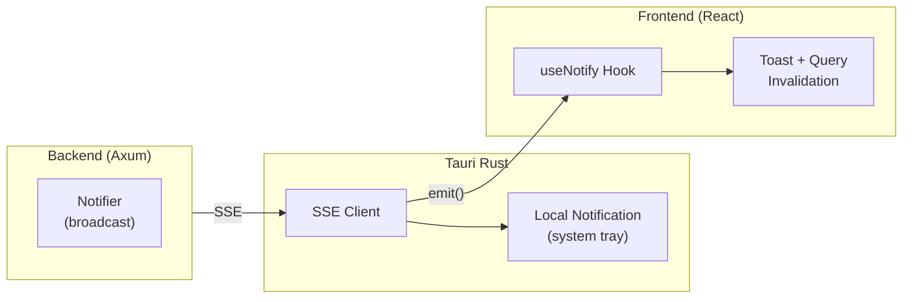
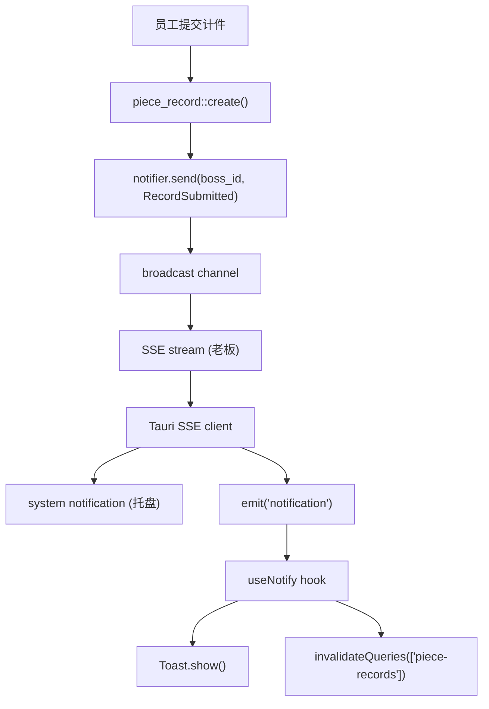

# 实时通知系统实现

基于 SSE (Server-Sent Events) 实现的实时消息推送系统，用于计件审批、工资发放等业务场景的即时通知。

## 架构概览



**为什么用 Rust SSE 客户端而不是前端 JS？**

- App 后台时 WebView 可能暂停，Rust 层持续运行
- 可直接调用系统通知 API（`tauri-plugin-notification`）
- 自动重连逻辑更可控

## 通知类型

```rust
pub enum Notification {
    RecordSubmitted { user_name, process_name, quantity }  // 员工提交 → 老板
    RecordApproved { process_name, quantity, amount }      // 老板通过 → 员工
    RecordRejected { process_name, quantity }              // 老板拒绝 → 员工
    PayrollReceived { amount }                             // 发工资 → 员工
}
```

## 后端实现

### 1. Notifier 服务 (`server/src/service/notification/mod.rs`)

使用 `DashMap` + `tokio::broadcast` 管理多用户订阅：

```rust
pub struct Notifier {
    channels: DashMap<Uuid, broadcast::Sender<Notification>>,
}

impl Notifier {
    /// 用户订阅 - SSE 连接时调用
    pub fn subscribe(&self, user_id: Uuid) -> broadcast::Receiver<Notification> {
        self.channels
            .entry(user_id)
            .or_insert_with(|| broadcast::channel(16).0)
            .subscribe()
    }

    /// 发送通知
    pub fn send(&self, user_id: Uuid, notification: Notification) {
        if let Some(sender) = self.channels.get(&user_id) {
            let _ = sender.send(notification);
        }
    }
}
```

**关键点：**
- 每个用户一个 broadcast channel，容量 16
- 懒初始化：首次订阅时创建 channel
- `send()` 忽略无订阅者的情况（用户不在线）

### 2. SSE 端点 (`server/src/service/notification/controller.rs`)

```rust
/// GET /api/sse/events?token=<jwt>
async fn sse_events(
    State(state): State<Arc<AppState>>,
    Query(query): Query<SseQuery>,
) -> Result<Sse<impl Stream<Item = Result<Event, Infallible>>>, AppError> {
    // Token 验证（不走中间件，因为 EventSource 不支持自定义 Header）
    let claims = verify_token(&query.token)?;

    // 订阅通知
    let mut rx = state.notifier.subscribe(claims.sub);

    let stream = async_stream::stream! {
        loop {
            match rx.recv().await {
                Ok(notification) => {
                    yield Ok(Event::default().data(json));
                }
                Err(RecvError::Lagged(_)) => continue,  // 消息积压，跳过
                Err(RecvError::Closed) => break,
            }
        }
    };

    // 30 秒心跳保活
    Ok(Sse::new(stream).keep_alive(
        KeepAlive::new().interval(Duration::from_secs(30)).text("ping")
    ))
}
```

**关键点：**
- Token 通过 Query 参数传递（EventSource 限制）
- 30 秒心跳防止连接超时
- `Lagged` 错误时跳过积压消息继续接收

### 3. 触发通知

在业务 Controller 中调用 `notifier.send()`：

```rust
// piece_record/controller.rs - 员工提交计件
pub async fn create(...) {
    let record = service::create(db, dto, claims.sub).await?;

    // 通知老板
    state.notifier.send(record.boss_id, Notification::RecordSubmitted {
        user_name: claims.display_name.clone(),
        process_name: process.name.clone(),
        quantity: record.quantity,
    });
}

// piece_record/controller.rs - 老板审批
pub async fn approve(...) {
    let record = service::approve(db, id, claims.sub).await?;

    // 通知员工
    state.notifier.send(record.user_id, Notification::RecordApproved { ... });
}
```

## Tauri 客户端

### SSE 客户端 (`src-tauri/src/sse.rs`)

```rust
async fn start_sse(app_handle, api_url, token, cancel_rx) {
    let url = format!("{}/api/sse/events?token={}", api_url, token);

    loop {
        let mut es = EventSource::get(&url);

        loop {
            tokio::select! {
                // 监听取消信号
                _ = cancel_rx.changed() => { return; }

                // 接收 SSE 事件
                event = es.next() => {
                    match event {
                        Some(Ok(Event::Message(msg))) => {
                            // 1. 发送系统通知
                            app_handle.notification()
                                .builder()
                                .title(&payload.title)
                                .body(&payload.body)
                                .show();

                            // 2. 通知前端
                            app_handle.emit("notification", &payload);
                        }
                        Some(Err(_)) => break,  // 错误，退出内层循环
                        None => break,          // 流结束
                    }
                }
            }
        }

        // 5 秒后重连
        tokio::time::sleep(Duration::from_secs(5)).await;
    }
}
```

**关键点：**
- 自动重连（5 秒间隔）
- `tokio::select!` 同时监听取消信号和 SSE 事件
- 双重通知：系统托盘 + 前端事件

### Tauri Commands

```rust
#[tauri::command]
pub async fn connect_sse(app_handle, state, api_url, token) -> Result<(), String>

#[tauri::command]
pub async fn disconnect_sse(state) -> Result<(), String>
```

## 前端集成

### useNotify Hook (`src/hooks/useNotify.ts`)

```typescript
export function useNotify() {
  const token = useAuthStore((s) => s.token);
  const queryClient = useQueryClient();

  useEffect(() => {
    if (!token) return;

    const setup = async () => {
      // 连接 SSE
      await invoke("connect_sse", { apiUrl, token });

      // 监听 Rust 层事件
      unlisten = await listen<NotificationPayload>("notification", (event) => {
        // 显示 Toast
        Toast.show({ content: event.payload.title });

        // 刷新相关查询
        switch (event.payload.type) {
          case "record_submitted":
            queryClient.invalidateQueries({ queryKey: ["piece-records"] });
            break;
          // ...
        }
      });
    };

    setup();
    return () => {
      invoke("disconnect_sse");
      unlisten?.();
    };
  }, [token]);
}
```

### 集成位置

在 `_auth.tsx` 布局组件中调用：

```tsx
function AuthLayout() {
  useNotify();  // 登录后自动启用
  return <Outlet />;
}
```

## 依赖

### 后端 (server/Cargo.toml)
```toml
dashmap = "6"
async-stream = "0.3"
```

### Tauri (src-tauri/Cargo.toml)
```toml
reqwest-eventsource = "0.6"
tokio = { version = "1", features = ["sync", "macros", "time"] }
log = "0.4"
```

### 前端
```bash
pnpm add @tauri-apps/plugin-notification
```

## 数据流



## 注意事项

1. **Token 安全**：SSE URL 包含 JWT，日志中注意脱敏
2. **重连策略**：当前固定 5 秒，可优化为指数退避
3. **消息丢失**：broadcast channel 容量 16，超出会 lag，当前策略是跳过
4. **Android 后台**：需要前台服务保持 App 活跃，否则可能被杀
