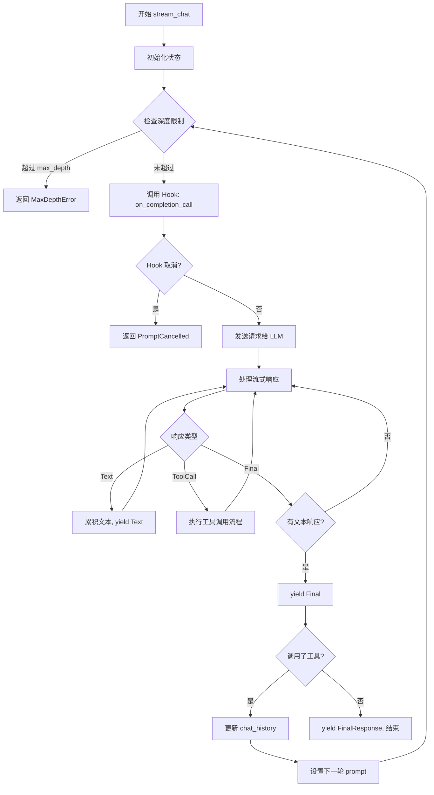
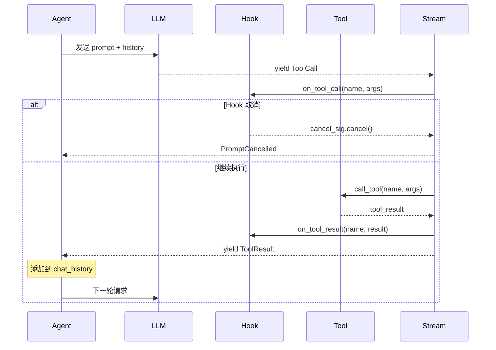
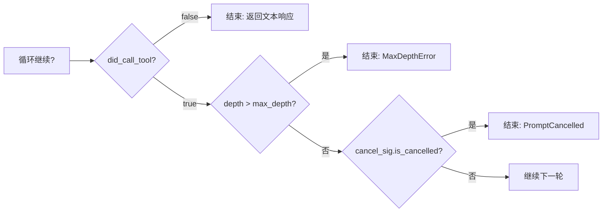
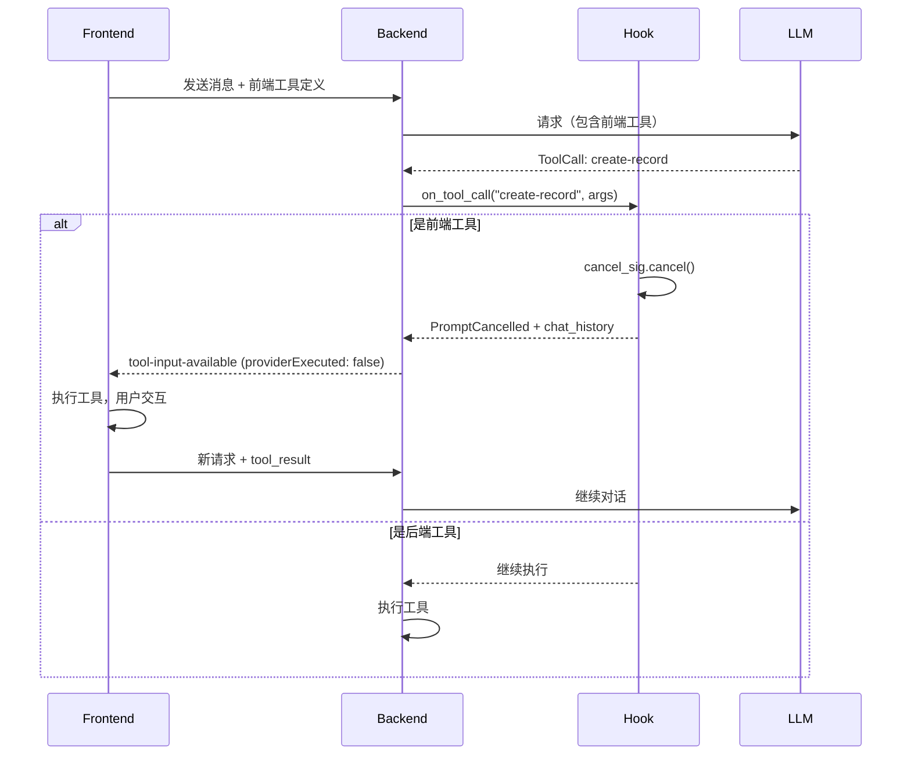
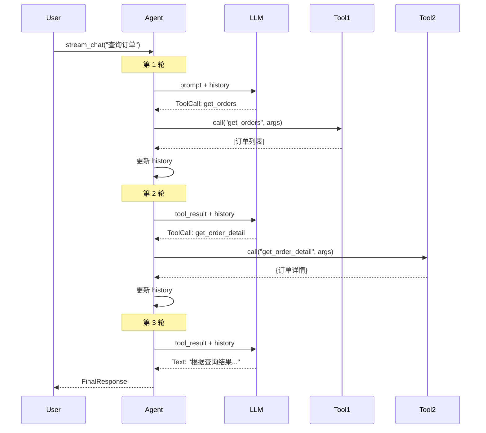

# rig Agent 多轮对话循环机制

本文档详细解析 rig 框架中 Agent 的 `stream_chat` 方法如何实现多轮工具调用循环。

## 1. 核心概念

### 1.1 Multi-Turn 机制

rig 的 Agent 支持多轮对话（multi-turn），即 LLM 可以连续调用多个工具，直到生成最终文本响应。

```rust
// 设置最大轮数
agent.stream_prompt("你的问题")
    .multi_turn(5)  // 最多 5 轮工具调用
    .await
```

### 1.2 关键数据结构

```rust
pub enum MultiTurnStreamItem<R> {
    /// 助手内容流（文本、工具调用等）
    StreamAssistantItem(StreamedAssistantContent<R>),
    /// 用户内容流（主要是工具结果）
    StreamUserItem(StreamedUserContent),
    /// 最终响应
    FinalResponse(FinalResponse),
}

pub enum StreamedAssistantContent<R> {
    Text(Text),              // 文本增量
    ToolCall(ToolCall),      // 完整工具调用
    ToolCallDelta { .. },    // 工具调用增量
    Reasoning(Reasoning),    // 推理内容
    Final(R),                // 流结束标记
}
```

## 2. 循环流程

### 2.1 整体流程图



### 2.2 工具调用详细流程



## 3. 源码解析

### 3.1 主循环结构

位置：`rig-core/src/agent/prompt_request/streaming.rs`

```rust
async fn send(self) -> StreamingResult<M::StreamingResponse> {
    let stream = async_stream::stream! {
        let mut current_prompt = prompt.clone();
        let mut did_call_tool = false;

        'outer: loop {
            // 1. 检查深度限制
            if current_max_depth > self.max_depth + 1 {
                max_depth_reached = true;
                break;
            }
            current_max_depth += 1;

            // 2. 调用 Hook: on_completion_call
            if let Some(ref hook) = self.hook {
                hook.on_completion_call(&current_prompt, &history, cancel_sig.clone()).await;
                if cancel_sig.is_cancelled() {
                    yield Err(PromptCancelled);
                }
            }

            // 3. 发送请求给 LLM
            let mut stream = agent
                .stream_completion(current_prompt.clone(), history.clone())
                .await?
                .stream()
                .await?;

            // 4. 将当前 prompt 加入历史
            chat_history.write().await.push(current_prompt.clone());

            let mut tool_calls = vec![];
            let mut tool_results = vec![];

            // 5. 处理流式响应
            while let Some(content) = stream.next().await {
                match content {
                    Ok(StreamedAssistantContent::Text(text)) => {
                        // 累积文本，调用 hook，yield 给调用者
                        last_text_response.push_str(&text.text);
                        hook.on_text_delta(&text.text, &last_text_response, cancel_sig).await;
                        yield Ok(MultiTurnStreamItem::stream_item(Text(text)));
                        did_call_tool = false;
                    },
                    Ok(StreamedAssistantContent::ToolCall(tool_call)) => {
                        // yield 工具调用事件
                        yield Ok(MultiTurnStreamItem::stream_item(ToolCall(tool_call)));

                        // 调用 hook: on_tool_call
                        hook.on_tool_call(&tool_call.function.name, tool_call.call_id, &args, cancel_sig).await;
                        if cancel_sig.is_cancelled() {
                            return Err(PromptCancelled);
                        }

                        // 执行工具
                        let tool_result = agent.tool_server_handle
                            .call_tool(&tool_call.function.name, &args)
                            .await;

                        // 调用 hook: on_tool_result
                        hook.on_tool_result(&name, call_id, &args, &result, cancel_sig).await;

                        // 收集工具调用和结果
                        tool_calls.push(AssistantContent::ToolCall(tool_call));
                        tool_results.push((id, call_id, tool_result));
                        did_call_tool = true;

                        // yield 工具结果
                        yield Ok(MultiTurnStreamItem::StreamUserItem(ToolResult(tr)));
                    },
                    Ok(StreamedAssistantContent::Final(final_resp)) => {
                        // 流结束
                        if is_text_response {
                            hook.on_stream_completion_response_finish(&prompt, &final_resp, cancel_sig).await;
                            yield Ok(MultiTurnStreamItem::stream_item(Final(final_resp)));
                        }
                    }
                    Err(e) => {
                        yield Err(e);
                        break 'outer;
                    }
                }
            }

            // 6. 更新 chat_history
            if !tool_calls.is_empty() {
                // 添加助手的工具调用消息
                chat_history.write().await.push(Message::Assistant {
                    content: OneOrMany::many(tool_calls),
                });
            }
            // 添加工具结果消息
            for (id, call_id, tool_result) in tool_results {
                chat_history.write().await.push(Message::User {
                    content: OneOrMany::one(UserContent::tool_result(id, result)),
                });
            }

            // 7. 设置下一轮 prompt
            current_prompt = chat_history.write().await.pop().unwrap();

            // 8. 检查是否结束
            if !did_call_tool {
                yield Ok(MultiTurnStreamItem::final_response(&last_text_response, usage));
                break;
            }
        }

        // 9. 处理深度超限
        if max_depth_reached {
            yield Err(MaxDepthError { .. });
        }
    };

    Box::pin(stream)
}
```

### 3.2 循环终止条件



## 4. StreamingPromptHook

Hook 允许在循环的各个阶段插入自定义逻辑：

```rust
pub trait StreamingPromptHook<M>: Clone + Send + Sync {
    /// 发送请求前调用
    fn on_completion_call(&self, prompt: &Message, history: &[Message], cancel_sig: CancelSignal);

    /// 收到文本增量时调用
    fn on_text_delta(&self, text_delta: &str, aggregated_text: &str, cancel_sig: CancelSignal);

    /// 收到工具调用增量时调用
    fn on_tool_call_delta(&self, tool_call_id: &str, tool_name: Option<&str>, delta: &str, cancel_sig: CancelSignal);

    /// 工具执行前调用 ⭐ 关键：可在此拦截前端工具
    fn on_tool_call(&self, tool_name: &str, tool_call_id: Option<String>, args: &str, cancel_sig: CancelSignal);

    /// 工具执行后调用
    fn on_tool_result(&self, tool_name: &str, tool_call_id: Option<String>, args: &str, result: &str, cancel_sig: CancelSignal);

    /// 流式响应完成后调用
    fn on_stream_completion_response_finish(&self, prompt: &Message, response: &R, cancel_sig: CancelSignal);
}
```

### 4.1 CancelSignal 机制

```rust
pub struct CancelSignal {
    cancelled: Arc<AtomicBool>,
    reason: Arc<RwLock<Option<String>>>,
}

impl CancelSignal {
    /// 取消循环
    pub fn cancel(&self) {
        self.cancelled.store(true, Ordering::SeqCst);
    }

    /// 带原因取消
    pub fn cancel_with_reason(&self, reason: &str) {
        *self.reason.write().unwrap() = Some(reason.to_string());
        self.cancel();
    }

    /// 检查是否已取消
    pub fn is_cancelled(&self) -> bool {
        self.cancelled.load(Ordering::SeqCst)
    }
}
```

## 5. 前端工具拦截方案

利用 `on_tool_call` Hook 拦截前端工具：



### 5.1 实现示例

```rust
#[derive(Clone)]
pub struct FrontendToolHook {
    frontend_tools: HashSet<String>,
    pending_call: Arc<Mutex<Option<PendingToolCall>>>,
}

impl<M: CompletionModel> StreamingPromptHook<M> for FrontendToolHook {
    fn on_tool_call(
        &self,
        tool_name: &str,
        tool_call_id: Option<String>,
        args: &str,
        cancel_sig: CancelSignal,
    ) -> impl Future<Output = ()> + Send {
        async move {
            if self.frontend_tools.contains(tool_name) {
                // 保存工具调用信息
                *self.pending_call.lock().unwrap() = Some(PendingToolCall {
                    tool_call_id,
                    tool_name: tool_name.to_string(),
                    args: args.to_string(),
                });
                // 取消循环
                cancel_sig.cancel_with_reason("Frontend tool call");
            }
        }
    }
}
```

## 6. 关键时序



## 7. 总结

| 阶段 | 说明 |
|------|------|
| 初始化 | 创建 `StreamingPromptRequest`，设置 `max_depth` |
| 循环开始 | 检查深度，调用 `on_completion_call` |
| LLM 请求 | `stream_completion` 发送请求 |
| 响应处理 | 根据类型分发：Text/ToolCall/Final |
| 工具执行 | `on_tool_call` → 执行 → `on_tool_result` |
| 历史更新 | 添加 Assistant 消息和 User 工具结果 |
| 循环判断 | `did_call_tool` 决定是否继续 |
| 结束 | 返回 `FinalResponse` 或错误 |
