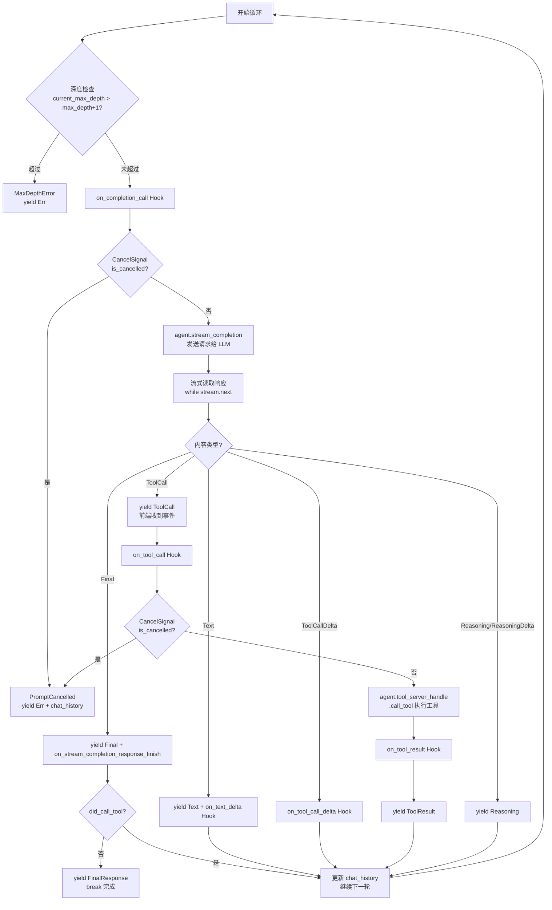

# rig StreamingPromptRequest 源码分析

> 分析 `rig-core/src/agent/prompt_request/streaming.rs` 的实现
> 版本：rig-core 0.28.0

---

## 概述

`StreamingPromptRequest` 是 rig 中负责流式多轮对话的核心组件。它处理 LLM 流式响应、工具调用循环、以及通过 Hook 机制支持自定义拦截逻辑。

---

## 核心类型

### 1. MultiTurnStreamItem - 流式输出事件类型

```rust
#[derive(Deserialize, Serialize, Debug, Clone)]
#[serde(tag = "type", rename_all = "camelCase")]
pub enum MultiTurnStreamItem<R> {
    /// 助手内容（文本、工具调用、推理等）
    StreamAssistantItem(StreamedAssistantContent<R>),
    /// 用户内容（主要是工具结果）
    StreamUserItem(StreamedUserContent),
    /// 最终响应（聚合的文本 + token 使用量）
    FinalResponse(FinalResponse),
}
```

### 2. StreamingPromptRequest - 流式请求构建器

```rust
pub struct StreamingPromptRequest<M, P>
where
    M: CompletionModel,              // 模型类型
    P: StreamingPromptHook<M>,       // Hook 类型（泛型，支持不同 Hook 实现）
{
    prompt: Message,                 // 当前 prompt
    chat_history: Option<Vec<Message>>, // 聊天历史
    max_depth: usize,                // 最大轮次（防止无限工具调用循环）
    agent: Arc<Agent<M>>,            // Agent 实例
    hook: Option<P>,                 // Hook（可选，用于拦截事件）
}
```

---

## 核心方法

### 构建器方法

| 方法 | 说明 |
|------|------|
| `new(agent, prompt)` | 创建新请求 |
| `multi_turn(depth)` | 设置最大轮次（默认 0，意味着只允许 1 次工具调用） |
| `with_history(history)` | 添加聊天历史 |
| `with_hook(hook)` | 添加 Hook（会改变泛型参数 P） |

### send() - 核心执行逻辑

这是整个文件的核心，使用 `async_stream::stream!` 生成流式响应。

---

## 执行流程图



---

## 关键代码解析

### 1. Hook 调用时机 - on_tool_call

**位置**：`streaming.rs` 第 289-357 行

```rust
// ⚠️ 关键顺序：先 yield ToolCall 事件，再调用 Hook

// 1. 先 yield ToolCall - 前端会立即收到
yield Ok(MultiTurnStreamItem::stream_item(StreamedAssistantContent::ToolCall(tool_call.clone())));

// 2. 然后调用 Hook - 可以在这里拦截
if let Some(ref hook) = self.hook {
    hook.on_tool_call(&tool_call.function.name, tool_call.call_id.clone(), &tool_args, cancel_sig.clone()).await;
    if cancel_sig.is_cancelled() {
        // 返回 PromptCancelled，包含当前 chat_history
        return Err(StreamingError::Prompt(PromptError::prompt_cancelled(
            chat_history.read().await.to_vec(),
            cancel_sig.cancel_reason().unwrap_or("<no reason given>"),
        ).into()));
    }
}

// 3. 最后才执行工具（如果没取消）
let tool_result = agent.tool_server_handle.call_tool(&tool_call.function.name, &tool_args).await;
```

**含义**：
- 前端在 Hook 执行前就收到了 `ToolCall` 事件
- Hook 可以调用 `cancel_sig.cancel()` 中断循环
- 中断后返回 `PromptCancelled` 错误，附带完整的 `chat_history`

### 2. Chat History 更新机制

**位置**：`streaming.rs` 第 408-434 行

```rust
// 1. 将工具调用添加到历史（作为 Assistant 消息）
if !tool_calls.is_empty() {
    chat_history.write().await.push(Message::Assistant {
        id: None,
        content: OneOrMany::many(tool_calls.clone()).expect("Impossible EmptyListError"),
    });
}

// 2. 将工具结果添加到历史（作为 User 消息）
for (id, call_id, tool_result) in tool_results {
    if let Some(call_id) = call_id {
        chat_history.write().await.push(Message::User {
            content: OneOrMany::one(UserContent::tool_result_with_call_id(
                &id, call_id, OneOrMany::one(ToolResultContent::text(&tool_result)),
            )),
        });
    } else {
        chat_history.write().await.push(Message::User {
            content: OneOrMany::one(UserContent::tool_result(
                &id, OneOrMany::one(ToolResultContent::text(&tool_result)),
            )),
        });
    }
}

// 3. 准备下一轮：最后一条消息作为新的 prompt
current_prompt = match chat_history.write().await.pop() {
    Some(prompt) => prompt,
    None => unreachable!("Chat history should never be empty at this point"),
};
```

**Chat History 的结构**：
```
[
    User: "用户消息",
    Assistant: ToolCall(...),
    User: ToolResult(...),
    Assistant: "LLM 的文本响应",
    User: ToolCall(...) ← 当前循环的 prompt
]
```

### 3. 循环退出条件

**位置**：`streaming.rs` 第 442-449 行

```rust
if !did_call_tool {
    // 没有调用工具 = LLM 直接返回了文本响应
    tracing::info!("Agent multi-turn stream finished");
    yield Ok(MultiTurnStreamItem::final_response(&last_text_response, aggregated_usage));
    break;  // 退出循环
}
// 否则继续下一轮（用工具结果继续对话）
```

**退出条件**：
1. `did_call_tool == false`：LLM 返回文本，不再调用工具
2. `max_depth_reached == true`：达到最大轮次
3. 发生错误（CompletionError, PromptError, ToolError）

### 4. Span 上下文隔离

**位置**：`streaming.rs` 第 201-205 行

```rust
// NOTE: We use .instrument(agent_span) instead of span.enter() to avoid
// span context leaking to other concurrent tasks. Using span.enter() inside
// async_stream::stream! holds the guard across yield points, which causes
// thread-local span context to leak when other tasks run on the same thread.
let stream = async_stream::stream! {
    // ...
}.instrument(agent_span);
```

**为什么不用 `span.enter()`**：
- `async_stream::stream!` 的 `yield` 会暂停执行
- 如果用 `enter()`，guard 跨越 yield 点，span 上下文会泄漏到其他并发任务
- 用 `.instrument()` 则不会，span 只在当前流内部有效

---

## StreamingPromptHook Trait

**位置**：`streaming.rs` 第 516-590 行

```rust
pub trait StreamingPromptHook<M>: Clone + Send + Sync
where
    M: CompletionModel,
{
    /// 发送 prompt 给模型前调用
    fn on_completion_call(
        &self, prompt: &Message, history: &[Message], cancel_sig: CancelSignal,
    ) -> impl Future<Output = ()> + Send;

    /// 收到文本增量时调用
    fn on_text_delta(
        &self, text_delta: &str, aggregated_text: &str, cancel_sig: CancelSignal,
    ) -> impl Future<Output = ()> + Send;

    /// 收到工具调用增量时调用
    /// tool_name 在第一次 delta 时是 Some，之后是 None
    fn on_tool_call_delta(
        &self, tool_call_id: &str, tool_name: Option<&str>,
        tool_call_delta: &str, cancel_sig: CancelSignal,
    ) -> impl Future<Output = ()> + Send;

    /// 工具执行前调用 ✅ 关键：可在此拦截前端工具
    fn on_tool_call(
        &self, tool_name: &str, tool_call_id: Option<String>,
        args: &str, cancel_sig: CancelSignal,
    ) -> impl Future<Output = ()> + Send;

    /// 工具执行后调用
    fn on_tool_result(
        &self, tool_name: &str, tool_call_id: Option<String>,
        args: &str, result: &str, cancel_sig: CancelSignal,
    ) -> impl Future<Output = ()> + Send;

    /// 流式响应完成后调用
    fn on_stream_completion_response_finish(
        &self, prompt: &Message,
        response: &<M as CompletionModel>::StreamingResponse,
        cancel_sig: CancelSignal,
    ) -> impl Future<Output = ()> + Send;
}

impl<M> StreamingPromptHook<M> for () where M: CompletionModel {}
```

**设计要点**：
1. 所有方法默认返回空 async `{}`，用户按需实现
2. 每个方法都接收 `CancelSignal`，可以随时取消
3. 方法返回 `impl Future<Output = ()> + Send`，支持异步

---

## CancelSignal 机制

**位置**：`agent/src/agent.rs`（未在 streaming.rs 中定义，但广泛使用）

```rust
// 创建 CancelSignal
let cancel_sig = CancelSignal::new();

// 在 Hook 中检查并取消
if cancel_sig.is_cancelled() {
    yield Err(StreamingError::Prompt(PromptError::prompt_cancelled(
        chat_history.read().await.to_vec(),
        cancel_sig.cancel_reason().unwrap_or("<no reason given>"),
    ).into()));
}

// 调用方取消
cancel_sig.cancel("frontend_tool");
```

**CancelSignal 的作用**：
1. 允许 Hook 中断 agent 循环
2. 中断后返回 `PromptCancelled` 错误
3. 错误附带 `chat_history`，可以继续下一轮对话
4. 支持设置取消原因（`cancel_reason`）

---

## 对于前端工具的意义

基于 `StreamingPromptRequest` 的流程，实现前端工具的关键点：

### 完整流程

```
1. 前端发送 prompt + tools 定义
   ↓
2. 后端创建 agent，注册前端工具（FrontendTool）
   ↓
3. agent.stream_chat() 发送请求给 LLM
   ↓
4. LLM 返回 ToolCall (create-record)
   ↓
5. rig 先 yield ToolCall 事件 → 前端收到
   ↓
6. FrontendToolHook.on_tool_call() 检测到是前端工具
   ↓
7. Hook 调用 cancel_sig.cancel("frontend_tool")
   ↓
8. 循环中断，返回 PromptCancelled + chat_history
   ↓
9. 适配层检测到 PromptCancelled
   ↓
10. 发送 tool-input-available (providerExecuted: false) 给前端
   ↓
11. 前端执行工具、用户交互
   ↓
12. 前端发送新请求，包含 tool_result
   ↓
13. 后端继续对话（chat_history 已包含 tool_call）
```

### Hook 实现示例

```rust
use rig::agent::{StreamingPromptHook, CancelSignal};

#[derive(Debug, Clone)]
pub struct FrontendToolHook {
    /// 前端工具名称集合
    frontend_tools: std::collections::HashSet<String>,
}

impl<M> StreamingPromptHook<M> for FrontendToolHook
where
    M: rig::completion::CompletionModel,
{
    async fn on_tool_call(
        &self,
        tool_name: &str,
        _tool_call_id: Option<String>,
        _args: &str,
        cancel_sig: CancelSignal,
    ) {
        if self.frontend_tools.contains(tool_name) {
            // 1. 前端已经收到 ToolCall 事件（因为先 yield 了）
            // 2. 中断循环，不执行后端工具
            cancel_sig.cancel("frontend_tool");
            // 3. 循环返回 PromptCancelled，包含 chat_history
        }
    }
}
```

### 使用 Hook

```rust
use rig::agent::Agent;

let stream = agent
    .stream_chat(prompt, chat_history)
    .await?
    .with_hook(FrontendToolHook::new(frontend_tools))
    .await?;
```

---

## 总结

`StreamingPromptRequest` 的关键设计：

1. **流式输出**：使用 `async_stream::stream!` 实现流式响应
2. **多轮对话**：自动处理工具调用循环和 chat_history 更新
3. **Hook 机制**：通过 `StreamingPromptHook` trait 支持自定义拦截
4. **Span 隔离**：使用 `.instrument()` 避免 span 上下文泄漏
5. **取消支持**：通过 `CancelSignal` 可以随时中断循环

这个设计使得实现前端工具变得简单：
- 只需要实现一个 `on_tool_call` Hook
- 检测到前端工具时调用 `cancel_sig.cancel()`
- 前端会在收到 ToolCall 后获取执行机会

---

## 参考资料

- [rig Documentation](https://docs.rig.rs/)
- [AI SDK Data Stream Protocol](https://sdk.vercel.ai/docs/ai-sdk-ui/stream-protocol)
- [assistant-ui Tools Guide](https://www.assistant-ui.com/docs/guides/Tools)
