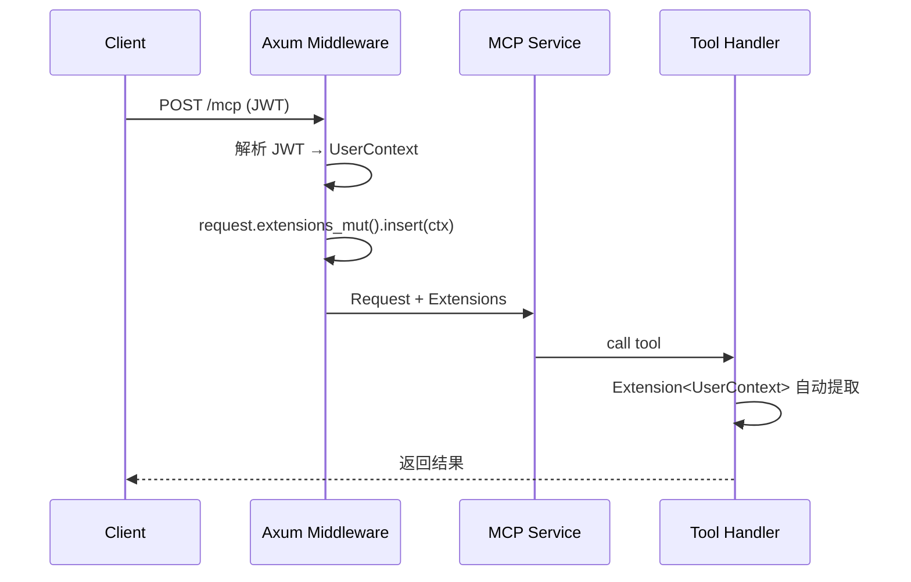

# rmcp 使用指南

rmcp 是 Rust 实现的 MCP (Model Context Protocol) SDK，用于构建 MCP Server。

## 安装

```toml
[dependencies]
rmcp = { version = "0.1", features = ["server", "macros", "transport-sse-server"] }
tokio = { version = "1", features = ["full"] }
serde = { version = "1.0", features = ["derive"] }
schemars = "0.8"
```

## MCP 三大核心功能

| 功能          | 用途       | 示例                             |
| ------------- | ---------- | -------------------------------- |
| **Tools**     | 执行操作   | 查询数据库、创建记录、调用 API   |
| **Resources** | 暴露数据   | 文件内容、配置信息、动态数据     |
| **Prompts**   | 预定义模板 | 常用对话模板、操作引导           |

## Tools

Tools 是 MCP 最常用的功能，让 LLM 能够执行操作。

### 定义 Tool

```rust
use rmcp::prelude::*;
use serde::{Deserialize, Serialize};
use schemars::JsonSchema;

#[derive(Debug, Serialize, Deserialize, JsonSchema)]
struct QueryOrdersArgs {
    /// 客户名称（可选）
    customer: Option<String>,
    /// 订单状态
    status: Option<String>,
}

#[derive(Clone)]
struct MyServer {
    db: DatabaseConnection,
}

#[tool_router]
impl MyServer {
    #[tool(description = "查询订单列表")]
    async fn query_orders(&self, args: Parameters<QueryOrdersArgs>) -> Result<String, String> {
        let orders = Order::find()
            .apply_if(args.customer.as_ref(), |q, c| q.filter(Column::Customer.contains(c)))
            .all(&self.db)
            .await
            .map_err(|e| e.to_string())?;

        serde_json::to_string(&orders).map_err(|e| e.to_string())
    }

    #[tool(description = "创建计件记录")]
    async fn create_piece_record(
        &self,
        args: Parameters<CreatePieceRecordArgs>,
    ) -> Result<String, String> {
        // 实现逻辑
        Ok("创建成功".to_string())
    }
}
```

### Tool 返回结构化数据

```rust
use rmcp::handler::server::tool::Json;

#[derive(Serialize, Deserialize, JsonSchema)]
struct OrderResult {
    id: Uuid,
    customer: String,
    total: i32,
}

#[tool(description = "查询订单详情")]
async fn get_order(&self, args: Parameters<GetOrderArgs>) -> Result<Json<OrderResult>, String> {
    let order = Order::find_by_id(args.id).one(&self.db).await?;
    Ok(Json(OrderResult { ... }))
}
```

### Tool 注解

```rust
#[tool(
    name = "query_orders",           // 自定义名称（默认用函数名）
    description = "查询订单列表",
    annotations(
        title = "订单查询",          // 显示标题
        read_only_hint = true,       // 只读提示
        destructive_hint = false,    // 破坏性操作提示
    )
)]
```

## Resources

Resources 用于暴露数据给 LLM，支持静态 URI 和动态 URI 模板。

### 静态资源

```rust
#[resource_router]
impl MyServer {
    /// 返回应用使用指南
    #[resource(
        uri = "guide://user-guide",
        name = "用户使用指南",
        description = "StitchWork 应用使用说明",
        mime_type = "text/markdown"
    )]
    async fn user_guide(&self) -> Result<String, McpError> {
        std::fs::read_to_string("docs/user-guide.md")
            .map_err(|e| McpError::internal(e.to_string()))
    }
}
```

### 动态资源模板

```rust
#[resource_router]
impl MyServer {
    /// 获取指定订单详情
    #[resource(
        uri_template = "order://{id}",
        name = "订单详情",
        description = "获取指定订单的完整信息"
    )]
    async fn order_detail(&self, id: String) -> Result<String, McpError> {
        let uuid = Uuid::parse_str(&id).map_err(|e| McpError::invalid_params(e.to_string()))?;
        let order = Order::find_by_id(uuid)
            .one(&self.db)
            .await
            .map_err(|e| McpError::internal(e.to_string()))?;

        serde_json::to_string_pretty(&order)
            .map_err(|e| McpError::internal(e.to_string()))
    }

    /// 获取员工计件汇总
    #[resource(
        uri_template = "employee://{id}/summary",
        name = "员工计件汇总"
    )]
    async fn employee_summary(&self, id: String) -> Result<String, McpError> {
        // 实现逻辑
    }
}
```

### 资源内容类型

```rust
use rmcp::model::{ResourceContents, TextResourceContents, BlobResourceContents};

// 文本内容
#[resource(uri = "config://app")]
async fn app_config(&self) -> Result<TextResourceContents, McpError> {
    Ok(TextResourceContents {
        uri: "config://app".to_string(),
        mime_type: Some("application/json".to_string()),
        text: serde_json::to_string(&self.config)?,
    })
}

// 二进制内容（Base64）
#[resource(uri_template = "image://{id}")]
async fn get_image(&self, id: String) -> Result<BlobResourceContents, McpError> {
    let data = std::fs::read(format!("images/{}.png", id))?;
    Ok(BlobResourceContents {
        uri: format!("image://{}", id),
        mime_type: Some("image/png".to_string()),
        blob: base64::encode(&data),
    })
}
```

## Prompts

Prompts 是预定义的对话模板，帮助用户快速开始特定任务。

```rust
#[prompt_router]
impl MyServer {
    #[prompt(
        name = "daily_report",
        description = "生成每日工作报告"
    )]
    async fn daily_report(&self, args: Parameters<DailyReportArgs>) -> Result<GetPromptResult, McpError> {
        Ok(GetPromptResult {
            description: Some("每日工作报告".to_string()),
            messages: vec![
                PromptMessage {
                    role: Role::User,
                    content: Content::text(format!(
                        "请帮我生成 {} 的工作报告，包括：\n1. 今日完成的订单\n2. 计件统计\n3. 待处理事项",
                        args.date
                    )),
                }
            ],
        })
    }
}
```

## Server 配置

### 启用功能

```rust
use rmcp::model::ServerCapabilities;

impl ServerHandler for MyServer {
    fn get_info(&self) -> ServerInfo {
        ServerInfo {
            name: "stitchwork-mcp".to_string(),
            version: "0.1.0".to_string(),
            capabilities: ServerCapabilities::builder()
                .enable_tools()
                .enable_resources()
                .enable_prompts()
                .build(),
            ..Default::default()
        }
    }
}
```

### 完整 Server 示例

```rust
use rmcp::prelude::*;
use rmcp::transport::sse_server::SseServer;

#[derive(Clone)]
struct StitchWorkMcp {
    db: DatabaseConnection,
}

#[tool_router]
impl StitchWorkMcp {
    #[tool(description = "查询订单")]
    async fn query_orders(&self, args: Parameters<QueryArgs>) -> Result<String, String> {
        // ...
    }
}

#[resource_router]
impl StitchWorkMcp {
    #[resource(uri = "guide://user-guide", name = "使用指南")]
    async fn user_guide(&self) -> Result<String, McpError> {
        // ...
    }
}

impl ServerHandler for StitchWorkMcp {
    fn get_info(&self) -> ServerInfo {
        ServerInfo {
            name: "stitchwork-mcp".to_string(),
            version: "0.1.0".to_string(),
            capabilities: ServerCapabilities::builder()
                .enable_tools()
                .enable_resources()
                .build(),
            ..Default::default()
        }
    }
}

#[tokio::main]
async fn main() -> Result<()> {
    let db = Database::connect(&env::var("DATABASE_URL")?).await?;
    let server = StitchWorkMcp { db };

    // stdio 模式（开发环境）
    // server.serve(rmcp::transport::stdio()).await?;

    // SSE 模式（生产环境）
    let sse = SseServer::new("0.0.0.0:3001".parse()?);
    server.serve(sse).await?;

    Ok(())
}
```

## 传输方式

### stdio（开发环境）

主服务启动 MCP Server 作为子进程：

```rust
use rmcp::transport::stdio;

server.serve(stdio()).await?;
```

### Axum 集成（推荐）

将 MCP Server 挂载到 Axum Router，与主服务共用端口：

```toml
# Cargo.toml
[dependencies]
rmcp = { version = "0.12", features = [
    "server",
    "macros",
    "schemars",
    "transport-streamable-http-server",
    "transport-streamable-http-server-session",
] }
axum = "0.8"
tokio-util = "0.7"
```

```rust
use rmcp::transport::streamable_http_server::{
    StreamableHttpServerConfig,
    StreamableHttpService,
    session::local::LocalSessionManager,
};
use tokio_util::sync::CancellationToken;

#[tokio::main]
async fn main() -> anyhow::Result<()> {
    let ct = CancellationToken::new();
    let db = Database::connect(&env::var("DATABASE_URL")?).await?;

    // 创建 MCP HTTP 服务
    let mcp_service = StreamableHttpService::new(
        move || Ok(StitchWorkMcp { db: db.clone() }),  // Server 工厂函数
        LocalSessionManager::default().into(),         // Session 管理
        StreamableHttpServerConfig {
            cancellation_token: ct.child_token(),
            ..Default::default()
        },
    );

    // 挂载到 Axum Router
    let router = axum::Router::new()
        .nest_service("/mcp", mcp_service)  // MCP 端点
        .route("/api/health", get(health));  // 其他路由

    let listener = tokio::net::TcpListener::bind("0.0.0.0:3001").await?;
    axum::serve(listener, router)
        .with_graceful_shutdown(async move {
            tokio::signal::ctrl_c().await.unwrap();
            ct.cancel();
        })
        .await?;

    Ok(())
}
```

**关键点**：

- `StreamableHttpService::new()` 接收**工厂函数**，每个 session 创建新实例
- `nest_service("/mcp", service)` 将 MCP 服务挂载到指定路径
- `CancellationToken` 用于 graceful shutdown，取消时关闭所有 session

### 独立 SSE Server

不依赖 Axum，独立运行：

```rust
use rmcp::transport::sse_server::SseServer;

let sse = SseServer::new("0.0.0.0:3001".parse()?);
server.serve(sse).await?;
```

## 错误处理

rmcp 的 tool 返回类型要求错误类型实现 `IntoContents` trait。推荐使用 thiserror 定义自定义错误类型。

### 定义错误类型

```rust
// crates/mcp-server/src/error.rs
use rmcp::model::{Content, IntoContents};

#[derive(thiserror::Error, Debug)]
pub enum McpToolError {
    #[error("数据库错误: {0}")]
    Database(#[from] sea_orm::DbErr),

    #[error("序列化错误: {0}")]
    Serialize(#[from] serde_json::Error),

    #[error("无效参数: {0}")]
    InvalidParam(String),

    #[error("未找到: {0}")]
    NotFound(String),

    #[error("无权限: {0}")]
    Forbidden(String),

    #[error("{0}")]
    Custom(String),
}

impl IntoContents for McpToolError {
    fn into_contents(self) -> Vec<Content> {
        vec![Content::text(self.to_string())]
    }
}

pub type Result<T> = std::result::Result<T, McpToolError>;
```

### 在 Tool 中使用

```rust
use crate::error::{McpToolError, Result};

#[tool_router]
impl BossMcp {
    #[tool(description = "查询订单")]
    async fn query_orders(&self, params: Parameters<QueryOrdersRequest>) -> Result<String> {
        let orders = order::Entity::find()
            .all(&self.db)
            .await?;  // DbErr 自动转换为 McpToolError::Database

        Ok(serde_json::to_string(&orders)?)  // serde_json::Error 自动转换
    }

    #[tool(description = "获取订单详情")]
    async fn get_order(&self, params: Parameters<GetOrderRequest>) -> Result<String> {
        let order = order::Entity::find_by_id(params.0.id)
            .one(&self.db)
            .await?
            .ok_or_else(|| McpToolError::NotFound("订单不存在".into()))?;

        Ok(serde_json::to_string(&order)?)
    }
}
```

### 预定义错误（McpError）

rmcp 也提供了内置的 `McpError` 用于协议级错误：

```rust
use rmcp::model::McpError;

McpError::invalid_params("参数错误")
McpError::internal("内部错误")
McpError::resource_not_found("资源不存在")
McpError::new(ErrorCode::Custom(1001), "自定义错误")
```

## 与 rig Agent 集成

```rust
use rig::providers::zhipu;
use rmcp::client::McpClient;

// 连接 MCP Server
let mcp_client = McpClient::connect_sse("http://localhost:3001").await?;

// 获取 Tools
let tools = mcp_client.list_tools().await?;

// 创建 Agent
let agent = zhipu_client
    .agent(GLM_4)
    .preamble("你是 StitchWork 助手")
    .tools(tools)  // MCP Tools
    .build();
```

## 上下文传递（Auth）

rmcp 支持通过 `Extension<T>` 在 tool 中获取自定义上下文，用于传递用户认证信息。

### 流程



### 定义 UserContext

```rust
#[derive(Clone, Debug)]
pub struct UserContext {
    pub user_id: Uuid,
    pub role: Role,
    pub workshop_id: Option<Uuid>,
}
```

### Axum Middleware 注入

```rust
async fn auth_middleware(
    headers: HeaderMap,
    mut request: Request<Body>,
    next: Next,
) -> Result<Response, StatusCode> {
    let token = extract_token(&headers).ok_or(StatusCode::UNAUTHORIZED)?;
    let claims = decode_jwt(&token).map_err(|_| StatusCode::UNAUTHORIZED)?;

    // 注入到 request extensions
    request.extensions_mut().insert(UserContext {
        user_id: claims.user_id,
        role: claims.role,
        workshop_id: claims.workshop_id,
    });

    Ok(next.run(request).await)
}
```

### Tool 中获取

```rust
use rmcp::handler::server::wrapper::Extension;

#[tool_router]
impl BossMcp {
    #[tool(description = "查询订单")]
    async fn query_orders(
        &self,
        params: Parameters<QueryOrdersRequest>,
        ctx: Extension<UserContext>,  // 自动提取
    ) -> Result<String, String> {
        let workshop_id = ctx.0.workshop_id.ok_or("无工坊信息")?;
        // 按 workshop_id 过滤数据
    }
}
```

## Tool Handler 可用参数

Tool 方法支持多种参数类型，通过 `FromContextPart` trait 自动提取：

| 类型                | 说明                             |
| ------------------- | -------------------------------- |
| `Parameters<T>`     | 工具参数（必需）                 |
| `Extension<T>`      | 自定义扩展数据（如 UserContext） |
| `Extensions`        | 所有扩展数据                     |
| `Meta`              | 请求元数据                       |
| `RequestId`         | 请求 ID                          |
| `CancellationToken` | 取消令牌                         |
| `ToolName`          | 当前工具名称                     |
| `JsonObject`        | 原始 JSON 参数                   |

```rust
#[tool(description = "示例")]
async fn example(
    &self,
    params: Parameters<MyArgs>,
    ctx: Extension<UserContext>,
    meta: Meta,
    request_id: RequestId,
) -> Result<String, String> {
    // ...
}
```

## ServerCapabilities

配置 Server 支持的功能：

```rust
let capabilities = ServerCapabilities::builder()
    .enable_tools()              // 启用 Tools
    .enable_resources()          // 启用 Resources
    .enable_prompts()            // 启用 Prompts
    .enable_logging()            // 启用日志
    .enable_completions()        // 启用补全
    .enable_experimental()       // 启用实验功能
    .enable_tool_list_changed()  // 工具列表变更通知
    .build();
```

## ServerHandler 生命周期

`ServerHandler` trait 定义了 Server 的完整生命周期：

```rust
pub trait ServerHandler {
    // 基础
    fn get_info(&self) -> ServerInfo;
    fn ping(&self, ctx) -> Result<(), McpError>;
    fn initialize(&self, request, ctx) -> Result<InitializeResult, McpError>;

    // Tools
    fn list_tools(&self, request, ctx) -> Result<ListToolsResult, McpError>;
    fn call_tool(&self, request, ctx) -> Result<CallToolResult, McpError>;

    // Resources
    fn list_resources(&self, request, ctx) -> Result<ListResourcesResult, McpError>;
    fn read_resource(&self, request, ctx) -> Result<ReadResourceResult, McpError>;
    fn subscribe(&self, request, ctx) -> Result<(), McpError>;
    fn unsubscribe(&self, request, ctx) -> Result<(), McpError>;

    // Prompts
    fn list_prompts(&self, request, ctx) -> Result<ListPromptsResult, McpError>;
    fn get_prompt(&self, request, ctx) -> Result<GetPromptResult, McpError>;

    // 通知
    fn on_initialized(&self, ctx);
    fn on_cancelled(&self, notification, ctx);
    fn on_progress(&self, notification, ctx);

    // 自定义
    fn on_custom_request(&self, request, ctx) -> Result<CustomResult, McpError>;
    fn on_custom_notification(&self, notification, ctx);
}
```

使用 `#[tool_router]`、`#[resource_router]`、`#[prompt_router]` 宏时，会自动实现对应方法。

## 参考资料

- [MCP 协议规范](https://spec.modelcontextprotocol.io/)
- [rmcp 文档](https://docs.rs/rmcp)
- [MCP Inspector](https://github.com/anthropics/mcp-inspector) - 调试工具
