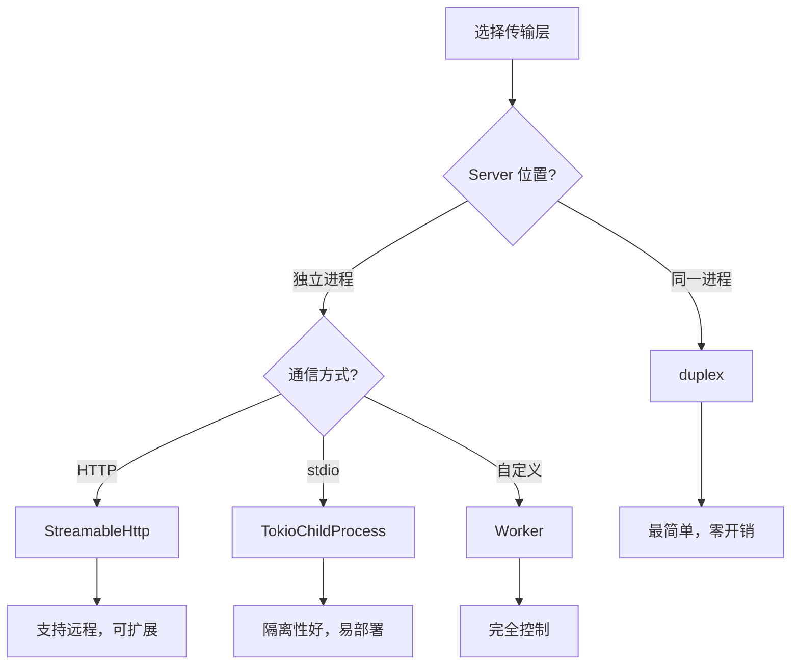

# rmcp Transport 与 rig 集成

rmcp 提供多种传输层实现，用于 MCP Client 和 Server 之间的通信。

## 传输层概览

| 传输类型 | Feature | 用途 |
|---------|---------|------|
| `TokioChildProcess` | `transport-child-process` | 子进程 stdio 通信 |
| `StreamableHttpClientTransport` | `transport-streamable-http-client` | HTTP 客户端 |
| `StreamableHttpService` | `transport-streamable-http-server` | HTTP 服务端 (Axum 集成) |
| `AsyncRwTransport` | `transport-async-rw` | AsyncRead/AsyncWrite 流 |
| `SinkStreamTransport` | 默认 | Sink/Stream 对象 |
| `WorkerTransport` | `transport-worker` | 自定义 Worker trait |

## 方案一：进程内通信 (duplex)

适用于 MCP Server 和 Client 在同一进程内运行的场景。

```toml
# Cargo.toml
rmcp = { version = "0.12", features = [
    "macros",
    "schemars",
    "transport-async-rw"
] }
```

```rust
use rmcp::ServiceExt;
use tokio::io::duplex;

pub async fn chat_with_mcp(db: DbConn) -> anyhow::Result<()> {
    // 创建双向管道
    let (client_io, server_io) = duplex(4096);

    // 启动 MCP Server (后台任务)
    let mcp_server = StaffMcp::new(db);
    tokio::spawn(async move {
        let _ = mcp_server.serve(server_io).await;
    });

    // 连接 MCP Client
    let mcp_client = rmcp::model::ClientInfo::default()
        .serve(client_io)
        .await?;

    // 获取工具列表
    let tools = mcp_client.list_all_tools().await?;
    println!("Available tools: {:?}", tools.iter().map(|t| &t.name).collect::<Vec<_>>());

    Ok(())
}
```

**优点**：零网络开销，最简单的进程内通信方式
**缺点**：Server 和 Client 必须在同一进程

## 方案二：HTTP 传输

适用于 MCP Server 独立部署或与 Axum 集成的场景。

### Server 端 (Axum 集成)

```toml
rmcp = { version = "0.12", features = [
    "macros",
    "schemars",
    "transport-streamable-http-server"
] }
```

```rust
use rmcp::transport::streamable_http_server::{
    StreamableHttpService,
    StreamableHttpServerConfig,
    session::local::LocalSessionManager,
};

let mcp_service = StreamableHttpService::new(
    move || Ok(StaffMcp::new(db.clone())),
    LocalSessionManager::default().into(),
    StreamableHttpServerConfig::default(),
);

let router = axum::Router::new()
    .nest_service("/mcp", mcp_service);
```

### Client 端

```toml
rmcp = { version = "0.12", features = ["transport-streamable-http-client"] }
```

```rust
let transport = rmcp::transport::StreamableHttpClientTransport::from_uri("http://localhost:3000/mcp");
let mcp_client = rmcp::model::ClientInfo::default()
    .serve(transport)
    .await?;
```

## 方案三：子进程 stdio

适用于 MCP Server 作为独立可执行文件运行的场景。

```toml
rmcp = { version = "0.12", features = ["transport-child-process"] }
```

```rust
use rmcp::transport::TokioChildProcess;

let transport = TokioChildProcess::new(
    tokio::process::Command::new("./mcp-server")
        .args(["--db", "postgres://..."])
)?;

let mcp_client = rmcp::model::ClientInfo::default()
    .serve(transport)
    .await?;
```

## 与 rig Agent 集成

rig 框架内置了 rmcp 支持，通过 `rmcp_tools` 方法集成 MCP 工具。

```toml
rig-core = { version = "0.28", features = ["rmcp"] }
```

### 基础集成

```rust
use rig::{client::CompletionClient, providers::openai};
use rmcp::ServiceExt;

pub async fn create_agent(
    openai_client: &openai::Client,
    db: DbConn,
) -> anyhow::Result<impl rig::agent::Agent> {
    // 建立 MCP 连接
    let (client_io, server_io) = tokio::io::duplex(4096);
    let mcp_server = StaffMcp::new(db);
    tokio::spawn(async move { mcp_server.serve(server_io).await });

    let mcp_client = rmcp::model::ClientInfo::default()
        .serve(client_io)
        .await?;

    // 获取工具
    let tools = mcp_client.list_all_tools().await?;

    // 创建 Agent
    let agent = openai_client
        .agent(openai::GPT_4O)
        .preamble("你是 StitchWork 助手，可以帮助用户查询订单、计件记录等信息。")
        .rmcp_tools(tools, mcp_client.peer().clone())
        .build();

    Ok(agent)
}
```

### 动态工具选择 (向量搜索)

当 MCP Server 提供大量工具时，可以使用向量搜索动态选择最相关的工具。

```rust
use rig::{
    embeddings::EmbeddingsBuilder,
    vector_store::in_memory_store::InMemoryVectorStore,
};

// 获取所有工具
let tools = mcp_client.list_all_tools().await?;

// 创建工具嵌入
let embedding_model = openai_client.embedding_model(openai::TEXT_EMBEDDING_3_SMALL);
let embeddings = EmbeddingsBuilder::new(embedding_model.clone())
    .documents(tools.iter().map(|t| t.description.clone().unwrap_or_default()).collect())?
    .build()
    .await?;

// 创建向量索引
let store = InMemoryVectorStore::from_documents(embeddings);
let index = store.index(embedding_model);

// 创建 Agent (动态选择 top 4 相关工具)
let agent = openai_client
    .agent(openai::GPT_4O)
    .dynamic_tools(4, index, tool_set)
    .build();
```

## 自定义 Worker Transport

当需要完全控制消息收发逻辑时，可以实现 `Worker` trait。

```rust
use rmcp::transport::worker::{Worker, WorkerContext, WorkerQuitReason, WorkerConfig};
use rmcp::service::RoleClient;

struct MyWorker {
    // 自定义状态
}

impl Worker for MyWorker {
    type Error = anyhow::Error;
    type Role = RoleClient;

    fn err_closed() -> Self::Error {
        anyhow::anyhow!("Connection closed")
    }

    fn err_join(e: tokio::task::JoinError) -> Self::Error {
        anyhow::anyhow!("Join error: {}", e)
    }

    async fn run(self, mut ctx: WorkerContext<Self>) -> Result<(), WorkerQuitReason<Self::Error>> {
        loop {
            tokio::select! {
                _ = ctx.cancellation_token.cancelled() => {
                    return Err(WorkerQuitReason::Cancelled);
                }
                req = ctx.recv_from_handler() => {
                    let req = req?;
                    // 处理发送请求
                    // ...
                    let _ = req.responder.send(Ok(()));
                }
            }
        }
    }

    fn config(&self) -> WorkerConfig {
        WorkerConfig {
            name: Some("my-worker".to_string()),
            channel_buffer_capacity: 16,
        }
    }
}

// 使用
let worker = MyWorker { /* ... */ };
let mcp_client = rmcp::model::ClientInfo::default()
    .serve(worker)  // Worker 自动转换为 WorkerTransport
    .await?;
```

## 传输层选择指南



## 常见问题

### Q: duplex buffer size 设多大？

推荐 4096-8192。太小会频繁阻塞，太大浪费内存。

### Q: 如何处理 MCP Server 崩溃？

```rust
let handle = tokio::spawn(async move {
    if let Err(e) = mcp_server.serve(server_io).await {
        tracing::error!("MCP Server error: {}", e);
    }
});

// 检查是否存活
if handle.is_finished() {
    // 重新创建连接
}
```

### Q: 如何传递认证信息？

HTTP 传输支持通过 Axum middleware 注入 Extension：

```rust
// Middleware 注入 UserContext
request.extensions_mut().insert(UserContext { user_id, role });

// Tool 中获取
#[tool(description = "查询订单")]
async fn query_orders(&self, ctx: Extension<UserContext>) -> Result<String, String> {
    let user_id = ctx.0.user_id;
    // ...
}
```

进程内通信 (duplex) 需要在创建 Server 时直接传入上下文。
