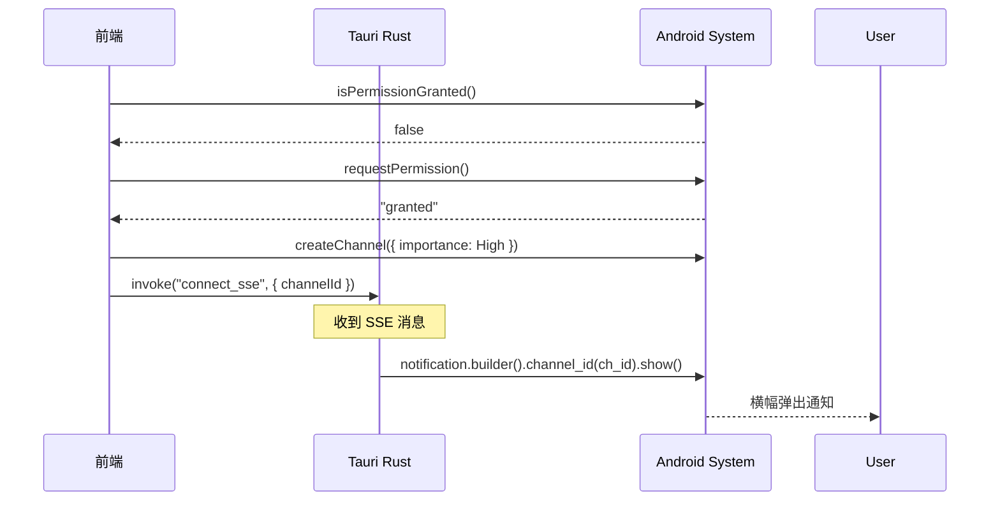

# Tauri 通知系统配置

Android 通知需要正确配置权限和渠道才能实现横幅弹出（heads-up notification）效果。

## 权限配置

### 1. Tauri Capabilities (`src-tauri/capabilities/mobile.json`)

```json
{
  "permissions": [
    "notification:default",
    "notification:allow-notify",
    "notification:allow-create-channel",
    "notification:allow-list-channels"
  ]
}
```

### 2. 运行时权限请求 (Android 13+)

Android 13 (API 33) 开始需要运行时请求 `POST_NOTIFICATIONS` 权限：

```typescript
import {
  isPermissionGranted,
  requestPermission,
} from "@tauri-apps/plugin-notification";

let permissionGranted = await isPermissionGranted();
if (!permissionGranted) {
  const permission = await requestPermission();
  permissionGranted = permission === "granted";
}
```

## 通知渠道 (Android 8+)

Android 8.0 (API 26) 引入通知渠道，不同渠道有不同的重要性级别：

| Importance | 值 | 效果 |
|------------|---|------|
| High | 4 | 横幅弹出 + 声音 |
| Default | 3 | 声音，不弹出 |
| Low | 2 | 无声音 |
| Min | 1 | 静默，不显示在状态栏 |

### 创建高优先级渠道

```typescript
import {
  createChannel,
  channels,
  Importance,
} from "@tauri-apps/plugin-notification";

const CHANNEL_ID = "stitchwork_high";

// 检查渠道是否已存在
const existingChannels = await channels();
if (!existingChannels.some((c) => c.id === CHANNEL_ID)) {
  await createChannel({
    id: CHANNEL_ID,
    name: "重要通知",
    importance: Importance.High,
    vibration: true,
  });
}
```

**注意**：渠道创建后，importance 无法通过代码修改，只能由用户在系统设置中调整。

## Rust 端发送通知

### 接收 channel_id 参数

```rust
#[tauri::command]
pub async fn connect_sse(
    app_handle: AppHandle,
    api_url: String,
    token: String,
    channel_id: Option<String>,  // 前端传入
) -> Result<(), String>
```

### 使用指定渠道发送

```rust
use tauri_plugin_notification::NotificationExt;

let mut builder = app_handle
    .notification()
    .builder()
    .title(&payload.title)
    .body(&payload.body);

// 指定渠道（Android 必需，iOS 忽略）
if let Some(ref ch_id) = channel_id {
    builder = builder.channel_id(ch_id);
}

builder.show()?;
```

## 完整流程



## 依赖

### Cargo.toml
```toml
[dependencies]
tauri-plugin-notification = "2"
```

### 前端
```bash
pnpm add @tauri-apps/plugin-notification
```

### lib.rs 注册插件
```rust
tauri::Builder::default()
    .plugin(tauri_plugin_notification::init())
```

## 常见问题

### 通知不弹出横幅

1. 检查渠道 importance 是否为 High
2. 检查系统设置中该 App 的通知权限
3. 检查系统设置中该渠道的重要性级别（用户可能手动调低）

### 渠道 importance 无法修改

渠道创建后 importance 固定，需要：
1. 删除旧渠道 `removeChannel(id)`
2. 创建新渠道（使用不同 id）
3. 或引导用户到系统设置手动调整
