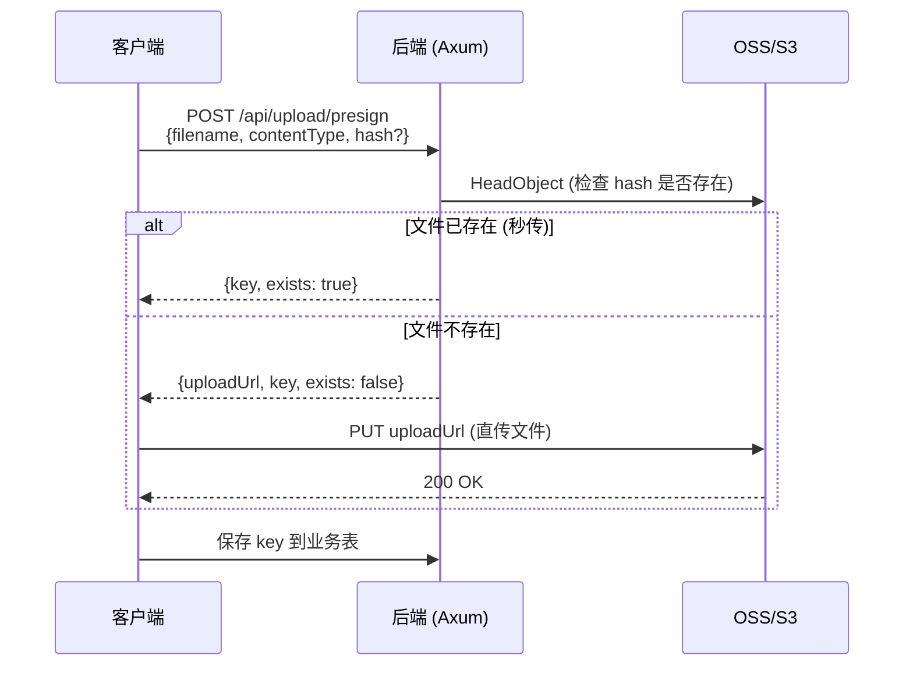

# 文件上传技术方案

基于 Presigned URL 的前端直传方案，支持阿里云 OSS / AWS S3 等 S3 兼容存储。

## 架构概览



**核心设计：**
- **前端直传**：客户端直接上传到 OSS，后端不经手文件流量
- **Presigned URL**：后端生成带签名的临时上传链接，15 分钟有效
- **Hash 去重**：基于内容 hash 的秒传，相同文件不重复上传

## 后端实现

### 配置 (server/.env)

```bash
# S3 兼容存储配置
AWS_REGION=oss-cn-hangzhou
AWS_ACCESS_KEY_ID=your-access-key
AWS_SECRET_ACCESS_KEY=your-secret-key
S3_BUCKET=your-bucket
S3_ENDPOINT=https://oss-cn-hangzhou.aliyuncs.com  # 阿里云 OSS
```

### S3 客户端初始化

```rust
// server/src/common/s3.rs
pub struct S3Client {
    pub client: aws_sdk_s3::Client,
    pub bucket: String,
}

impl S3Client {
    pub async fn new() -> Option<Self> {
        let region = env::var("AWS_REGION").ok()?;
        let bucket = env::var("S3_BUCKET").ok()?;
        let endpoint = env::var("S3_ENDPOINT").ok();

        let mut config_loader = aws_config::defaults(BehaviorVersion::latest())
            .region(Region::new(region));

        if let Some(endpoint) = endpoint {
            config_loader = config_loader.endpoint_url(endpoint);
        }

        let config = config_loader.load().await;
        let client = aws_sdk_s3::Client::new(&config);

        Some(Self { client, bucket })
    }

    /// 生成预签名下载 URL
    pub async fn get_presigned_url(&self, key: &str, expires_secs: u64) -> Result<String, String> {
        let presigning_config = PresigningConfig::expires_in(Duration::from_secs(expires_secs))
            .map_err(|e| e.to_string())?;

        let presigned = self.client
            .get_object()
            .bucket(&self.bucket)
            .key(key)
            .presigned(presigning_config)
            .await
            .map_err(|e| e.to_string())?;

        Ok(presigned.uri().to_string())
    }
}
```

### API 接口

#### 1. 获取上传凭证

```rust
// POST /api/upload/presign
#[derive(Deserialize)]
#[serde(rename_all = "camelCase")]
pub struct PresignRequest {
    pub filename: String,
    pub content_type: String,
    pub hash: Option<String>,  // 可选，用于秒传
}

#[derive(Serialize)]
#[serde(rename_all = "camelCase")]
pub struct PresignResponse {
    pub upload_url: Option<String>,  // None 表示秒传
    pub key: String,
    pub exists: bool,
}

async fn presign(
    State(state): State<Arc<AppState>>,
    Extension(claims): Extension<Claims>,
    AppJson(req): AppJson<PresignRequest>,
) -> Result<ApiResponse<PresignResponse>> {
    let s3 = state.s3.as_ref()
        .ok_or(AppError::Internal("S3 not configured".into()))?;

    let ext = req.filename.rsplit('.').next().unwrap_or("bin");

    // 有 hash 则用 hash 作为文件名（支持秒传）
    if let Some(ref hash) = req.hash {
        let key = format!("uploads/{}.{}", hash, ext);

        // 检查是否已存在
        let exists = s3.client
            .head_object()
            .bucket(&s3.bucket)
            .key(&key)
            .send()
            .await
            .is_ok();

        if exists {
            return Ok(ApiResponse::ok(PresignResponse {
                upload_url: None,
                key,
                exists: true,
            }));
        }

        // 生成上传 URL
        let presigned = generate_presigned_put(&s3, &key, &req.content_type).await?;
        return Ok(ApiResponse::ok(PresignResponse {
            upload_url: Some(presigned),
            key,
            exists: false,
        }));
    }

    // 无 hash，用 UUID 作为文件名
    let key = format!("uploads/{}.{}", Uuid::new_v4(), ext);
    let presigned = generate_presigned_put(&s3, &key, &req.content_type).await?;

    Ok(ApiResponse::ok(PresignResponse {
        upload_url: Some(presigned),
        key,
        exists: false,
    }))
}

async fn generate_presigned_put(s3: &S3Client, key: &str, content_type: &str) -> Result<String> {
    let presigning_config = PresigningConfig::expires_in(Duration::from_secs(900))?;

    let presigned = s3.client
        .put_object()
        .bucket(&s3.bucket)
        .key(key)
        .content_type(content_type)
        .presigned(presigning_config)
        .await?;

    Ok(presigned.uri().to_string())
}
```

#### 2. 文件访问（重定向）

```rust
// GET /api/files/{*key}
async fn redirect_to_file(
    State(state): State<Arc<AppState>>,
    Path(key): Path<String>,
) -> impl IntoResponse {
    let s3 = match state.s3.as_ref() {
        Some(s3) => s3,
        None => return StatusCode::SERVICE_UNAVAILABLE.into_response(),
    };

    match s3.get_presigned_url(&key, 3600).await {
        Ok(url) => Redirect::temporary(&url).into_response(),
        Err(_) => StatusCode::NOT_FOUND.into_response(),
    }
}
```

### 路由注册

```rust
// 需要认证
Router::new().route("/upload/presign", post(presign))

// 公开访问
Router::new().route("/files/{*key}", get(redirect_to_file))
```

## 前端实现

### API 封装

```typescript
// src/api/upload.ts
interface PresignResponse {
  uploadUrl: string | null;
  key: string;
  exists: boolean;
}

export const uploadApi = {
  presign: (filename: string, contentType: string, hash?: string) =>
    client.post<PresignResponse>("/api/upload/presign", {
      filename,
      contentType,
      hash,
    }),
};

/** 根据 key 生成访问 URL */
export function getFileUrl(key: string): string {
  if (!key) return "";
  return `${import.meta.env.VITE_API_URL}/api/files/${key}`;
}
```

### 上传函数

```typescript
// src/utils/upload.ts
export async function uploadFile(
  file: File,
  options?: { hash?: string }
): Promise<string> {
  const { uploadUrl, key, exists } = await uploadApi.presign(
    file.name,
    file.type,
    options?.hash
  );

  // 秒传：文件已存在
  if (exists) {
    return key;
  }

  // 直传到 OSS
  await fetch(uploadUrl!, {
    method: "PUT",
    body: file,
    headers: { "Content-Type": file.type },
  });

  return key;
}
```

### 使用示例

```tsx
// 上传并保存 key
const handleUpload = async (file: File) => {
  const key = await uploadFile(file);
  await orderApi.update(orderId, { imageKey: key });
};

// 显示图片

```

## Tauri 优化（可选）

移动端使用 Rust 处理图片，提升性能：

```typescript
// Tauri 环境：Rust 压缩 + 直接上传
if (isTauri()) {
  const result = await invoke<UploadResult>("upload_image", {
    imageData: Array.from(new Uint8Array(await file.arrayBuffer())),
    apiUrl: API_URL,
    token: getToken(),
    options: { maxDimension: 2560, quality: 88 },
  });
  return result.key;
}
```

详见 [dev-notes/image-upload-optimization.md](dev-notes/image-upload-optimization.md)

## 存储结构

```
bucket/
└── uploads/
    ├── {uuid}.jpg           # 无 hash 上传
    ├── {blake3-hash}.jpg    # 有 hash 上传（支持秒传）
    └── ...
```

## 数据库存储

业务表只存 key，不存完整 URL：

```rust
// order 表
pub struct Order {
    // ...
    pub image_key: Option<String>,  // 存储 "uploads/xxx.jpg"
}
```

显示时通过 `getFileUrl(key)` 转换为完整 URL。

## 安全考虑

| 风险 | 措施 |
|------|------|
| 未授权上传 | Presign API 需要 JWT 认证 |
| URL 泄露 | Presigned URL 15 分钟过期 |
| 文件覆盖 | 使用 UUID/hash 作为文件名 |
| 恶意文件 | 前端限制类型，后端校验 Content-Type |
| 大文件攻击 | 前端压缩，OSS 配额限制 |

## 依赖

### 后端

```toml
[dependencies]
aws-sdk-s3 = "1"
aws-config = { version = "1", features = ["behavior-version-latest"] }
```

### 前端

```bash
# 图片压缩（浏览器环境）
pnpm add browser-image-compression
```

## 成本参考（阿里云 OSS）

| 项目 | 价格 |
|------|------|
| 存储 | 0.12 元/GB/月 |
| 外网下行 | 0.50 元/GB |
| PUT/GET 请求 | 0.01 元/万次 |

小型应用每月几元即可。
