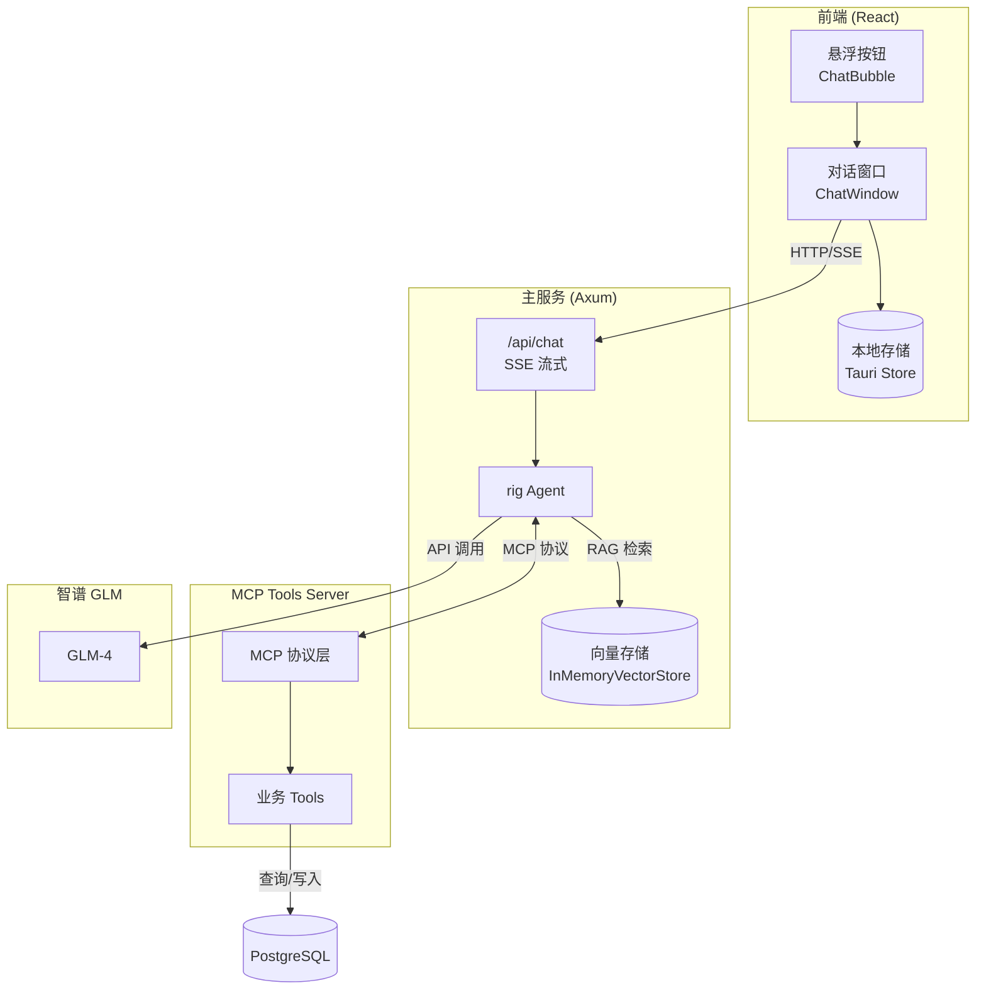
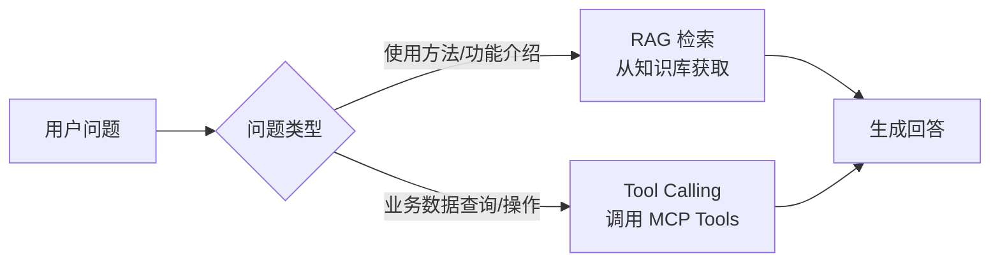
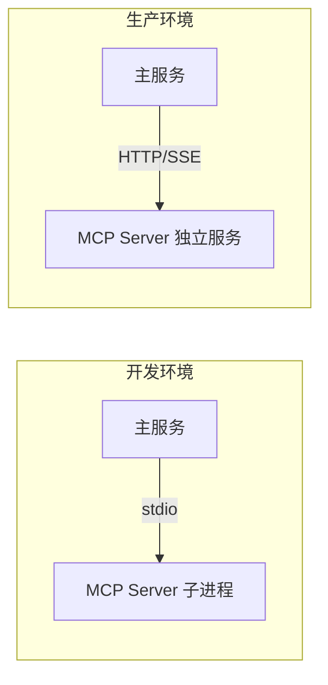
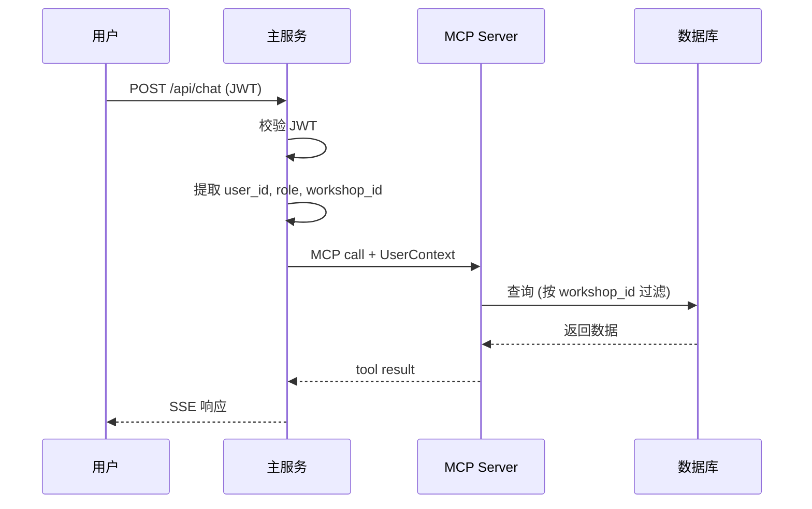
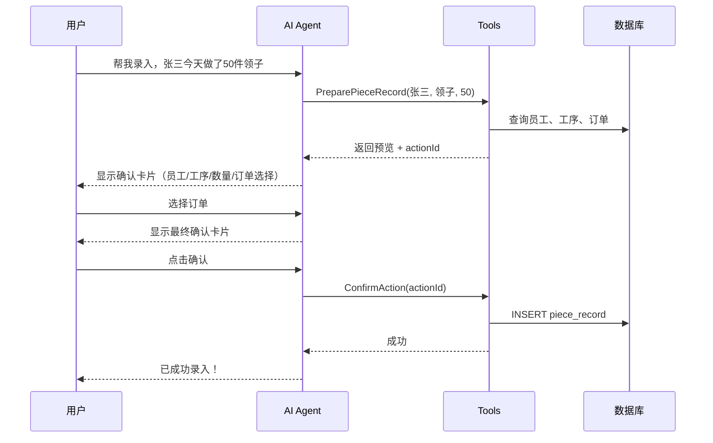
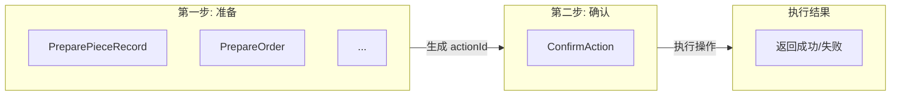
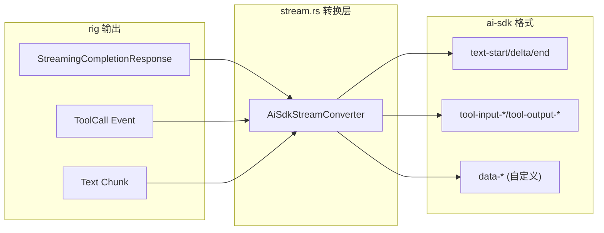

# AI 对话功能设计方案

## 概述

为 StitchWork 系统接入 AI 对话功能，支持业务查询、操作引导和通用聊天的混合模式。

## 技术选型

| 层级 | 技术 |
|------|------|
| 前端 UI | React + @ai-sdk/react |
| 后端 Agent | Rust rig 框架 |
| Tools 服务 | MCP Server (独立服务) |
| LLM | 智谱 GLM |
| 对话存储 | 本地存储 (Tauri Store / localStorage) |

## 整体架构

采用 **RAG + Tool Calling 混合模式**，结合 MCP 独立服务架构：



### 混合模式分工

| 模式 | 适用场景 | 示例 |
|------|----------|------|
| **RAG 检索** | 应用使用指南、功能介绍、操作流程 | "怎么创建订单"、"工资怎么发放" |
| **Tool Calling** | 实时业务数据查询和操作 | "张三这个月做了多少件"、"帮我录入计件" |



### 架构选择理由

| 优势 | 说明 |
|------|------|
| **解耦** | Tools 独立开发、测试、部署，不影响主服务 |
| **复用** | 同一套 Tools 可被多个 Agent 使用（未来扩展） |
| **标准化** | MCP 是 Anthropic 标准协议，生态兼容性好 |
| **调试友好** | MCP 有标准的调试工具（如 MCP Inspector） |
| **热更新** | Tools 更新不需要重启主服务 |

### MCP 通信方式

MCP 支持两种传输方式：

| 方式 | 适用场景 | 本项目选择 |
|------|----------|------------|
| **stdio** | 本地进程通信，主服务启动子进程 | 开发环境 |
| **HTTP/SSE** | 网络通信，独立部署 | 生产环境 |



### 权限控制

采用 **MCP Context 传递用户上下文** 方案，主服务校验 JWT 后将用户信息传递给 MCP Server：



**UserContext 结构：**

```rust
// crates/common/src/context.rs
#[derive(Clone, Serialize, Deserialize)]
pub struct UserContext {
    pub user_id: Uuid,
    pub role: Role,           // Boss | Staff | Admin
    pub workshop_id: Option<Uuid>,  // Staff/Boss 所属工坊
}
```

**MCP Server 使用上下文：**

```rust
// mcp-server/src/tools/query_piece_records.rs
#[tool(description = "查询计件记录")]
async fn query_piece_records(
    args: QueryArgs,
    ctx: &UserContext,  // 从 MCP context 获取
    db: &DatabaseConnection,
) -> Result<Vec<PieceRecordDto>> {
    // 自动按 workshop_id 过滤，确保数据隔离
    PieceRecord::find()
        .filter(Column::WorkshopId.eq(ctx.workshop_id))
        .all(db)
        .await
}
```

## 写操作交互流程

以"创建计件记录"为例：



## Tools 设计

写操作分两步，确保用户确认后才执行：



### Tools 列表

| Tool | 类型 | 描述 |
|------|------|------|
| QueryOrders | 只读 | 查询订单列表 |
| QueryPieceRecords | 只读 | 查询计件记录 |
| QueryPayroll | 只读 | 查询工资信息 |
| QueryProcesses | 只读 | 查询工序列表 |
| QueryEmployees | 只读 | 查询员工列表 |
| PreparePieceRecord | 准备 | 准备创建计件记录 |
| PrepareOrder | 准备 | 准备创建订单 |
| ConfirmAction | 确认 | 确认执行待处理操作 |

## API 设计

### 端点

```
POST /api/chat
Content-Type: application/json
Authorization: Bearer <jwt>
```

### 请求

```json
{
  "messages": [
    { "role": "user", "content": "帮我查一下张三这个月的计件" }
  ]
}
```

### 响应

SSE 流，遵循 [ai-sdk Data Stream Protocol](https://sdk.vercel.ai/docs/ai-sdk-ui/stream-protocol)。

**必需 Header：**

```
Content-Type: text/event-stream
x-vercel-ai-ui-message-stream: v1
```

**协议格式示例：**

```
# 消息开始
data: {"type":"start","messageId":"msg_001"}

# 文本流式输出
data: {"type":"text-start","id":"text_001"}
data: {"type":"text-delta","id":"text_001","delta":"你"}
data: {"type":"text-delta","id":"text_001","delta":"好"}
data: {"type":"text-end","id":"text_001"}

# Tool 调用（查询类）
data: {"type":"tool-input-start","toolCallId":"call_001","toolName":"query_piece_records"}
data: {"type":"tool-input-available","toolCallId":"call_001","toolName":"query_piece_records","input":{"employee":"张三"}}
data: {"type":"tool-output-available","toolCallId":"call_001","output":{"records":[...]}}

# 自定义数据（确认卡片）
data: {"type":"data-confirm-card","data":{"actionId":"action_001","title":"计件录入确认","preview":{...}}}

# 消息结束
data: {"type":"finish"}
data: [DONE]
```

## ai-sdk Stream 转换层

rig 社区目前没有现成的 ai-sdk 适配器，需要自己实现转换层。

### 转换流程



### 核心实现

```rust
// server/src/service/chat/stream.rs

use axum::response::sse::{Event, Sse};
use futures::Stream;
use serde_json::json;

/// ai-sdk SSE 事件类型
pub enum AiSdkEvent {
    Start { message_id: String },
    TextStart { id: String },
    TextDelta { id: String, delta: String },
    TextEnd { id: String },
    ToolInputStart { tool_call_id: String, tool_name: String },
    ToolInputAvailable { tool_call_id: String, tool_name: String, input: serde_json::Value },
    ToolOutputAvailable { tool_call_id: String, output: serde_json::Value },
    DataCustom { data_type: String, data: serde_json::Value },
    Finish,
    Done,
}

impl AiSdkEvent {
    pub fn to_sse_event(&self) -> Event {
        match self {
            Self::Start { message_id } => {
                Event::default().data(json!({"type": "start", "messageId": message_id}).to_string())
            }
            Self::TextDelta { id, delta } => {
                Event::default().data(json!({"type": "text-delta", "id": id, "delta": delta}).to_string())
            }
            Self::ToolInputAvailable { tool_call_id, tool_name, input } => {
                Event::default().data(json!({
                    "type": "tool-input-available",
                    "toolCallId": tool_call_id,
                    "toolName": tool_name,
                    "input": input
                }).to_string())
            }
            Self::DataCustom { data_type, data } => {
                Event::default().data(json!({
                    "type": format!("data-{}", data_type),
                    "data": data
                }).to_string())
            }
            Self::Finish => Event::default().data(json!({"type": "finish"}).to_string()),
            Self::Done => Event::default().data("[DONE]".to_string()),
            // ... 其他事件类型
        }
    }
}

/// 将 rig 流转换为 ai-sdk 兼容的 SSE 流
pub fn convert_rig_to_ai_sdk_stream(
    rig_stream: impl Stream<Item = RigStreamEvent>,
) -> impl Stream<Item = Result<Event, Infallible>> {
    // 转换逻辑
}
```

### 确认卡片的自定义数据

使用 ai-sdk 的 `data-*` 类型发送确认卡片：

```rust
// 后端发送
AiSdkEvent::DataCustom {
    data_type: "confirm-card".to_string(),
    data: json!({
        "actionId": "action_001",
        "title": "计件录入确认",
        "preview": {
            "employee": "张三",
            "process": "领子",
            "quantity": 50
        }
    })
}
```

```tsx
// 前端处理 (useChat onDataPart)
const { messages } = useChat({
  api: '/api/chat',
  onDataPart: ({ type, data }) => {
    if (type === 'confirm-card') {
      // 渲染确认卡片
      setPendingAction(data);
    }
  }
});
```

## 文件结构

### Workspace 结构

采用 Cargo workspace 管理多个 crate，共享 entity 和通用代码：

```
stitchwork/
├── Cargo.toml              # workspace 配置
├── crates/
│   ├── entity/             # 共享 SeaORM entities
│   │   ├── Cargo.toml
│   │   └── src/
│   │       ├── lib.rs
│   │       ├── user.rs
│   │       ├── order.rs
│   │       ├── piece_record.rs
│   │       └── ...
│   └── common/             # 共享类型、UserContext
│       ├── Cargo.toml
│       └── src/
│           ├── lib.rs
│           └── context.rs  # UserContext 定义
├── server/                 # 主服务 (Axum + rig)
│   ├── Cargo.toml          # 依赖 entity, common
│   └── src/
│       ├── main.rs
│       └── service/
│           └── chat/       # AI 对话服务
│               ├── mod.rs
│               ├── controller.rs
│               ├── agent.rs
│               └── stream.rs
└── mcp-server/             # MCP Tools Server
    ├── Cargo.toml          # 依赖 entity, common
    └── src/
        ├── main.rs
        └── tools/
            ├── mod.rs
            ├── query_orders.rs
            ├── query_piece_records.rs
            ├── query_payroll.rs
            ├── prepare_piece_record.rs
            └── confirm_action.rs
```

### 前端新增

```
src/components/chat/
├── ChatBubble.tsx      # 悬浮按钮
├── ChatWindow.tsx      # 对话窗口
├── MessageItem.tsx     # 消息渲染（含确认卡片）
├── ConfirmCard.tsx     # 操作确认卡片
└── index.ts
```

## RAG 知识库检索

### 知识库文档

使用 Markdown 文档作为知识库，存放应用使用指南：

```
docs/knowledge/
├── user-guide.md       # 完整使用指南
└── (可按需拆分为多个文件提高检索精度)
```

### 向量存储初始化

服务启动时加载知识库文档并创建向量索引：

```rust
// server/src/service/chat/knowledge.rs

use rig::embeddings::EmbeddingsBuilder;
use rig::vector_store::in_memory_store::InMemoryVectorStore;
use rig::vector_store::VectorStore;
use std::sync::Arc;

pub struct KnowledgeBase {
    index: Arc<InMemoryVectorIndex<ZhipuEmbeddingModel>>,
}

impl KnowledgeBase {
    pub async fn new(embedding_model: ZhipuEmbeddingModel) -> Result<Self> {
        let mut vector_store = InMemoryVectorStore::default();

        // 加载知识库文档
        let guide_content = std::fs::read_to_string("docs/knowledge/user-guide.md")?;

        // 创建嵌入向量
        let embeddings = EmbeddingsBuilder::new(embedding_model.clone())
            .simple_document("user_guide", &guide_content)
            .build()
            .await?;

        vector_store.add_documents(embeddings).await?;

        // 创建索引
        let index = Arc::new(vector_store.index(embedding_model));

        Ok(Self { index })
    }

    pub fn index(&self) -> Arc<InMemoryVectorIndex<ZhipuEmbeddingModel>> {
        self.index.clone()
    }
}
```

### Agent 集成

Agent 同时配置 RAG 检索和 Tool Calling：

```rust
// server/src/service/chat/agent.rs

pub async fn create_agent(
    client: &ZhipuClient,
    knowledge_base: &KnowledgeBase,
    mcp_tools: Vec<McpTool>,
) -> Result<Agent> {
    let agent = client
        .agent(GLM_4)
        .preamble(SYSTEM_PROMPT)
        // RAG: 检索 top 3 相关文档片段作为上下文
        .dynamic_context(3, knowledge_base.index())
        // Tool Calling: 业务数据查询和操作
        .tools(mcp_tools)
        .build();

    Ok(agent)
}

const SYSTEM_PROMPT: &str = r#"
你是 StitchWork 服装加工管理系统的 AI 助手。

你的能力：
1. 回答应用使用问题（基于知识库）
2. 查询业务数据（订单、计件、工资等）
3. 协助录入数据（需用户确认）

回答原则：
- 简洁明了，避免冗长
- 涉及数据操作时，先展示预览让用户确认
- 不确定时如实告知，不要编造
"#;
```

### 文档更新

知识库文档更新后需重启服务重新加载。未来可优化为：
- 文件监听自动重载
- 管理后台在线编辑

## 环境变量

```bash
# server/.env
ZHIPU_API_KEY=your-api-key
```

## 依赖

```toml
# Cargo.toml (workspace)
[workspace]
members = ["crates/*", "server", "mcp-server"]

[workspace.dependencies]
entity = { path = "crates/entity" }
common = { path = "crates/common" }
sea-orm = "1.0"
rig-core = "0.x"
rmcp = "0.x"  # Rust MCP SDK
```

```toml
# server/Cargo.toml
[dependencies]
entity = { workspace = true }
common = { workspace = true }
rig-core = { workspace = true }
```

```toml
# mcp-server/Cargo.toml
[dependencies]
entity = { workspace = true }
common = { workspace = true }
rmcp = { workspace = true }
```

```json
// package.json
"@ai-sdk/react": "^1.x"
```
