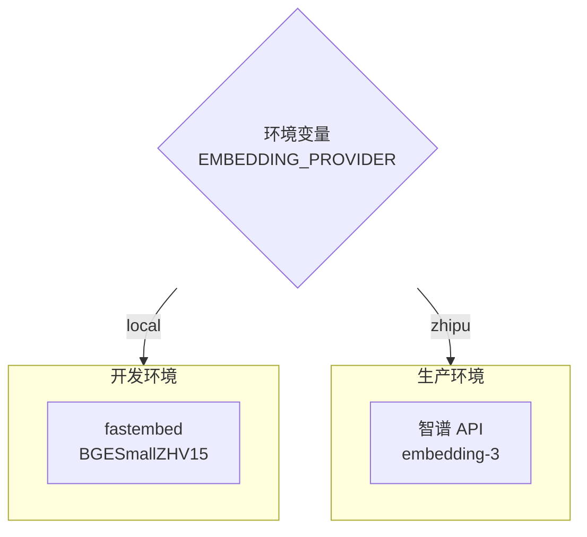

# Rig 自定义 Embedding 指南

## 概述

本文档介绍如何在 rig 框架中自定义 embedding 模型，包括实现 `EmbeddingModel` trait 以及集成本地 `fastembed` 库。

## EmbeddingModel Trait

rig 的 embedding 抽象基于 `EmbeddingModel` trait：

```rust
pub trait EmbeddingModel: WasmCompatSend + WasmCompatSync {
    type Client;
    const MAX_DOCUMENTS: usize;  // 单次请求最大文档数

    fn make(client: &Self::Client, model: impl Into<String>, dims: Option<usize>) -> Self;
    fn ndims(&self) -> usize;  // embedding 向量维度
    fn embed_texts(
        &self,
        texts: impl IntoIterator<Item = String> + WasmCompatSend,
    ) -> impl Future<Output = Result<Vec<Embedding>, EmbeddingError>> + WasmCompatSend;

    // 默认实现
    fn embed_text(&self, text: &str) -> impl Future<Output = Result<Embedding, EmbeddingError>>;
}
```

## 技术选型

| 方案 | 优势 | 劣势 |
|------|------|------|
| **OpenAI API** | 效果好，开箱即用 | 需网络，按量付费 |
| **智谱 API** | 中文效果好，国内访问快 | 需网络，按量付费 |
| **Ollama 本地** | 免费，离线可用 | 需部署 Ollama 服务 |
| **fastembed** | 纯本地，无依赖，速度快 | 模型较小，效果有限 |

**推荐**：开发环境使用 fastembed，生产环境使用智谱 API。

## fastembed 集成

### 依赖

```toml
[dependencies]
fastembed = "5"
rig-core = "0.27"
tokio = { version = "1", features = ["sync"] }
```

### 实现 EmbeddingModel

```rust
// crates/server/src/chat/fastembed_model.rs

use fastembed::{EmbeddingModel as FastEmbedModelType, InitOptions, TextEmbedding};
use rig::embeddings::{Embedding, EmbeddingError, EmbeddingModel};
use std::sync::Arc;
use tokio::sync::Mutex;

/// fastembed 封装，实现 rig 的 EmbeddingModel trait
#[derive(Clone)]
pub struct FastEmbedEmbeddingModel {
    model: Arc<Mutex<TextEmbedding>>,
    ndims: usize,
    model_name: String,
}

impl FastEmbedEmbeddingModel {
    pub fn new(model_type: FastEmbedModelType) -> anyhow::Result<Self> {
        let model = TextEmbedding::try_new(
            InitOptions::new(model_type.clone()).with_show_download_progress(true),
        )?;

        let (ndims, model_name) = match model_type {
            FastEmbedModelType::AllMiniLML6V2 => (384, "all-MiniLM-L6-v2"),
            FastEmbedModelType::BGEBaseENV15 => (768, "bge-base-en-v1.5"),
            FastEmbedModelType::BGELargeENV15 => (1024, "bge-large-en-v1.5"),
            FastEmbedModelType::BGESmallZHV15 => (512, "bge-small-zh-v1.5"),
            FastEmbedModelType::BGEBaseZHV15 => (768, "bge-base-zh-v1.5"),
            FastEmbedModelType::BGELargeZHV15 => (1024, "bge-large-zh-v1.5"),
            FastEmbedModelType::MultilingualE5Small => (384, "multilingual-e5-small"),
            FastEmbedModelType::MultilingualE5Large => (1024, "multilingual-e5-large"),
            _ => (384, "unknown"),
        };

        Ok(Self {
            model: Arc::new(Mutex::new(model)),
            ndims,
            model_name: model_name.to_string(),
        })
    }

    /// 创建中文模型（推荐）
    pub fn chinese() -> anyhow::Result<Self> {
        Self::new(FastEmbedModelType::BGESmallZHV15)
    }

    /// 创建多语言模型
    pub fn multilingual() -> anyhow::Result<Self> {
        Self::new(FastEmbedModelType::MultilingualE5Small)
    }
}

impl EmbeddingModel for FastEmbedEmbeddingModel {
    const MAX_DOCUMENTS: usize = 256;
    type Client = ();

    fn make(_client: &Self::Client, _model: impl Into<String>, dims: Option<usize>) -> Self {
        Self::chinese().expect("Failed to create FastEmbed model")
    }

    fn ndims(&self) -> usize {
        self.ndims
    }

    async fn embed_texts(
        &self,
        texts: impl IntoIterator<Item = String>,
    ) -> Result<Vec<Embedding>, EmbeddingError> {
        let documents: Vec<String> = texts.into_iter().collect();
        let docs_ref: Vec<&str> = documents.iter().map(|s| s.as_str()).collect();

        let model = self.model.lock().await;

        let vecs = model
            .embed(docs_ref, None)
            .map_err(|e| EmbeddingError::ProviderError(e.to_string()))?;

        Ok(vecs
            .into_iter()
            .zip(documents)
            .map(|(vec, document)| Embedding {
                document,
                vec: vec.into_iter().map(|v| v as f64).collect(),
            })
            .collect())
    }
}
```

### 使用示例

```rust
use rig::embeddings::EmbeddingsBuilder;
use rig::vector_store::in_memory_store::InMemoryVectorStore;

// 创建模型
let embedding_model = FastEmbedEmbeddingModel::chinese()?;

// 构建知识库
let documents = vec![
    "如何创建订单：点击首页的新建订单按钮...".to_string(),
    "工资发放流程：每月15日自动结算...".to_string(),
];

let embeddings = EmbeddingsBuilder::new(embedding_model.clone())
    .documents(documents)?
    .build()
    .await?;

let store = InMemoryVectorStore::from_documents(embeddings);
let index = store.index(embedding_model);
```

## 可用模型

### 中文模型（推荐）

| 模型 | 维度 | 大小 | 说明 |
|------|------|------|------|
| `BGESmallZHV15` | 512 | ~100MB | 速度快，适合开发 |
| `BGEBaseZHV15` | 768 | ~400MB | 平衡 |
| `BGELargeZHV15` | 1024 | ~1.3GB | 效果最好 |

### 多语言模型

| 模型 | 维度 | 大小 | 说明 |
|------|------|------|------|
| `MultilingualE5Small` | 384 | ~500MB | 支持 100+ 语言 |
| `MultilingualE5Large` | 1024 | ~2.2GB | 效果更好 |

### 英文模型

| 模型 | 维度 | 大小 | 说明 |
|------|------|------|------|
| `AllMiniLML6V2` | 384 | ~90MB | 轻量级，速度最快 |
| `BGEBaseENV15` | 768 | ~400MB | 平衡 |
| `BGELargeENV15` | 1024 | ~1.3GB | 效果最好 |

## 与现有代码集成

### 修改 KnowledgeBase

```rust
// crates/server/src/chat/knowledge_base.rs

use crate::chat::fastembed_model::FastEmbedEmbeddingModel;

pub struct KnowledgeBase {
    pub store: InMemoryVectorStore<String>,
    pub embedding_model: FastEmbedEmbeddingModel,
}

impl KnowledgeBase {
    pub async fn new<P: AsRef<Path>>(path: P) -> Result<Self> {
        let embedding_model = FastEmbedEmbeddingModel::chinese()?;

        let mut documents_dir = fs::read_dir(path).await?;
        let mut documents = vec![];

        while let Some(entry) = documents_dir.next_entry().await? {
            if entry.file_type().await?.is_file() {
                let content = fs::read_to_string(entry.path()).await?;
                documents.push(content);
            }
        }

        let embeddings = EmbeddingsBuilder::new(embedding_model.clone())
            .documents(documents)?
            .build()
            .await?;

        let store = InMemoryVectorStore::from_documents(embeddings);

        Ok(Self {
            store,
            embedding_model,
        })
    }

    pub fn index(&self) -> InMemoryVectorIndex<FastEmbedEmbeddingModel, String> {
        self.store.clone().index(self.embedding_model.clone())
    }
}
```

## 性能对比

在 M1 Mac 上测试（1000 条中文文档）：

| 模型 | 首次加载 | 单条 embedding | 批量 (100条) |
|------|----------|----------------|--------------|
| BGESmallZHV15 | 2s | 15ms | 800ms |
| BGEBaseZHV15 | 5s | 30ms | 2s |
| BGELargeZHV15 | 10s | 80ms | 6s |

**注意**：首次运行会下载模型文件，耗时取决于网络。

## 生产环境建议



### 环境变量切换

```rust
pub fn create_embedding_model() -> anyhow::Result<Box<dyn EmbeddingModel>> {
    match std::env::var("EMBEDDING_PROVIDER").as_deref() {
        Ok("zhipu") => {
            let api_key = std::env::var("ZHIPU_API_KEY")?;
            Ok(Box::new(ZhipuEmbeddingModel::new(api_key)))
        }
        _ => Ok(Box::new(FastEmbedEmbeddingModel::chinese()?)),
    }
}
```

## 参考资料

- [rig 官方文档](https://docs.rs/rig-core)
- [fastembed-rs GitHub](https://github.com/anush008/fastembed-rs)
- [BGE 模型介绍](https://huggingface.co/BAAI/bge-small-zh-v1.5)
