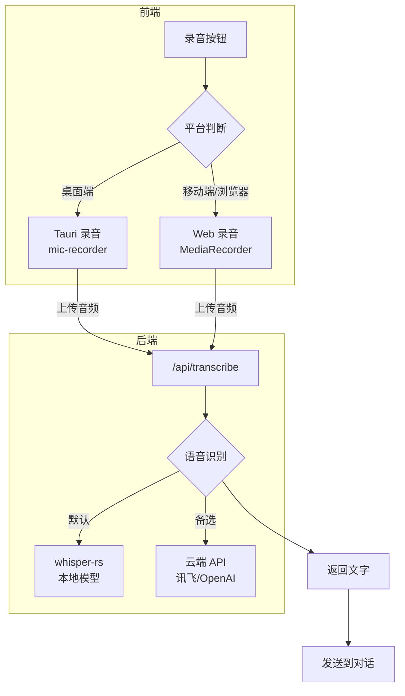
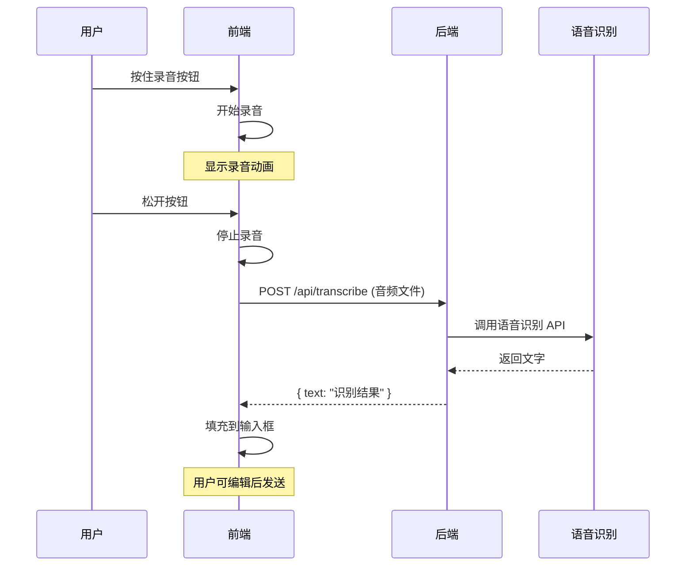
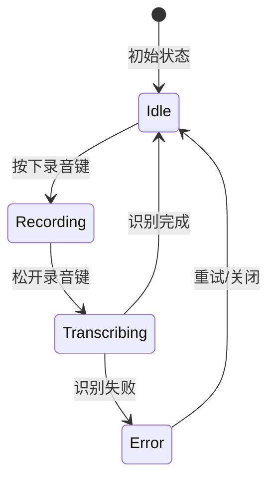

# 语音输入功能设计

## 概述

为 AI 对话功能添加语音输入支持，用户可以通过语音录入问题，系统自动转换为文字发送给 AI。

## 技术选型

### 录音方案

| 平台 | 方案 | 说明 |
|------|------|------|
| 桌面端 | tauri-plugin-mic-recorder | Tauri 原生录音插件 |
| Android/iOS | Web MediaRecorder API | WebView 内置 API |
| 浏览器 | Web MediaRecorder API | 标准 Web API |

**注意**：`tauri-plugin-mic-recorder` 目前不支持移动端，因此 Android/iOS 使用 Web API。

### 语音识别方案

| 方案 | 类型 | 优势 | 劣势 | 推荐场景 |
|------|------|------|------|----------|
| **whisper-rs** | 本地 | 离线可用，免费，效果好 | 需下载模型，占用资源 | **推荐** |
| **transcribe-rs** | 本地 | 多引擎支持，API 统一 | 较新，文档少 | 需要多引擎切换 |
| **讯飞语音** | 云端 | 中文效果好，国内访问快 | 按量付费 | 国内生产备选 |
| **OpenAI Whisper** | 云端 | 效果最好，多语言支持 | 需翻墙，按量付费 | 海外用户 |
| **Web Speech API** | 浏览器 | 免费，无需后端 | 依赖浏览器，效果一般 | 快速原型 |

**推荐**：使用 `whisper-rs` 本地模型，免费且离线可用。

## 整体架构



## 交互流程



## 前端实现

### 组件结构

```
src/components/chat/
├── VoiceButton.tsx      # 语音按钮组件
├── VoiceRecorder.tsx    # 录音逻辑封装
└── useVoiceRecorder.ts  # 录音 Hook
```

### 录音 Hook

```typescript
// src/components/chat/useVoiceRecorder.ts

import { useState, useRef, useCallback } from 'react';
import { isTauri } from '@/utils/platform';

interface UseVoiceRecorderOptions {
  onTranscribed?: (text: string) => void;
  onError?: (error: Error) => void;
}

export function useVoiceRecorder(options: UseVoiceRecorderOptions = {}) {
  const [isRecording, setIsRecording] = useState(false);
  const [isTranscribing, setIsTranscribing] = useState(false);
  const mediaRecorderRef = useRef<MediaRecorder | null>(null);
  const chunksRef = useRef<Blob[]>([]);

  const startRecording = useCallback(async () => {
    try {
      if (isTauri() && window.__TAURI__) {
        // Tauri 桌面端录音
        const { startRecording } = await import('tauri-plugin-mic-recorder-api');
        await startRecording();
      } else {
        // Web MediaRecorder API
        const stream = await navigator.mediaDevices.getUserMedia({ audio: true });
        const mediaRecorder = new MediaRecorder(stream, {
          mimeType: 'audio/webm;codecs=opus',
        });

        chunksRef.current = [];
        mediaRecorder.ondataavailable = (e) => {
          if (e.data.size > 0) {
            chunksRef.current.push(e.data);
          }
        };

        mediaRecorder.start(100); // 每 100ms 收集一次数据
        mediaRecorderRef.current = mediaRecorder;
      }

      setIsRecording(true);
    } catch (error) {
      options.onError?.(error as Error);
    }
  }, [options]);

  const stopRecording = useCallback(async () => {
    setIsRecording(false);
    setIsTranscribing(true);

    try {
      let audioBlob: Blob;

      if (isTauri() && window.__TAURI__) {
        // Tauri 桌面端
        const { stopRecording } = await import('tauri-plugin-mic-recorder-api');
        const audioPath = await stopRecording();
        // 读取文件并转换为 Blob
        const { readFile } = await import('@tauri-apps/plugin-fs');
        const audioData = await readFile(audioPath);
        audioBlob = new Blob([audioData], { type: 'audio/wav' });
      } else {
        // Web MediaRecorder
        const mediaRecorder = mediaRecorderRef.current;
        if (!mediaRecorder) return;

        await new Promise<void>((resolve) => {
          mediaRecorder.onstop = () => resolve();
          mediaRecorder.stop();
        });

        // 停止所有音轨
        mediaRecorder.stream.getTracks().forEach((track) => track.stop());

        audioBlob = new Blob(chunksRef.current, { type: 'audio/webm' });
      }

      // 上传并转写
      const formData = new FormData();
      formData.append('audio', audioBlob, 'recording.webm');

      const response = await fetch('/api/transcribe', {
        method: 'POST',
        headers: {
          Authorization: `Bearer ${getToken()}`,
        },
        body: formData,
      });

      const { text } = await response.json();
      options.onTranscribed?.(text);
    } catch (error) {
      options.onError?.(error as Error);
    } finally {
      setIsTranscribing(false);
    }
  }, [options]);

  return {
    isRecording,
    isTranscribing,
    startRecording,
    stopRecording,
  };
}
```

### 语音按钮组件

```tsx
// src/components/chat/VoiceButton.tsx

import { Mic } from 'lucide-react';
import { useVoiceRecorder } from './useVoiceRecorder';
import { motion } from 'motion/react';

interface VoiceButtonProps {
  onTranscribed: (text: string) => void;
}

export function VoiceButton({ onTranscribed }: VoiceButtonProps) {
  const { isRecording, isTranscribing, startRecording, stopRecording } =
    useVoiceRecorder({
      onTranscribed,
      onError: (error) => {
        console.error('录音失败:', error);
      },
    });

  return (
    <motion.button
      className={`p-2 rounded-full ${
        isRecording ? 'bg-red-500 text-white' : 'bg-gray-100'
      }`}
      onPointerDown={startRecording}
      onPointerUp={stopRecording}
      onPointerLeave={isRecording ? stopRecording : undefined}
      disabled={isTranscribing}
      whileTap={{ scale: 0.95 }}
    >
      {isTranscribing ? (
        <span className="animate-pulse">识别中...</span>
      ) : (
        <>
          <Mic className={isRecording ? 'animate-pulse' : ''} />
          {isRecording && <span className="ml-1">松开发送</span>}
        </>
      )}
    </motion.button>
  );
}
```

### 集成到聊天窗口

```tsx
// src/components/chat/ChatWindow.tsx

import { VoiceButton } from './VoiceButton';

export function ChatWindow() {
  const [input, setInput] = useState('');

  const handleTranscribed = (text: string) => {
    setInput((prev) => prev + text);
  };

  return (
    <div className="chat-window">
      {/* 消息列表 */}
      <div className="input-area flex gap-2">
        <input
          value={input}
          onChange={(e) => setInput(e.target.value)}
          placeholder="输入消息..."
        />
        <VoiceButton onTranscribed={handleTranscribed} />
        <button onClick={handleSend}>发送</button>
      </div>
    </div>
  );
}
```

## 后端实现

### API 端点

```rust
// crates/server/src/service/chat/transcribe.rs

use axum::{
    extract::Multipart,
    response::Json,
};
use serde::Serialize;

#[derive(Serialize)]
pub struct TranscribeResponse {
    pub text: String,
}

pub async fn transcribe(mut multipart: Multipart) -> Result<Json<TranscribeResponse>> {
    let mut audio_data = Vec::new();

    while let Some(field) = multipart.next_field().await? {
        if field.name() == Some("audio") {
            audio_data = field.bytes().await?.to_vec();
        }
    }

    // 调用本地 Whisper 模型
    let text = transcribe_with_whisper(&audio_data).await?;

    Ok(Json(TranscribeResponse { text }))
}
```

### whisper-rs 本地模型 (推荐)

```rust
// crates/server/src/service/chat/whisper_local.rs

use std::path::Path;
use std::sync::Arc;
use tokio::sync::Mutex;
use whisper_rs::{FullParams, SamplingStrategy, WhisperContext, WhisperContextParameters};

/// 本地 Whisper 语音识别
pub struct WhisperLocal {
    ctx: Arc<Mutex<WhisperContext>>,
}

impl WhisperLocal {
    /// 加载模型
    pub fn new<P: AsRef<Path>>(model_path: P) -> anyhow::Result<Self> {
        let ctx = WhisperContext::new_with_params(
            model_path.as_ref().to_str().unwrap(),
            WhisperContextParameters::default(),
        )?;

        Ok(Self {
            ctx: Arc::new(Mutex::new(ctx)),
        })
    }

    /// 转写音频
    /// audio_data: 16KHz, 单声道, f32 PCM 数据
    pub async fn transcribe(&self, audio_data: &[f32]) -> anyhow::Result<String> {
        let ctx = self.ctx.lock().await;

        let mut params = FullParams::new(SamplingStrategy::Greedy { best_of: 1 });
        params.set_language(Some("zh")); // 设置中文
        params.set_print_special(false);
        params.set_print_progress(false);
        params.set_print_realtime(false);
        params.set_print_timestamps(false);

        let mut state = ctx.create_state()?;
        state.full(params, audio_data)?;

        // 获取所有识别结果
        let num_segments = state.full_n_segments()?;
        let mut result = String::new();

        for i in 0..num_segments {
            let segment = state.full_get_segment_text(i)?;
            result.push_str(&segment);
        }

        Ok(result.trim().to_string())
    }
}

/// 将 WebM/WAV 音频转换为 Whisper 需要的格式
pub fn convert_audio_to_f32_pcm(audio_bytes: &[u8]) -> anyhow::Result<Vec<f32>> {
    // 使用 symphonia 解码音频
    use symphonia::core::audio::SampleBuffer;
    use symphonia::core::codecs::DecoderOptions;
    use symphonia::core::formats::FormatOptions;
    use symphonia::core::io::MediaSourceStream;
    use symphonia::core::meta::MetadataOptions;
    use symphonia::core::probe::Hint;

    let cursor = std::io::Cursor::new(audio_bytes.to_vec());
    let mss = MediaSourceStream::new(Box::new(cursor), Default::default());

    let hint = Hint::new();
    let format_opts = FormatOptions::default();
    let metadata_opts = MetadataOptions::default();
    let decoder_opts = DecoderOptions::default();

    let probed = symphonia::default::get_probe().format(&hint, mss, &format_opts, &metadata_opts)?;
    let mut format = probed.format;

    let track = format.default_track().ok_or(anyhow::anyhow!("No audio track"))?;
    let mut decoder = symphonia::default::get_codecs().make(&track.codec_params, &decoder_opts)?;

    let mut samples = Vec::new();

    while let Ok(packet) = format.next_packet() {
        if let Ok(decoded) = decoder.decode(&packet) {
            let spec = *decoded.spec();
            let mut sample_buf = SampleBuffer::<f32>::new(decoded.capacity() as u64, spec);
            sample_buf.copy_interleaved_ref(decoded);
            samples.extend_from_slice(sample_buf.samples());
        }
    }

    // 如果是立体声，转为单声道
    // 如果采样率不是 16KHz，需要重采样
    // 这里简化处理，假设已经是 16KHz 单声道

    Ok(samples)
}
```

### 讯飞语音识别

```rust
// crates/server/src/service/chat/xunfei_asr.rs

use base64::Engine;
use hmac::{Hmac, Mac};
use sha2::Sha256;

pub struct XunfeiASR {
    app_id: String,
    api_key: String,
    api_secret: String,
}

impl XunfeiASR {
    pub fn new(app_id: &str, api_key: &str, api_secret: &str) -> Self {
        Self {
            app_id: app_id.to_string(),
            api_key: api_key.to_string(),
            api_secret: api_secret.to_string(),
        }
    }

    pub async fn transcribe(&self, audio_data: &[u8]) -> Result<String> {
        // 1. 生成鉴权 URL
        let url = self.build_auth_url()?;

        // 2. WebSocket 连接讯飞 API
        let (ws, _) = tokio_tungstenite::connect_async(&url).await?;

        // 3. 分片发送音频数据
        // 4. 接收识别结果

        // 简化示例，实际需要处理 WebSocket 通信
        Ok("识别结果".to_string())
    }

    fn build_auth_url(&self) -> Result<String> {
        let host = "iat-api.xfyun.cn";
        let path = "/v2/iat";
        let date = chrono::Utc::now().format("%a, %d %b %Y %H:%M:%S GMT").to_string();

        let signature_origin = format!(
            "host: {}\ndate: {}\nGET {} HTTP/1.1",
            host, date, path
        );

        let mut mac = Hmac::<Sha256>::new_from_slice(self.api_secret.as_bytes())?;
        mac.update(signature_origin.as_bytes());
        let signature = base64::engine::general_purpose::STANDARD.encode(mac.finalize().into_bytes());

        let authorization_origin = format!(
            "api_key=\"{}\", algorithm=\"hmac-sha256\", headers=\"host date request-line\", signature=\"{}\"",
            self.api_key, signature
        );
        let authorization = base64::engine::general_purpose::STANDARD.encode(authorization_origin);

        Ok(format!(
            "wss://{}{}?authorization={}&date={}&host={}",
            host, path,
            urlencoding::encode(&authorization),
            urlencoding::encode(&date),
            host
        ))
    }
}
```

### OpenAI Whisper (备选)

```rust
// crates/server/src/service/chat/whisper.rs

use reqwest::multipart::{Form, Part};

pub struct WhisperASR {
    api_key: String,
}

impl WhisperASR {
    pub async fn transcribe(&self, audio_data: &[u8]) -> Result<String> {
        let client = reqwest::Client::new();

        let form = Form::new()
            .part(
                "file",
                Part::bytes(audio_data.to_vec())
                    .file_name("audio.webm")
                    .mime_str("audio/webm")?,
            )
            .text("model", "whisper-1")
            .text("language", "zh");

        let response: serde_json::Value = client
            .post("https://api.openai.com/v1/audio/transcriptions")
            .header("Authorization", format!("Bearer {}", self.api_key))
            .multipart(form)
            .send()
            .await?
            .json()
            .await?;

        Ok(response["text"].as_str().unwrap_or("").to_string())
    }
}
```

## Tauri 配置

### 桌面端录音插件

```toml
# src-tauri/Cargo.toml
[dependencies]
tauri-plugin-mic-recorder = "2.0"
```

```rust
// src-tauri/src/lib.rs
pub fn run() {
    tauri::Builder::default()
        .plugin(tauri_plugin_mic_recorder::init())
        // ...
        .run(tauri::generate_context!())
        .expect("error while running tauri application");
}
```

```json
// src-tauri/capabilities/default.json
{
  "permissions": [
    "mic-recorder:default"
  ]
}
```

### Android 麦克风权限

```xml
<!-- src-tauri/gen/android/app/src/main/AndroidManifest.xml -->
<uses-permission android:name="android.permission.RECORD_AUDIO" />
```

```typescript
// 前端请求权限
async function requestMicPermission() {
  try {
    const stream = await navigator.mediaDevices.getUserMedia({ audio: true });
    stream.getTracks().forEach((track) => track.stop());
    return true;
  } catch (error) {
    console.error('麦克风权限被拒绝:', error);
    return false;
  }
}
```

## 环境变量

```bash
# server/.env

# 语音识别提供商: local | xunfei | openai
ASR_PROVIDER=local

# 本地 Whisper 模型路径 (推荐)
WHISPER_MODEL_PATH=models/ggml-large-v3-turbo-q5_0.bin

# 讯飞语音 (备选)
XUNFEI_APP_ID=your-app-id
XUNFEI_API_KEY=your-api-key
XUNFEI_API_SECRET=your-api-secret

# OpenAI Whisper API (备选)
OPENAI_API_KEY=your-openai-key
```

## 依赖

### 前端

```json
// package.json
{
  "dependencies": {
    "tauri-plugin-mic-recorder-api": "^2.0.0"
  }
}
```

### 后端

```toml
# crates/server/Cargo.toml
[dependencies]
# 本地语音识别 (推荐)
whisper-rs = "0.14"         # Whisper 本地推理
symphonia = { version = "0.5", features = ["all"] }  # 音频解码

# 云端备选
tokio-tungstenite = "0.21"  # WebSocket (讯飞)
hmac = "0.12"               # HMAC 签名
sha2 = "0.10"               # SHA256
base64 = "0.22"             # Base64 编码
urlencoding = "2.1"         # URL 编码
```

## 音频格式处理

不同平台录制的音频格式不同：

| 平台 | 格式 | 说明 |
|------|------|------|
| Tauri 桌面 | WAV | mic-recorder 默认输出 |
| Web/Android | WebM/Opus | MediaRecorder 默认 |

后端需要统一转换为识别服务支持的格式：

```rust
// 使用 symphonia 或 ffmpeg 转换格式
pub async fn convert_to_pcm(audio_data: &[u8], mime_type: &str) -> Result<Vec<u8>> {
    match mime_type {
        "audio/wav" => Ok(audio_data.to_vec()),
        "audio/webm" => {
            // 使用 ffmpeg 转换
            let output = tokio::process::Command::new("ffmpeg")
                .args(["-i", "pipe:0", "-f", "wav", "-ar", "16000", "-ac", "1", "pipe:1"])
                .stdin(std::process::Stdio::piped())
                .stdout(std::process::Stdio::piped())
                .spawn()?;
            // ...
            Ok(output)
        }
        _ => Err(anyhow!("Unsupported audio format")),
    }
}
```

## UI 交互设计

### 状态



### 视觉反馈

| 状态 | 视觉效果 |
|------|----------|
| 空闲 | 灰色麦克风图标 |
| 录音中 | 红色脉冲动画 + 时长显示 |
| 识别中 | 加载动画 + "识别中..." |
| 错误 | 红色提示 + 重试按钮 |

## Whisper 模型下载

从 Hugging Face 下载 GGML 格式模型：

```bash
# 创建模型目录
mkdir -p models

# 下载模型 (选择一个)
# large-v3-turbo: 效果好，速度快 (推荐)
wget https://huggingface.co/ggerganov/whisper.cpp/resolve/main/ggml-large-v3-turbo-q5_0.bin -O models/ggml-large-v3-turbo-q5_0.bin

# medium: 平衡选择
wget https://huggingface.co/ggerganov/whisper.cpp/resolve/main/ggml-medium.bin -O models/ggml-medium.bin

# small: 速度优先
wget https://huggingface.co/ggerganov/whisper.cpp/resolve/main/ggml-small.bin -O models/ggml-small.bin
```

### 可用模型对比

| 模型 | 大小 | 中文效果 | 速度 | 推荐场景 |
|------|------|----------|------|----------|
| `ggml-large-v3-turbo-q5_0` | ~1.5GB | 最好 | 快 | **推荐** |
| `ggml-large-v3` | ~3GB | 最好 | 较慢 | 高精度 |
| `ggml-medium` | ~1.5GB | 好 | 中等 | 平衡 |
| `ggml-small` | ~500MB | 一般 | 快 | 资源受限 |
| `ggml-base` | ~150MB | 较差 | 很快 | 测试用 |

### 编译要求

`whisper-rs` 需要编译 whisper.cpp，确保安装：

```bash
# macOS
xcode-select --install

# Ubuntu/Debian
sudo apt install build-essential cmake

# Windows
# 需要安装 Visual Studio Build Tools 或 MSYS2
```

## 参考资料

- [whisper-rs](https://github.com/tazz4843/whisper-rs) - Rust Whisper 绑定
- [whisper.cpp](https://github.com/ggerganov/whisper.cpp) - C++ Whisper 实现
- [transcribe-rs](https://github.com/cjpais/transcribe-rs) - 多引擎转写库
- [tauri-plugin-mic-recorder](https://github.com/ayangweb/tauri-plugin-mic-recorder)
- [Web MediaRecorder API](https://developer.mozilla.org/en-US/docs/Web/API/MediaRecorder)
- [讯飞语音听写 WebAPI](https://www.xfyun.cn/doc/asr/voicedictation/API.html)
- [OpenAI Whisper API](https://platform.openai.com/docs/guides/speech-to-text)
