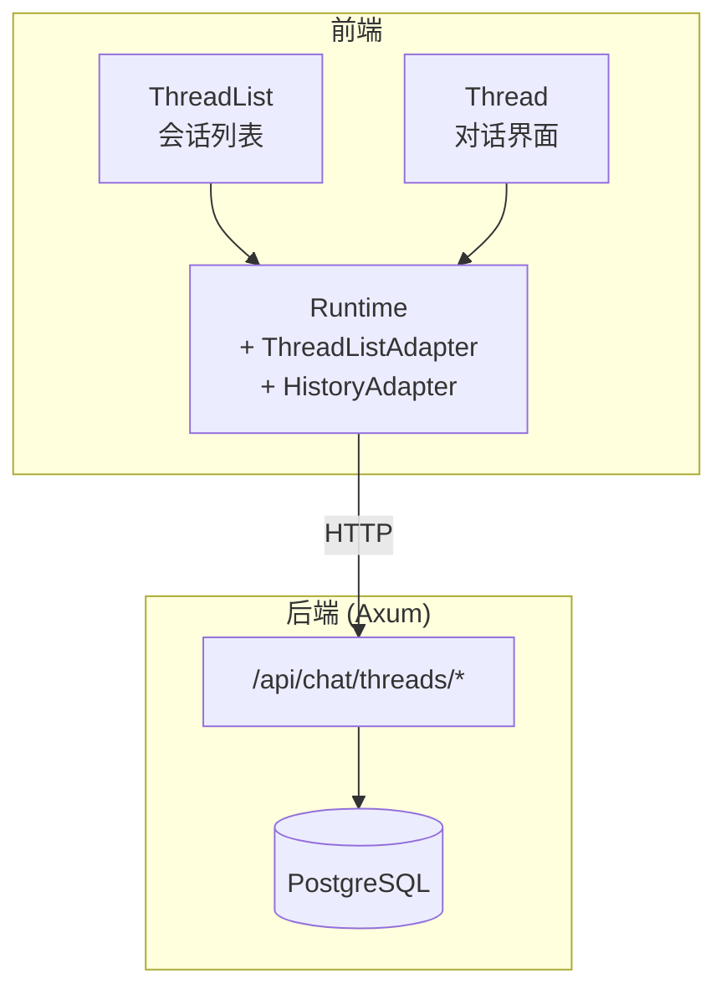
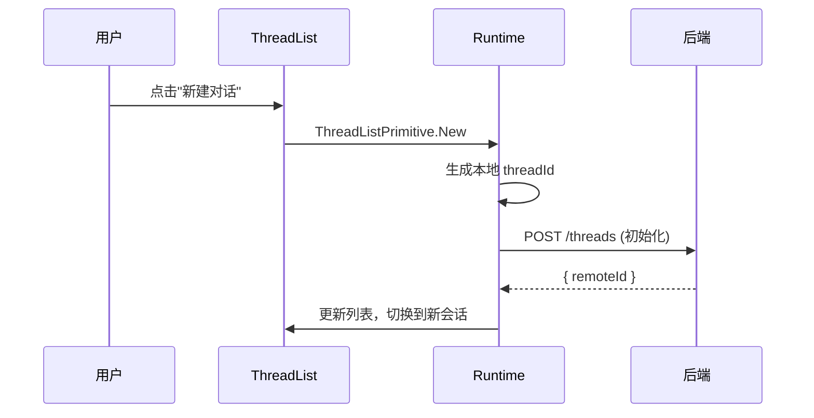
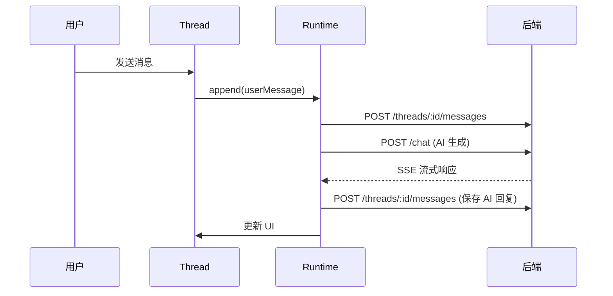
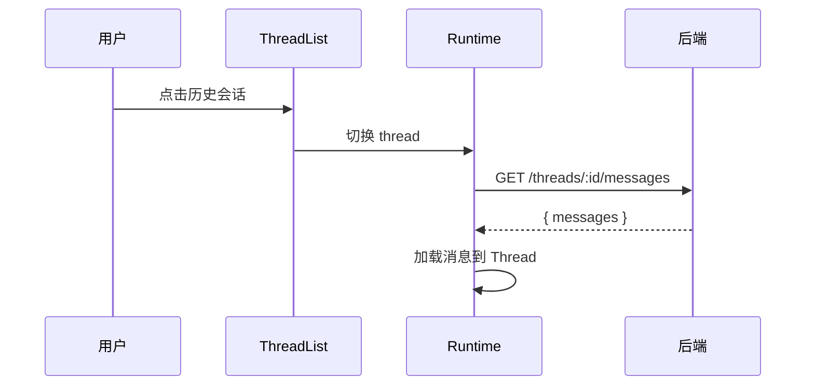

# AI 对话历史管理功能设计

## 概述

为 AI 对话功能添加历史消息管理，支持：
- 多会话（Thread）管理：创建、切换、重命名、归档、删除
- 消息持久化：保存和恢复对话历史
- 跨设备同步：通过后端 API 实现

## 当前状态

项目使用 `useChatRuntime` + `AssistantChatTransport`，消息仅存储在内存中，刷新页面后丢失。

```tsx
// src/routes/chat.tsx
const runtime = useChatRuntime({
  transport: new AssistantChatTransport({
    api: `${import.meta.env.VITE_API_URL}/api/chat`,
    headers: { Authorization: `Bearer ${token}` },
  }),
});
```

## 目标架构



## 数据模型

### 数据库表设计

```sql
-- 会话表
CREATE TABLE chat_thread (
    id UUID PRIMARY KEY DEFAULT gen_random_uuid(),
    user_id UUID NOT NULL REFERENCES "user"(id),
    title VARCHAR(100),
    status VARCHAR(20) DEFAULT 'active', -- active, archived
    created_at TIMESTAMPTZ DEFAULT NOW(),
    updated_at TIMESTAMPTZ DEFAULT NOW()
);

-- 消息表
CREATE TABLE chat_message (
    id UUID PRIMARY KEY DEFAULT gen_random_uuid(),
    thread_id UUID NOT NULL REFERENCES chat_thread(id) ON DELETE CASCADE,
    role VARCHAR(20) NOT NULL, -- user, assistant, system, tool
    content JSONB NOT NULL,    -- 支持复杂内容（文本、tool call 等）
    created_at TIMESTAMPTZ DEFAULT NOW()
);

-- 索引
CREATE INDEX idx_chat_thread_user ON chat_thread(user_id, status);
CREATE INDEX idx_chat_message_thread ON chat_message(thread_id, created_at);
```

### SeaORM Entity

```rust
// server/src/entity/chat_thread.rs
#[derive(Clone, Debug, DeriveEntityModel)]
#[sea_orm(table_name = "chat_thread")]
pub struct Model {
    #[sea_orm(primary_key)]
    pub id: Uuid,
    pub user_id: Uuid,
    pub title: Option<String>,
    pub status: String,
    pub created_at: DateTimeWithTimeZone,
    pub updated_at: DateTimeWithTimeZone,
}

// server/src/entity/chat_message.rs
#[derive(Clone, Debug, DeriveEntityModel)]
#[sea_orm(table_name = "chat_message")]
pub struct Model {
    #[sea_orm(primary_key)]
    pub id: Uuid,
    pub thread_id: Uuid,
    pub role: String,
    pub content: Json<serde_json::Value>,
    pub created_at: DateTimeWithTimeZone,
}
```

## API 设计

### 会话管理

| 方法     | 路径                                     | 描述        |
| ------ | -------------------------------------- | --------- |
| GET    | `/api/chat/threads`                    | 获取会话列表    |
| POST   | `/api/chat/threads`                    | 创建会话      |
| PATCH  | `/api/chat/threads/:id`                | 更新会话（重命名） |
| PATCH  | `/api/chat/threads/:id/archive`        | 归档会话      |
| PATCH  | `/api/chat/threads/:id/unarchive`      | 取消归档      |
| DELETE | `/api/chat/threads/:id`                | 删除会话      |
| POST   | `/api/chat/threads/:id/generate-title` | 生成标题      |

### 消息管理

| 方法 | 路径 | 描述 |
|------|------|------|
| GET | `/api/chat/threads/:id/messages` | 获取消息历史 |
| POST | `/api/chat/threads/:id/messages` | 保存消息 |

### 请求/响应示例

```typescript
// GET /api/chat/threads
interface ThreadListResponse {
  threads: Array<{
    id: string;
    title: string | null;
    status: 'active' | 'archived';
    updatedAt: string;
  }>;
}

// GET /api/chat/threads/:id/messages
interface MessagesResponse {
  messages: Array<{
    id: string;
    role: 'user' | 'assistant' | 'system' | 'tool';
    content: any; // ThreadMessage content format
    createdAt: string;
  }>;
}
```

## 前端实现

### 方案一：使用 useRemoteThreadListRuntime（推荐）

assistant-ui 提供了 `useRemoteThreadListRuntime` 用于自定义 thread 存储：

```tsx
// src/components/chat/runtime-provider.tsx
import {
  AssistantRuntimeProvider,
  RuntimeAdapterProvider,
  useAssistantApi,
  unstable_useRemoteThreadListRuntime as useRemoteThreadListRuntime,
  type unstable_RemoteThreadListAdapter as RemoteThreadListAdapter,
  type ThreadHistoryAdapter,
} from "@assistant-ui/react";
import { useChatRuntime } from "@assistant-ui/react-ai-sdk";
import { useMemo } from "react";

// Thread 列表适配器
const createThreadListAdapter = (token: string): RemoteThreadListAdapter => ({
  async list() {
    const res = await fetch("/api/chat/threads", {
      headers: { Authorization: `Bearer ${token}` },
    });
    const data = await res.json();
    return {
      threads: data.threads.map((t: any) => ({
        remoteId: t.id,
        title: t.title,
        status: t.status === "archived" ? "archived" : "regular",
      })),
    };
  },

  async initialize(threadId: string) {
    const res = await fetch("/api/chat/threads", {
      method: "POST",
      headers: {
        Authorization: `Bearer ${token}`,
        "Content-Type": "application/json",
      },
      body: JSON.stringify({ id: threadId }),
    });
    const data = await res.json();
    return { remoteId: data.id };
  },

  async rename(remoteId: string, newTitle: string) {
    await fetch(`/api/chat/threads/${remoteId}`, {
      method: "PATCH",
      headers: {
        Authorization: `Bearer ${token}`,
        "Content-Type": "application/json",
      },
      body: JSON.stringify({ title: newTitle }),
    });
  },

  async archive(remoteId: string) {
    await fetch(`/api/chat/threads/${remoteId}/archive`, {
      method: "PATCH",
      headers: { Authorization: `Bearer ${token}` },
    });
  },

  async unarchive(remoteId: string) {
    await fetch(`/api/chat/threads/${remoteId}/unarchive`, {
      method: "PATCH",
      headers: { Authorization: `Bearer ${token}` },
    });
  },

  async delete(remoteId: string) {
    await fetch(`/api/chat/threads/${remoteId}`, {
      method: "DELETE",
      headers: { Authorization: `Bearer ${token}` },
    });
  },

  async generateTitle(remoteId: string, messages: any[]) {
    const res = await fetch(`/api/chat/threads/${remoteId}/generate-title`, {
      method: "POST",
      headers: {
        Authorization: `Bearer ${token}`,
        "Content-Type": "application/json",
      },
      body: JSON.stringify({ messages }),
    });
    // 返回 AssistantStream
    return res.body!;
  },

  // Provider 组件 - 提供 thread 级别的适配器
  unstable_Provider: ({ children }) => {
    const api = useAssistantApi();
    const token = useAuthStore((s) => s.token);

    const history = useMemo<ThreadHistoryAdapter>(
      () => ({
        async load() {
          const { remoteId } = api.threadListItem().getState();
          if (!remoteId) return { messages: [] };

          const res = await fetch(`/api/chat/threads/${remoteId}/messages`, {
            headers: { Authorization: `Bearer ${token}` },
          });
          const data = await res.json();
          return { messages: data.messages };
        },

        async append(message) {
          const { remoteId } = await api.threadListItem().initialize();
          await fetch(`/api/chat/threads/${remoteId}/messages`, {
            method: "POST",
            headers: {
              Authorization: `Bearer ${token}`,
              "Content-Type": "application/json",
            },
            body: JSON.stringify({ message }),
          });
        },
      }),
      [api, token]
    );

    return (
      <RuntimeAdapterProvider adapters={{ history }}>
        {children}
      </RuntimeAdapterProvider>
    );
  },
});

export function ChatRuntimeProvider({ children }: { children: React.ReactNode }) {
  const token = useAuthStore((s) => s.token)!;

  const runtime = useRemoteThreadListRuntime({
    runtimeHook: () => {
      return useChatRuntime({
        transport: new AssistantChatTransport({
          api: `${import.meta.env.VITE_API_URL}/api/chat`,
          headers: { Authorization: `Bearer ${token}` },
        }),
      });
    },
    adapter: createThreadListAdapter(token),
  });

  return (
    <AssistantRuntimeProvider runtime={runtime}>
      {children}
    </AssistantRuntimeProvider>
  );
}
```

### UI 组件

使用 assistant-ui 提供的 ThreadList 组件：

```tsx
// src/routes/chat.tsx
import { Thread } from "@/components/thread";
import { ThreadList } from "@/components/thread-list";
import { ChatRuntimeProvider } from "@/components/chat/runtime-provider";

function ChatPage() {
  return (
    <ChatRuntimeProvider>
      <div className="flex h-full">
        {/* 侧边栏 - 会话列表 */}
        <aside className="w-64 border-r">
          <ThreadList />
        </aside>
        {/* 主内容 - 对话 */}
        <main className="flex-1">
          <Thread />
        </main>
      </div>
    </ChatRuntimeProvider>
  );
}
```

### 添加 ThreadList 组件

```bash
npx assistant-ui@latest add thread-list
```

## 交互流程

### 创建新会话



### 发送消息并保存



### 恢复历史对话



## 实现步骤

### 后端

1. [ ] 创建 `chat_thread` 和 `chat_message` Entity
2. [ ] 实现 Thread CRUD API
3. [ ] 实现消息保存和加载 API
4. [ ] 实现标题生成 API（调用 LLM）

### 前端

1. [ ] 安装 thread-list 组件
2. [ ] 实现 `RemoteThreadListAdapter`
3. [ ] 实现 `ThreadHistoryAdapter`
4. [ ] 更新 ChatPage 布局，添加侧边栏
5. [ ] 测试会话切换和消息持久化

## 移动端适配

考虑到项目是移动端应用，ThreadList 可以：

1. **抽屉模式**：侧边栏作为抽屉，点击按钮展开
2. **底部 Tab**：在底部导航添加"历史"Tab
3. **下拉选择**：顶部标题栏添加会话切换下拉菜单

```tsx
// 抽屉模式示例
import { Sheet, SheetContent, SheetTrigger } from "@/components/ui/sheet";
import { History } from "lucide-react";

function MobileChatPage() {
  return (
    <ChatRuntimeProvider>
      <div className="flex h-full flex-col">
        {/* 顶部栏 */}
        <header className="flex h-12 items-center border-b px-2">
          <Sheet>
            <SheetTrigger asChild>
              <button className="p-2">
                <History size={20} />
              </button>
            </SheetTrigger>
            <SheetContent side="left" className="w-72 p-0">
              <ThreadList />
            </SheetContent>
          </Sheet>
          <span className="ml-2 font-medium">AI 助手</span>
        </header>
        {/* 对话内容 */}
        <div className="flex-1 overflow-hidden">
          <Thread />
        </div>
      </div>
    </ChatRuntimeProvider>
  );
}
```

## 参考

- [assistant-ui LocalRuntime 文档](https://www.assistant-ui.com/docs/runtimes/custom/local)
- [ThreadList 组件](https://www.assistant-ui.com/docs/ui/thread-list)
- [Assistant Cloud 概述](https://www.assistant-ui.com/docs/cloud/overview)
