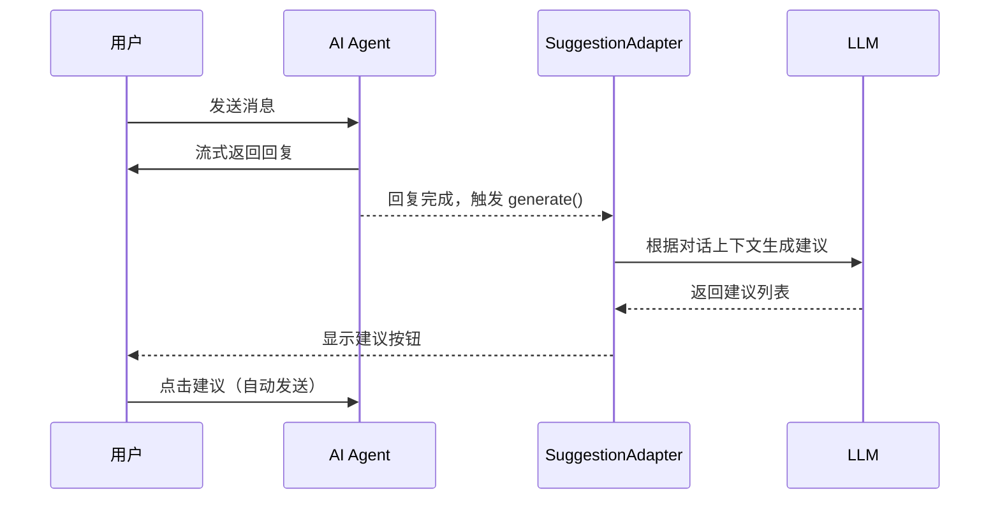

# AI 对话动态建议功能设计

## 概述

为 AI 对话添加动态建议（Suggestions）功能，在每次 Assistant 回复后显示预测的后续问题，用户可以点击快速继续对话。

## 当前状态

目前项目在 `src/components/thread.tsx` 中的 `ThreadSuggestions` 只在欢迎页（空对话）显示静态建议：

```tsx
const SUGGESTIONS = [
  {
    title: "查询今日产量",
    label: "和收入统计",
    prompt: "帮我查询今日的产量和收入统计",
  },
  {
    title: "查看本月订单",
    label: "进度和状态",
    prompt: "帮我查看本月订单的进度和状态",
  },
] as const;
```

## 目标

实现每次 Assistant 回复后动态生成 2-3 个相关建议，提升对话体验。

## 技术方案

### 方案一：使用 SuggestionAdapter（推荐）

assistant-ui 的 `LocalRuntime` 原生支持 `SuggestionAdapter`，可在每次回复后动态生成建议。



#### 前端实现

```tsx
// src/components/assistant/runtime-provider.tsx

import {
  useLocalRuntime,
  type SuggestionAdapter
} from "@assistant-ui/react";

const suggestionAdapter: SuggestionAdapter = {
  async *generate({ messages }) {
    // 只在有消息且最后一条是 assistant 消息时生成建议
    const lastMessage = messages[messages.length - 1];
    if (!lastMessage || lastMessage.role !== "assistant") {
      return;
    }

    // 调用后端 API 生成建议
    const response = await fetch("/api/chat/suggestions", {
      method: "POST",
      headers: { "Content-Type": "application/json" },
      body: JSON.stringify({
        messages: messages.slice(-5) // 只传最近 5 条消息
      }),
    });

    const suggestions = await response.json();

    yield suggestions.map((text: string) => ({
      id: crypto.randomUUID(),
      text,
    }));
  },
};

export function MyRuntimeProvider({ children }) {
  const runtime = useLocalRuntime(MyModelAdapter, {
    adapters: {
      suggestion: suggestionAdapter
    },
  });

  return (
    <AssistantRuntimeProvider runtime={runtime}>
      {children}
    </AssistantRuntimeProvider>
  );
}
```

#### 后端 API

```rust
// server/src/service/chat/suggestions.rs

use axum::{Json, extract::State};
use serde::{Deserialize, Serialize};

#[derive(Deserialize)]
pub struct SuggestionsRequest {
    messages: Vec<Message>,
}

#[derive(Serialize)]
pub struct SuggestionsResponse(Vec<String>);

pub async fn generate_suggestions(
    State(state): State<AppState>,
    Json(req): Json<SuggestionsRequest>,
) -> Json<SuggestionsResponse> {
    // 构建 prompt 让 LLM 生成建议
    let prompt = format!(
        r#"基于以下对话，生成 2-3 个用户可能想问的后续问题。

对话历史：
{}

要求：
- 问题要简短（10-20字）
- 与当前对话主题相关
- 符合服装加工管理系统的业务场景
- 只返回问题列表，每行一个，不要编号

问题："#,
        format_messages(&req.messages)
    );

    let response = state.llm_client
        .chat()
        .model("glm-4-flash") // 使用轻量模型降低延迟
        .messages(vec![Message::user(prompt)])
        .send()
        .await?;

    let suggestions: Vec<String> = response
        .content
        .lines()
        .filter(|line| !line.is_empty())
        .take(3)
        .map(|s| s.trim().to_string())
        .collect();

    Json(SuggestionsResponse(suggestions))
}
```

### 方案二：在 AssistantMessage 中渲染

如果不使用 adapter，可以手动在 `AssistantMessage` 组件中添加建议。

```tsx
// src/components/thread.tsx

import {
  MessagePrimitive,
  ThreadPrimitive,
  useMessage,
  useThread,
} from "@assistant-ui/react";

const AssistantMessage: FC = () => {
  return (
    <MessagePrimitive.Root data-role="assistant">
      <div className="aui-assistant-message-content">
        <MessagePrimitive.Parts components={{...}} />
      </div>

      {/* 动态建议 - 只在最后一条消息且不在生成中时显示 */}
      <MessageSuggestions />

      <div className="aui-assistant-message-footer">
        <BranchPicker />
        <AssistantActionBar />
      </div>
    </MessagePrimitive.Root>
  );
};

const MessageSuggestions: FC = () => {
  const message = useMessage();
  const thread = useThread();
  const [suggestions, setSuggestions] = useState<string[]>([]);

  // 只在最后一条消息且不在运行时加载建议
  const shouldShow = message.isLast && !thread.isRunning;

  useEffect(() => {
    if (!shouldShow) return;

    // 获取建议
    fetchSuggestions().then(setSuggestions);
  }, [shouldShow, message.id]);

  if (!shouldShow || suggestions.length === 0) return null;

  return (
    <div className="flex flex-wrap gap-2 mt-3 px-2">
      {suggestions.map((text, i) => (
        <ThreadPrimitive.Suggestion
          key={i}
          prompt={text}
          send
          asChild
        >
          <Button
            variant="outline"
            size="sm"
            className="text-xs h-7 rounded-full"
          >
            {text}
          </Button>
        </ThreadPrimitive.Suggestion>
      ))}
    </div>
  );
};
```

## API 设计

### 端点

```
POST /api/chat/suggestions
Content-Type: application/json
Authorization: Bearer <jwt>
```

### 请求

```json
{
  "messages": [
    { "role": "user", "content": "帮我查一下今天的产量" },
    { "role": "assistant", "content": "今天共完成 1,234 件..." }
  ]
}
```

### 响应

```json
["查看各员工的详细产量", "和昨天的产量对比", "导出今日产量报表"]
```

## UI 设计

### 建议按钮样式

```tsx
<Button
  variant="outline"
  size="sm"
  className={cn(
    "text-xs h-7 px-3 rounded-full",
    "border-border/60 hover:border-border",
    "hover:bg-muted/50 transition-colors",
    "animate-in fade-in slide-in-from-bottom-1 duration-200"
  )}
>
  {suggestion}
</Button>
```

### 位置

建议显示在 Assistant 消息下方，ActionBar 上方：

```
┌─────────────────────────────────────┐
│ Assistant 消息内容                    │
├─────────────────────────────────────┤
│ [建议1] [建议2] [建议3]              │  ← 动态建议
├─────────────────────────────────────┤
│ 📋 🔄 ⬇️                            │  ← ActionBar
└─────────────────────────────────────┘
```

## 性能优化

1. **使用轻量模型**：建议生成使用 `glm-4-flash` 等轻量模型，降低延迟
2. **限制上下文**：只传最近 5 条消息，减少 token 消耗
3. **缓存策略**：相同对话上下文的建议可缓存
4. **延迟加载**：消息渲染完成后再请求建议，不阻塞主流程

## 实现步骤

1. [ ] 后端添加 `/api/chat/suggestions` 端点
2. [ ] 前端实现 `SuggestionAdapter`
3. [ ] 在 `AssistantMessage` 中添加建议渲染（如果不用 adapter）
4. [ ] 添加加载状态和动画效果
5. [ ] 测试和优化响应速度

## 参考

- [assistant-ui SuggestionAdapter 文档](https://www.assistant-ui.com/docs/runtimes/custom/local#suggestion-adapter)
- [ThreadPrimitive.Suggestion API](https://www.assistant-ui.com/docs/reference/primitives/thread#threadprimitivesuggestion)
