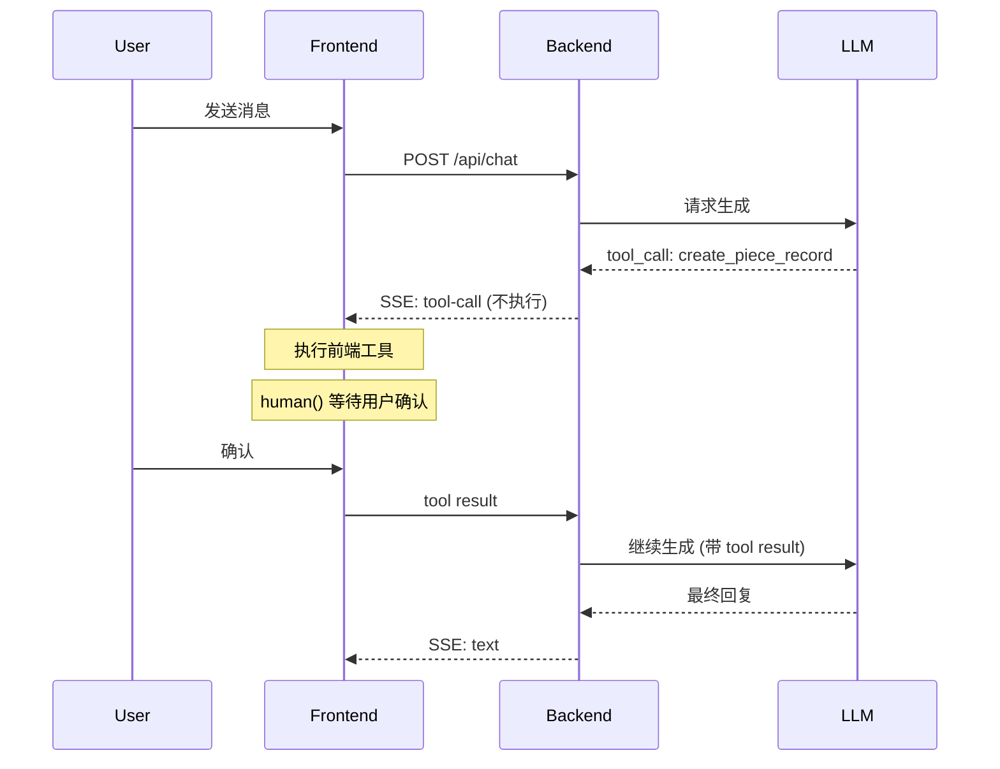

# 前端工具标准化流程改造计划

## 调研结果

### Rust 生态现状

| Crate | 说明 | 状态 | Data Stream Protocol | 前端工具支持 |
|-------|------|------|---------------------|-------------|
| [aisdk](https://crates.io/crates/aisdk) | Vercel AI SDK 风格的 Rust 库 | v0.3.0, 活跃开发 | ⚠️ 部分支持 | ❌ 不支持 |
| [rig-ai-sdk](https://crates.io/crates/rig-ai-sdk) | 当前使用，Rig 框架适配器 | 在用 | 部分支持 | ⚠️ 需变通 |

### 其他语言实现

| 项目 | 语言 | Data Stream Protocol |
|------|------|---------------------|
| [aisdk-go](https://github.com/coder/aisdk-go) | Go | ✅ 完整支持 |
| [py-ai-datastream](https://github.com/elementary-data/py-ai-datastream) | Python | ✅ 完整支持 |
| [assistant-stream](https://www.npmjs.com/package/assistant-stream) | TypeScript | ✅ 官方实现 |

### aisdk 源码分析结论

> 详细分析见：[aisdk-source-analysis.md](../dev-notes/aisdk-source-analysis.md)

**关键发现**：

1. **不支持前端工具** - 工具在 `handle_tool_call()` 中服务端自动执行，没有暂停等待外部输入的机制
2. **无暂停/恢复** - 流式生成无法暂停等待外部输入后继续
3. **事件格式不完整** - 缺少 `tool-input-available`、`requires-action` 等前端工具所需事件
4. **ToolCallEnd 包含 result** - 表明工具已执行完成，无法支持等待前端执行的流程

**结论**：`aisdk` 适用于纯服务端工具场景，不适用于需要前端工具（human-in-the-loop）的 StitchWork 项目。

### 其他发现

1. **`assistant-stream` Rust 版不存在** - 这是 Vercel 的 npm 包，没有官方 Rust 实现

2. **Data Stream Protocol 完整工具事件**（前端工具需要）：

   ```text
   tool-input-start      → 工具调用开始
   tool-input-delta      → 参数流式传输
   tool-input-available  → 参数就绪，等待执行 (state: "requires-action")
   tool-output-available → 工具执行完成，返回结果
   ```

3. **当前 rig-ai-sdk 问题**：
   - 使用 `cancel_with_reason` 终止流
   - 不支持等待 tool result 后继续生成

---

## 背景

当前 Rust 后端使用 `FrontendToolHook` + `cancel_with_reason` 机制处理前端工具：

```rust
// 当前实现
impl<M> StreamingPromptHook<M> for FrontendToolHook {
    fn on_tool_call(&self, tool_name: &str, ..., cancel_sig: CancelSignal) {
        if tools.get(tool_name).is_some() {
            cancel_sig.cancel_with_reason(FRONTEND_TOOL_CANCEL_REASON);  // 直接取消
        }
    }
}
```

这导致：
1. 后端流直接终止，LLM 不会等待工具结果
2. 前端需要使用 `sendAutomaticallyWhen` 手动触发新请求
3. 新请求会重新发送完整的消息历史，效率较低

## 目标

改造为标准 AI SDK 流程：



## 技术方案对比

### 方案 A：使用 assistant-stream (推荐)

使用 Anthropic 官方的 `assistant-stream` Rust 实现，它原生支持 AI SDK UI Message Stream 协议。

**优点**：
- 原生支持 tool result 回传
- 与 AI SDK 完全兼容
- 社区维护

**缺点**：
- 需要替换 rig-ai-sdk
- 可能需要重构 chat session 逻辑

**实现步骤**：

1. 添加依赖
```toml
[dependencies]
assistant-stream = "0.1"  # 检查最新版本
```

2. 使用 `AssistantStream` 构建响应
```rust
use assistant_stream::{AssistantStream, ToolCallPart};

pub async fn chat(req: AISdkChatRequest) -> impl IntoResponse {
    let stream = AssistantStream::new();

    // 当 LLM 返回 tool call 时
    if is_frontend_tool(&tool_name) {
        // 发送 tool-call 事件，不执行
        stream.tool_call(ToolCallPart {
            tool_call_id: id,
            tool_name: name,
            args: args,
            state: "requires-action",  // 标记为需要前端处理
        });
        // 流保持打开，等待后续请求
    }

    stream.into_response()
}
```

3. 处理 tool result 请求
```rust
// 新增端点处理 tool result
#[derive(TypedPath)]
#[typed_path("/chat/tool-result")]
pub struct ToolResultPath;

pub async fn handle_tool_result(
    req: ToolResultRequest,
) -> impl IntoResponse {
    // 获取 session
    // 将 tool result 添加到消息历史
    // 继续 LLM 生成
}
```

### 方案 B：修改 Rig Hook 实现 (中等复杂度)

保持使用 Rig，但修改 Hook 行为：不取消流，而是暂停等待。

**问题**：Rig 的 `StreamingPromptHook` 不原生支持"暂停等待外部输入"。

**变通方案**：使用 channel 等待 tool result

```rust
pub struct FrontendToolHook {
    pub tools: Option<ForwardedTools>,
    pub result_rx: tokio::sync::mpsc::Receiver<ToolResult>,
}

impl<M> StreamingPromptHook<M> for FrontendToolHook {
    fn on_tool_call(&self, tool_name: &str, tool_call_id: Option<String>, args: &str, ...) {
        if is_frontend_tool(tool_name) {
            // 发送 tool-call 事件到前端
            self.send_tool_call_event(tool_call_id, tool_name, args);

            // 等待前端返回结果 (阻塞当前 tool call)
            let result = self.result_rx.recv().await;

            // 返回结果给 LLM
            return ToolResponse::Success(result);
        }
    }
}
```

**挑战**：
- 需要修改 Rig 框架或 fork
- 流式响应期间保持连接可能有超时问题
- 状态管理复杂

### 方案 C：分离请求模式 (最简单)

保持当前架构，但优化前端逻辑：

1. 后端 cancel 时发送特殊标记
2. 前端检测标记，执行工具
3. 前端将 tool result 附加到下一条消息

```typescript
// 前端：检测到前端工具被取消
if (message.status === 'cancelled' && message.cancelReason === '__FRONTEND_TOOL__') {
  // 执行工具
  const result = await executeTool(toolCall);

  // 将结果作为新消息的一部分发送
  await sendMessage({
    role: 'user',
    content: [
      { type: 'tool-result', toolCallId, result }
    ]
  });
}
```

**优点**：
- 改动最小
- 与当前架构兼容

**缺点**：
- 仍然是两次请求
- 消息历史中会有额外的 tool-result 消息

## 推荐方案

**短期（快速修复）**：方案 C - 优化前端逻辑

**长期（标准化）**：方案 A - 使用 assistant-stream

## 方案 A 详细实现计划

### Phase 1: 调研 assistant-stream

1. 调研 `assistant-stream` Rust 实现
   - 检查 crates.io 是否有官方 crate
   - 如果没有，考虑使用 `assistant-stream` npm 包的协议规范自行实现

2. 评估与 Rig 的集成方式
   - 是否可以作为 Rig 的输出适配器
   - 是否需要替换整个 chat 流程

### Phase 2: 实现 AI SDK Stream 协议

创建 `crates/server/src/chat/ai_sdk_stream.rs`:

```rust
//! AI SDK UI Message Stream 协议实现
//!
//! 参考: https://sdk.vercel.ai/docs/ai-sdk-ui/stream-protocol

use axum::response::sse::Event;
use serde::Serialize;

/// AI SDK Stream 事件类型
pub enum AISdkStreamEvent {
    /// 文本增量
    TextDelta { text: String },

    /// 工具调用开始
    ToolCallBegin {
        tool_call_id: String,
        tool_name: String,
    },

    /// 工具调用参数增量
    ToolCallDelta {
        tool_call_id: String,
        args_text_delta: String,
    },

    /// 工具调用完成 (等待结果)
    ToolCallEnd {
        tool_call_id: String,
    },

    /// 工具结果
    ToolResult {
        tool_call_id: String,
        result: serde_json::Value,
    },

    /// 流结束
    Finish {
        finish_reason: String,
    },
}

impl AISdkStreamEvent {
    pub fn to_sse_event(&self) -> Event {
        // 转换为 AI SDK 格式的 SSE 事件
        match self {
            Self::ToolCallEnd { tool_call_id } => {
                Event::default()
                    .event("tool-call")
                    .data(serde_json::json!({
                        "toolCallId": tool_call_id,
                        "state": "requires-action"
                    }).to_string())
            }
            // ... 其他事件
        }
    }
}
```

### Phase 3: 重构 Chat Session

修改 `ChatSession` 支持工具结果回传：

```rust
pub struct ChatSession {
    pub agent: Agent<CompletionModel>,
    pub mcp_client: RunningService<...>,
    // 新增：等待中的工具调用
    pub pending_tool_calls: DashMap<String, PendingToolCall>,
}

pub struct PendingToolCall {
    pub tool_name: String,
    pub args: serde_json::Value,
    pub result_tx: oneshot::Sender<ToolResult>,
}

impl ChatSession {
    /// 添加工具结果
    pub async fn add_tool_result(&self, tool_call_id: &str, result: serde_json::Value) -> Result<()> {
        if let Some((_, pending)) = self.pending_tool_calls.remove(tool_call_id) {
            pending.result_tx.send(ToolResult::Success(result))?;
        }
        Ok(())
    }
}
```

### Phase 4: 新增 API 端点

```rust
// 处理工具结果
#[derive(TypedPath)]
#[typed_path("/chat/tool-result")]
pub struct ToolResultPath;

#[derive(Deserialize)]
pub struct ToolResultRequest {
    pub session_id: String,
    pub tool_call_id: String,
    pub result: serde_json::Value,
    pub is_error: bool,
}

pub async fn add_tool_result(
    _: ToolResultPath,
    State(app_state): State<Arc<AppState>>,
    Extension(claims): Extension<Claims>,
    Json(req): Json<ToolResultRequest>,
) -> Result<impl IntoResponse> {
    let session = app_state.session_manager.get(&req.session_id)?;
    session.add_tool_result(&req.tool_call_id, req.result).await?;
    Ok(Json(json!({ "ok": true })))
}
```

### Phase 5: 前端适配

移除 `sendAutomaticallyWhen`，使用标准的 `addToolResult`:

```typescript
// 前端自动处理
const runtime = useChatRuntime({
  transport: new AssistantChatTransport({
    api: `${import.meta.env.VITE_API_URL}/api/chat`,
    // ...
  }),
  // 不再需要 sendAutomaticallyWhen
});
```

`makeAssistantTool` 的 `execute` 返回的结果会自动通过 `addToolResult` 发送。

## 时间估算

| 阶段 | 工作量 | 说明 |
|------|--------|------|
| Phase 1 | 1-2 天 | 调研 assistant-stream |
| Phase 2 | 2-3 天 | 实现 AI SDK Stream 协议 |
| Phase 3 | 2-3 天 | 重构 Chat Session |
| Phase 4 | 1 天 | 新增 API 端点 |
| Phase 5 | 0.5 天 | 前端适配 |
| 测试 | 2 天 | 端到端测试 |

**总计**：约 8-11 天

## 风险评估

1. **Rig 框架限制**：可能需要 fork Rig 或使用其他框架
2. **长连接超时**：前端工具执行时间可能较长，需要处理超时
3. **状态一致性**：多个工具并发执行时的状态管理

## 替代方案：使用 rig-ai-sdk 的 data-stream 模式

如果 Rig 支持发送自定义事件，可以：

1. 发送 `tool-call` 事件（状态为 `requires-action`）
2. 流暂停，保持连接
3. 前端通过 WebSocket 或新请求发送结果
4. 后端收到结果后继续流

这需要调研 `rig_ai_sdk` 的 `adapt_rig_stream_sse` 是否支持自定义事件注入。

## 结论

短期建议保持当前架构，优化 `sendAutomaticallyWhen` 逻辑确保其正确工作。

长期建议在 Phase 1 调研完成后，根据 assistant-stream 的可用性决定是否进行完整改造。如果 Rust 生态不成熟，可以考虑使用 Node.js 中间层处理 AI SDK 协议，Rust 后端专注于业务逻辑和 MCP 工具。
