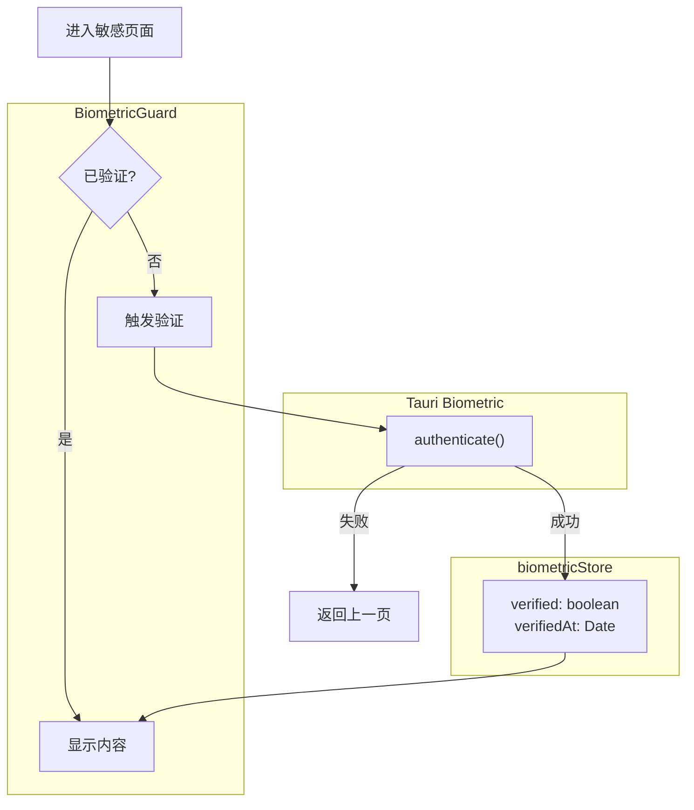

# Design: Biometric Guard

## Context

StitchWork 包含敏感业务数据（客户联系方式、工资明细），需要防止设备被他人临时使用时的数据泄露。生物识别提供无密码的快速二次验证。

## Goals / Non-Goals

**Goals:**

- 保护敏感页面免受未授权访问
- 提供流畅的用户体验（不频繁弹出验证）
- 支持设备不支持生物识别时的降级

**Non-Goals:**

- 不替代登录认证（仅作为补充验证）
- 不实现后端 API 级别的二次验证
- 不实现 PIN 码等备用验证方式（可后续扩展）

## Decisions

### 1. 会话级认证状态

**Decision:** 使用 Zustand store 管理认证状态，不持久化到 localStorage

**Rationale:**

- 应用关闭后状态自动清除，提高安全性
- 避免 token 过期但生物识别状态仍有效的问题
- 简化实现，无需处理存储安全性

### 2. 路由级守卫 vs 组件级守卫

**Decision:** 使用组件级 `<BiometricGuard>` 包裹页面内容

**Rationale:**

- TanStack Router 不原生支持异步守卫
- 组件方式更灵活，可在任意层级使用
- 可显示 loading 状态，体验更好

### 3. 后台超时策略

**Decision:** 应用切换到后台超过 5 分钟后清除认证状态

**Rationale:**

- 平衡安全性和便利性
- 用户短暂切换应用不需要重新验证
- 长时间离开后需要重新验证

### 4. 非 Tauri 环境处理

**Decision:** 非 Tauri 环境自动通过认证

**Rationale:**

- Web 环境无生物识别能力
- 开发调试方便
- 生产环境仅部署为 Tauri app

## Architecture



## API Design

### useBiometric Hook

```typescript
interface UseBiometricReturn {
  isAvailable: boolean;       // 设备是否支持
  isVerified: boolean;        // 当前是否已验证
  authenticate: () => Promise<boolean>;  // 触发验证
}
```

### BiometricGuard Component

```tsx
<BiometricGuard
  reason="查看客户信息需要验证身份"  // 提示文案
  onCancel={() => navigate(-1)}      // 取消回调
>
  <CustomerList />
</BiometricGuard>
```

### biometricStore

```typescript
interface BiometricState {
  verified: boolean;
  verifiedAt: Date | null;
  setVerified: (verified: boolean) => void;
  clearIfExpired: (timeoutMs: number) => void;
}
```

## Risks / Trade-offs

| Risk | Mitigation |
|------|------------|
| 设备不支持生物识别 | 自动跳过验证（可后续添加 PIN 码备选） |
| 用户频繁切换应用触发验证 | 5 分钟超时窗口 |
| 后台超时检测不准确 | 使用 Tauri visibility 事件 + 时间戳比较 |

## Open Questions

1. ~~是否需要支持 PIN 码作为备选验证方式？~~ 暂不实现，后续根据用户反馈添加
2. ~~超时时间是否需要可配置？~~ 暂用固定 5 分钟，后续可加入设置
