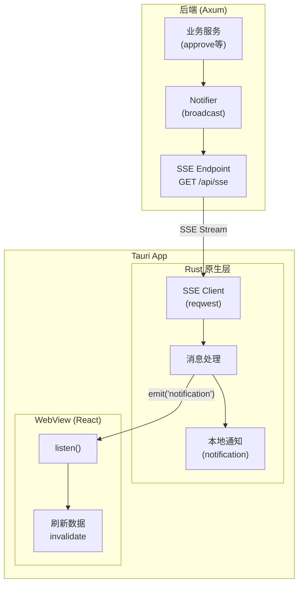
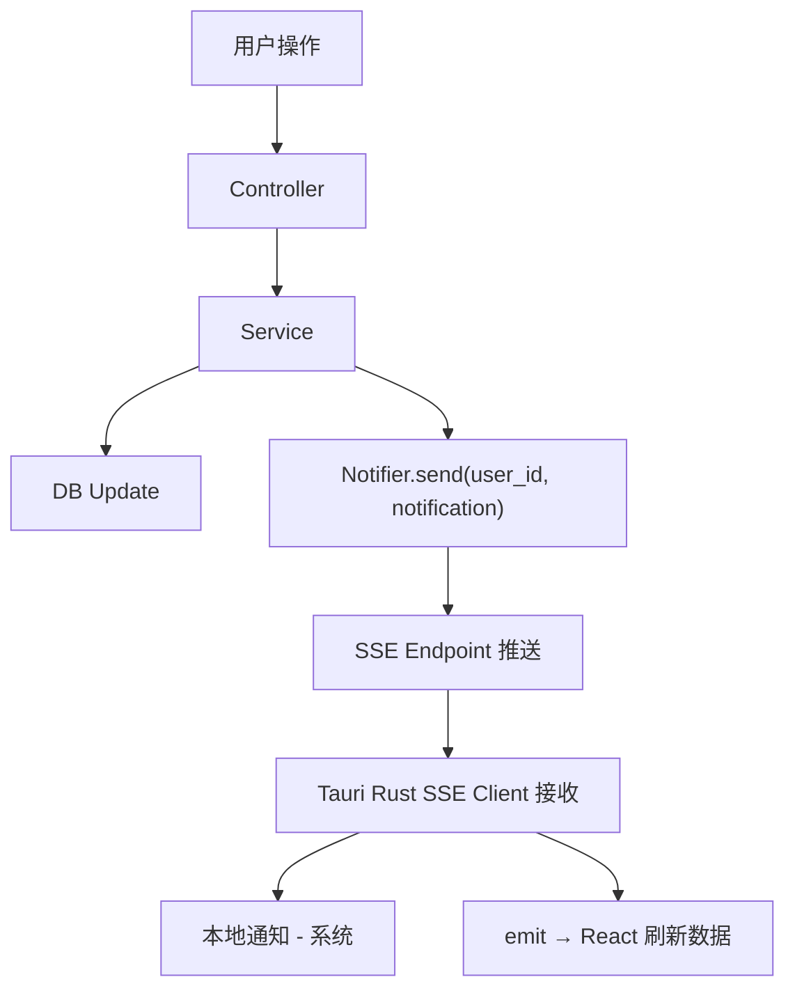

# Design: Realtime Notifications

## Architecture



## 为什么使用 Rust 层 SSE

| 方面 | 前端 JS | Rust 原生层 |
|------|---------|-------------|
| App 后台 | WebView 暂停，连接断开 | **原生进程可能保持** |
| 本地通知 | 需要桥接调用 | **直接调用系统 API** |
| 断线重连 | 需要手动实现 | 可在后台自动重连 |
| 资源占用 | WebView 内存开销 | 更轻量 |

## Server Design (Axum)

### Notifier Service

使用 `tokio::sync::broadcast` 实现多用户订阅：

```rust
pub struct Notifier {
    channels: DashMap<Uuid, broadcast::Sender<Notification>>,
}

impl Notifier {
    pub fn subscribe(&self, user_id: Uuid) -> broadcast::Receiver<Notification> {
        self.channels
            .entry(user_id)
            .or_insert_with(|| broadcast::channel(16).0)
            .subscribe()
    }

    pub fn send(&self, user_id: Uuid, notification: Notification) {
        if let Some(sender) = self.channels.get(&user_id) {
            let _ = sender.send(notification);
        }
    }
}
```

### SSE Endpoint

```rust
GET /api/sse/events?token=<jwt>

// Response: text/event-stream
data: {"type":"record_approved","title":"计件已通过","body":"..."}

// 心跳 (每30秒)
: ping
```

### Notification Types

```rust
#[derive(Serialize, Deserialize, Clone)]
#[serde(tag = "type", rename_all = "snake_case")]
pub enum Notification {
    RecordSubmitted { user_name: String, process_name: String, quantity: i32 },
    RecordApproved { process_name: String, quantity: i32, amount: String },
    RecordRejected { process_name: String, quantity: i32 },
    PayrollReceived { amount: String },
}

impl Notification {
    pub fn title(&self) -> &str {
        match self {
            Self::RecordSubmitted { .. } => "新计件待审核",
            Self::RecordApproved { .. } => "计件已通过",
            Self::RecordRejected { .. } => "计件被拒绝",
            Self::PayrollReceived { .. } => "收到工资",
        }
    }

    pub fn body(&self) -> String {
        match self {
            Self::RecordSubmitted { user_name, process_name, quantity } =>
                format!("{}提交了{}计件 {}件", user_name, process_name, quantity),
            Self::RecordApproved { process_name, quantity, amount } =>
                format!("{}工序 {}件 ¥{}", process_name, quantity, amount),
            Self::RecordRejected { process_name, quantity } =>
                format!("{}工序 {}件", process_name, quantity),
            Self::PayrollReceived { amount } =>
                format!("¥{}", amount),
        }
    }
}
```

## Tauri Client Design (Rust)

### SSE 客户端模块

```rust
// src-tauri/src/sse.rs
use reqwest_eventsource::{Event, EventSource};
use tauri::{AppHandle, Emitter};
use tauri_plugin_notification::NotificationExt;

pub async fn start_sse(app_handle: AppHandle, api_url: String, token: String) {
    let url = format!("{}/api/sse/events?token={}", api_url, token);
    let mut es = EventSource::get(&url);

    while let Some(event) = es.next().await {
        match event {
            Ok(Event::Message(msg)) => {
                if let Ok(notification) = serde_json::from_str::<Notification>(&msg.data) {
                    // 发送本地通知
                    let _ = app_handle.notification()
                        .builder()
                        .title(notification.title())
                        .body(&notification.body())
                        .show();

                    // 通知前端刷新数据
                    let _ = app_handle.emit("notification", &notification);
                }
            }
            Err(e) => {
                // 断线重连 (等待 5 秒)
                tokio::time::sleep(Duration::from_secs(5)).await;
            }
            _ => {}
        }
    }
}
```

### Tauri Commands

```rust
#[tauri::command]
async fn connect_sse(app_handle: AppHandle, api_url: String, token: String) {
    tauri::async_runtime::spawn(start_sse(app_handle, api_url, token));
}

#[tauri::command]
async fn disconnect_sse() {
    // 取消 SSE 任务
}
```

## Frontend Design (React)

### 监听通知事件

```typescript
// src/hooks/useNotify.ts
import { listen } from '@tauri-apps/api/event';
import { invoke } from '@tauri-apps/api/core';

export function useNotify() {
  const token = useAuthStore(s => s.token);
  const queryClient = useQueryClient();

  useEffect(() => {
    if (!token) return;

    // 连接 SSE
    invoke('connect_sse', {
      apiUrl: import.meta.env.VITE_API_URL,
      token,
    });

    // 监听通知事件
    const unlisten = listen('notification', (event) => {
      const notification = event.payload as Notification;

      // 显示 Toast
      Toast.show({ content: notification.title });

      // 刷新相关数据
      queryClient.invalidateQueries({ queryKey: ['piece-records'] });
      queryClient.invalidateQueries({ queryKey: ['home-overview'] });
    });

    return () => {
      invoke('disconnect_sse');
      unlisten.then(fn => fn());
    };
  }, [token]);
}
```

## Integration Points

### 触发通知的位置

1. **计件提交** - `piece_record/service.rs::create()` → 通知老板
2. **计件审批** - `piece_record/service.rs::approve()` / `reject()` → 通知员工
3. **批量审批** - `piece_record/service.rs::batch_approve()` / `batch_reject()` → 通知员工
4. **工资发放** - `payroll/service.rs::create()` → 通知员工

### 数据流



## Dependencies

### Server (Cargo.toml)
```toml
dashmap = "6"
async-stream = "0.3"
```

### Tauri Client (src-tauri/Cargo.toml)
```toml
reqwest-eventsource = "0.6"
```

### Frontend (package.json)
```json
"@tauri-apps/plugin-notification": "^2"
```

## Trade-offs

| 决策 | 选择 | 原因 |
|------|------|------|
| SSE 客户端位置 | Rust 原生层 | 后台保持能力更好 |
| 实时协议 | SSE vs WebSocket | SSE 更简单，单向推送足够 |
| 认证方式 | Query Param | reqwest 容易携带 |
| 离线消息 | 不支持 | 简化实现，MVP 阶段 |

## Security Considerations

- Token 通过 Query Parameter 传递，需确保 HTTPS
- SSE 连接需要验证 token 有效性
- 避免将 token 记录到日志
