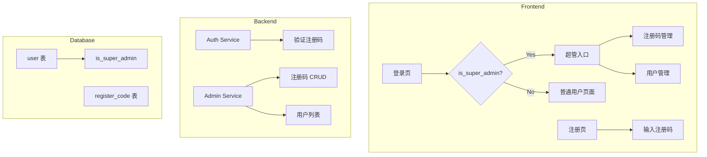

# Design: Super Admin and Registration Code

## Architecture Overview



## Data Model

### User Table Changes

```rust
// user entity 修改
pub phone: String,           // 必填，唯一（原来是 Option<String>）
pub is_super_admin: bool,    // 新增，默认 false
```

**注意**：`phone` 字段从可选改为必填，需要处理现有数据迁移。

### Register Code Table

```rust
#[sea_orm(table_name = "register_code")]
pub struct Model {
    #[sea_orm(primary_key, auto_increment = false)]
    pub id: Uuid,
    #[sea_orm(unique)]
    pub code: String,              // 注册码，8位随机字符串
    pub is_active: bool,           // 是否启用（可手动禁用）
    pub used_by: Option<Uuid>,     // 使用者 user_id（null=未使用）
    pub used_at: Option<DateTimeUtc>, // 使用时间
    pub created_at: DateTimeUtc,
}
```

**判断逻辑**：
- 可用：`is_active == true && used_by.is_none()`
- 已使用：`used_by.is_some()`
- 已禁用：`is_active == false`

## API Design

### Admin APIs (Super Admin Only)

```
POST   /api/admin/register-codes      # 创建注册码
GET    /api/admin/register-codes      # 获取注册码列表
DELETE /api/admin/register-codes/:id  # 禁用注册码

GET    /api/admin/users               # 获取用户列表
```

### Auth API Changes

```
POST /api/auth/register
  Request: { username, password, phone, registerCode }
  # phone: 必填，唯一
  # registerCode: 必填

POST /api/auth/register-staff
  Request: { username, password, phone, inviteCode }
  # phone: 必填，唯一

POST /api/auth/login
  Request: { username, password }
  # username 支持用户名或手机号
```

## Frontend Routes

```
/admin                    # 超管首页（跳转到注册码管理）
/admin/register-codes     # 注册码管理
/admin/users              # 用户管理
```

使用 `_admin.tsx` 布局路由，检查 `user.isSuperAdmin`。

## Security Considerations

1. **超管权限检查**：所有 `/api/admin/*` 接口需要验证 `is_super_admin`
2. **注册码生成**：使用安全随机数生成 8 位字母数字组合
3. **首个超管**：通过 SQL 手动设置，不提供 API

```sql
UPDATE "user" SET is_super_admin = true WHERE username = 'your_username';
```

## Migration Strategy

1. 添加 `is_super_admin` 字段（默认 false），不影响现有用户
2. 创建 `register_code` 表
3. 现有用户正常使用，新工坊主需要注册码
4. 手动设置第一个超管
