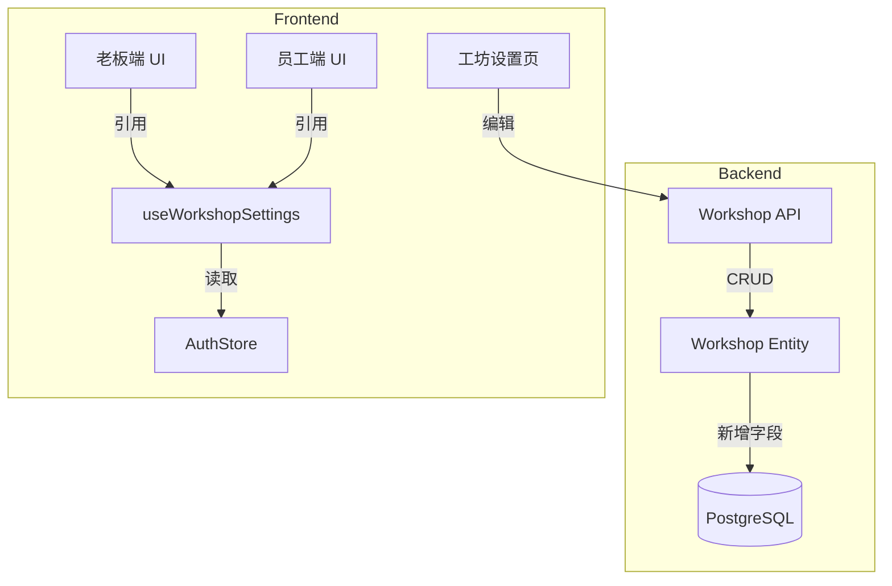

# Design: add-workshop-settings

## Architecture Overview



## Data Model

### Workshop 新增字段

| 字段 | 类型 | 默认值 | 说明 |
|-----|------|-------|-----|
| `piece_unit` | String | "打" | 计件单位名称 |
| `business_label` | String | "工坊" | 经营场所名称 |

## Frontend Integration

### useWorkshopSettings Hook

```typescript
// src/hooks/useWorkshopSettings.ts
export function useWorkshopSettings() {
  const workshop = useAuthStore(s => s.user?.workshop);

  return {
    pieceUnit: workshop?.pieceUnit ?? "打",
    businessLabel: workshop?.businessLabel ?? "工坊",
  };
}
```

### 文案替换策略

1. **直接替换**：`{quantity}打` → `{quantity}{pieceUnit}`
2. **标签替换**：`工坊设置` → `{businessLabel}设置`
3. **组合文案**：使用模板字符串 `${businessLabel}地址`

## UI 变更清单

### 需要替换「打」的位置

| 文件 | 行号 | 原文案 | 替换后 |
|-----|-----|-------|-------|
| `_auth.tsx` | 28, 34 | "计件" | 保持不变（菜单标题） |
| `share/$token.tsx` | 226 | "剩余{n}件" | `剩余{n}{pieceUnit}` |
| `_staff/-home.tsx` | 55, 114, 218 | "{n}件" | `{n}{pieceUnit}` |
| `_staff/my-records/*.tsx` | 多处 | "件" | `{pieceUnit}` |
| `_boss/-home.tsx` | 259, 308, 393 | "{n}件" | `{n}{pieceUnit}` |
| `_boss/shares/*.tsx` | 多处 | "¥{n}/件" | `¥{n}/{pieceUnit}` |
| `_boss/records/*.tsx` | 多处 | "件" | `{pieceUnit}` |

### 需要替换「工坊」的位置

| 文件 | 行号 | 原文案 | 替换后 |
|-----|-----|-------|-------|
| `workshop.tsx` | 41, 57-66 | "工坊*" | `{businessLabel}*` |
| `share/$token.tsx` | 184 | "工坊地址" | `{businessLabel}地址` |

## API Changes

### PUT /api/workshop

Request body 新增可选字段：
```json
{
  "name": "string",
  "desc": "string?",
  "address": "string?",
  "image": "string?",
  "pieceUnit": "string?",
  "businessLabel": "string?"
}
```

Response 新增字段：
```json
{
  "id": "uuid",
  "name": "string",
  "pieceUnit": "打",
  "businessLabel": "工坊",
  ...
}
```
